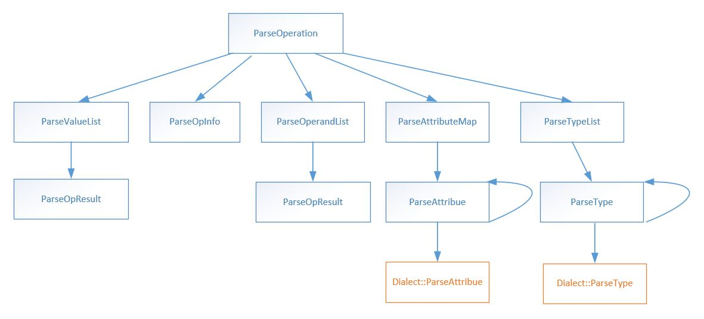

# Pir Parser实现分享
本文档对Pir的Parser的实现思路进行介绍，Parser主要完成读取一个描述计算图的文本串在构建出对应计算图对象的工作.<br>阅读本文档的收获：
- 加深了解PIR体系设计
- 熟悉PIR下各个组件中API的使用
- 了解Dialect机制
## 一、背景
### 1.1 Pir体系下的Program
Pir体系下的`Program`主要由计算图`graphs`和权重参数`weights`组成.其中计算图`graphs`描述了该`Program`的计算行为.新IR描述下的`Program`主要包括`Region`,`Block`,`Operation`,`Value`等组件.关于这些组件的设计思路和实现推荐一下两个文档`Docs/19_PIR_Adapt_CINN/CodeReading/PIR_source_code_reading_guide.md`和`pfcc/paddle-code-reading/IR_Dialect/ir_program.md`，里面对Pir的提出背景，组件设计与实现做了详细的介绍.
### 1.2 Pir计算图文法介绍
实现`Parser`可能更关心的是组成`graphs`的文法.因为文法描述了语言中的基本元素以及它们之间的组合关系.通过文法可以确定`Parser`要处理的基本元素，以及`Parser`必须有哪些模块，它们直接如如何相互调用完成工作的.

>**ModuleOp/Program**<br>
> Program  ::= [ ParameterList ] ModuleOp; <br>
> ModuleOp ::= { Region };<br>
> <br>
> ParameterList ::= { Parameter };<br>
> Parameter ::= Stringidentifier ":" Type "\n";<br><br>
> **Region/Block** <br>
> Region ::= { Block }; <br>
> Block ::= "{" { Operation } "}" ;<br><br>
> **Operation**<br>
> Operation ::= OpResultList? "=" (GenericOperation | CustomOperation)<br>
> GenericOperation ::= OpName "("OperandList? ")" AttributeMap ":" FunctionType<br>
> OpName::= "\"" StringIdentifier "." StringIdentifier "\""<br>
> CustomOperation::= CustomOperationFormat<br>
> OpResultList  ::= ValueList<br>
> OperandList::= ValueList<br>
> ValueList ::= ValueId ("," ValueId)*<br>
> ValueId::= "%" Digits<br>
> AttributeMap::= "[" (AttributeEntry ("," AttributeEntry)* ) ")"<br>
> AttributeEntry::= StringIdentifier ":" Attribute<br>
> FunctionType::= TypeList  '->'  TypeList<br>
> TypeList ::= Type (",", Type)*

文法为了配合后面的`Parser`设计有一些改动.

只看文法可能有一些抽象,下面是一个计算图在该文法下输出的例子:
>{<br>
 (%0) = "pd_op.seed" () {deterministic:false,force_cpu:false,rng_name:"",seed:(Int32)0} : () -> pd_op.tensor<1xi64>
 <br>(%1) = "pd_op.fetch" (%0) {col:(Int32)0,name:"Out"} : (pd_op.tensor<1xi64>) -> pd_op.tensor<1xi64>
 <br>}

## 二、Parser的设计与实现
在确定描述PIR计算图的文法之后,`Parser`的实现思路是采用经典的`自顶向下分析方法`,为每一个基本的组成元素比如`Attribute`,`Type`,`Value`等,构造相应的`Parser`子程序,通过不断调用相应的`Parser`子程序完成对整个计算图的构造.
以上是构造`Parser`的基本思路,其实`Parser`程序可以参考的程序有很多,实现相对固定.下面分模块展开介绍,重点想介绍的是在`Parse`PIR计算图的背景下,实现`Parser`时遇到了哪些问题,是怎么解决的,这些解决方法并不是最优的,有一些妥协.欢迎大家提出更好的想法.<br>
为了方便后面的介绍这里首先给出`Parser`工作的例子：
>{<br>
(%0) = "pd_op.feed" () {col:2,name:LearningRate} : () -> tensor<1xf32><br>
(%1) = "pd_op.feed" () {col:1,name:Grad} : () -> tensor<102x105xf32><br>
(%2) = "pd_op.feed" () {col:0,name:Param} : () -> tensor<102x105xf32><br>
(%3) = "pd_op.dpsgd" (%2, %1, %0) {batch_size:16,clip:10000,seed:0,sigma:0} : (tensor<102x105xf32>, ensor<102x105xf32>, tensor<1xf32>) ->tensor<102x105xf32><br>
(%4) = "pd_op.fetch" (%3) {col:0,name:ParamOut} : (tensor<102x105xf32>) -> tensor<102x105xf32><br>
}

上面是一个完整的计算图，但是已经和现在的很不相同了.可以看出它由5个Op构成，我们大体看一下`Parser`是如何构造出第一个Op的.
> (%0) = "pd_op.feed" () {col:2,name:LearningRate} : () -> tensor<1xf32>

第一个Op的信息全部包含着上面的字符串中，上述字符串首先会被`Lexer`处理成
> "(", "%0", ")", "=", "pd_op.feed", "(", ")", "{", "col", ":",  "2",
> ",", "name", ":", "LearningRate", "}", ":", "(", ")", "->", "tensor","<", "1",
> "1", "xf32", ">"

但是`Lexer`并不是一口气把上面的字符串全变成`Token`的，只有`Parser`请求`Token`时，`Lexer`才会返回一个.另外，`xf32`这个`Token`有一些奇怪，后面会介绍这个问题.
现在`Parser`能够看到的就是上面的这些`Token`，然后它利用这些`Token`来构造Op.简单描述一下这个过程，当`Parser`看到第一个`Token`"("时，他清楚这时应该处理`OpResultList`，当`Parser`遇到")"这时就说明`OpResultList`,然后期待"="，之后遇到的`Token`就携带了`OpName`.然后`Parser`处理`OpResultList`.当遇到"{"时表示要处理`AttributeMap`了，这里可以看出在处理不同的`Attribute`上会有一些问题，后面会讨论这里的设计.之后`Parser`会去处理`FunctionTypeList`.它会遇到"tensor"这个`Token`这个`Token`的具体含义`Parser`本身也不清楚.因为我们不能假设`Parser`可以预判所有的`FunctionType`，这个问题的处理方式后面会详细讨论.
### 2.1 Lexer的设计与实现
`Lexer`是`Parser`的一个子模块,主要功能是将输入的文本序列拆分成一个个的`Token`,`Parser`在执行`parse`的过程中会不断地向`Lexer`请求一个个`Token`,然后,`Parser`会根据这些`Token`决定下一步的动作,或者利用`Token`的信息构建计算图.
`Lexer`的声明如下:
```C++
class Lexer {
 private:
  std::istream& is;
  size_t line = 1;
  size_t column = 1; 

 public:
  explicit Lexer(std::istream& is) : is(is) {}
  ~Lexer() = default;
  Token ConsumeToken();  
  Token PeekToken();    
  std::unique_ptr<Token> LexIdentifer();
  std::unique_ptr<Token> LexNumberOrArraow();
  std::unique_ptr<Token> LexEndTagOrNullVal();
  std::unique_ptr<Token> LexValueId();
  std::unique_ptr<Token> LexEOF();
  std::unique_ptr<Token> LexString();
  char GetChar();
  void SkipWhitespace();
  bool IsEndTag(char);
  bool IsSpace(char);
  size_t GetLine();
  size_t GetColumn();
  void Unget(const int len);
};

```
这里简单介绍一下`Lexer`里面主要函数的功能<br>
- `ConsumeToken` : 消费一个`Token`,并且返回该Token
- `PeekToken` : 查看下一个`Token`,但是不消费
- `LexXXX` : 尝试得到某些类型的`Token`
- `GetChar` : 重新封装了`istream`中的`get`,是为了统计`line`和`column`
- `Unget` : `istarem`的读'指针'回指.

<br>

#### 遇到的问题:<br>
#### 2.1.1字符`x`的二义性问题如何解决?<br>
字符`x`的二义性指的是字符`x`本身具有英文字母`x`的含义.但是在`OperatorDialect::PrintType`中在print`DenseTensorType`时使用`x`表示乘法的含义.例如,`pd_op.tensor<1xi64>`里面的字符`x`就是表示乘法的含义,我们在分析这个字符串时词法分析器就应该返回下面的`Token`:
> pd_op.tensor, <,  1, x,  i64, >

但是,又由于`x`本身具有字母`x`的性质,`Lexer`会认为`xi64`是一个标识符,所以会得到如下`Token`,
> pd_op.tensor, <, 1, xi64, ><br>


这样的`Token`会给干扰`Parser`的分析,但是也不能暴力的赋予`x`乘法符号的含义,因为我们会遇到像`complex128`之类的标识符.

这里最初的解决方案是给`Parser`处理一个`Operation`的过程分段,具体分为:

- ParseOpResult
- ParseOpInfo
- ParseOperand
- ParseAttribute
- ParseFunctionType
  
因为`Operation`输出的格式是固定的,`Parser`清楚目前他在做什么,所以由`Parser`告诉`Lexer`现在需要的是构成`FunctionType`那部分的`Token`,就把`x`解释成终结符.但是这样设计太冗余了,前面几个状态没有用到,而且`FunctionType`并不一定是只能由`DenseTensorType`构成,后面可能会造成新的问题.

最终的方案是让`Lexer`暴露出`Unget`接口,这也是为什么`Lexer`提供了`PeekToken`之后,还要将`Unget`暴露出来的原因.因为`Parser`在处理`DenseTensorType`时会进入`ParseDenseTensorType`相关的函数,进入了这个函数也就说明在执行`DenseTensorType`的`parse`.这个字符二义性是`DenseTensorType`的`Print`引起的,现在交给`DenseTensorType`的`Parser`去处理就显得更加合理一些.为了辅助处理这个问题,让`Lexer`提供了`Unget`接口.
```C++
pir::Type OperatorDialect::ParseType(pir::IrParser &parser) {  // NOLINT
  parser.ConsumeAToken("pd_op.tensor");
  parser.ConsumeAToken("<");
  std::vector<int> dim{};
  Token dim_token = parser.PeekToken();
  while (dim_token.token_type_ == DIGIT) {
    dim_token = parser.ConsumeToken();
    dim.push_back(atoi(dim_token.val_.c_str()));
    std::string peek_token_val = parser.PeekToken().val_;
    if (peek_token_val[0] != 'x') {
      break;
    }
    parser.ConsumeToken();
    parser.lexer->Unget(static_cast<int>(peek_token_val.size() - 1));
    if (parser.PeekToken().token_type_ != DIGIT) {
      break;
    }
  }
  phi::DDim ddim = phi::make_ddim(dim);
  pir::Type dtype = parser.ParseType();
  std::vector<std::vector<size_t>> lod;
  std::vector<size_t> lodv;
  lodv.push_back(0);
  lod.push_back(lodv);
  parser.ConsumeAToken(">");
  return DenseTensorType::get(
      parser.ctx, dtype, ddim, phi::DataLayout::UNDEFINED, lod, 0);
}
```
从`OperatorDialect::ParseType`的实现来看,虽然`Lexer`返回的`Token`是`xi64`,但是`Parser`只关心第一个字符是不是它正在期待的`x`,如果是就利用`Unget`函数将剩下的字符还给`Lexer`,下次再次向`Lexer`请求`Token`就得到了`i64`.

### 2.2 Parser的设计与实现
`Parser`主要功能就是调用`Lexer`,通过分析`Lexer`返回的`Token`构建出计算图.这里`Parser`的主要设计思路是分析程序程序由一组递归过程组成，递归下降分析程序的主要设计思路是：对每一语法变量(非终结符)构造一个相应的子程序，识别对应的语法单位，通过子程序间的相互调用实现对输入串的分析.`Parser`设计的核心其实是对单个`Operation`的`parse`.因为由之前的文法可以看出,针对目前的PIR描述的计算图单一`block`只有`Operation`组成.

`parser`的定义如下:
```C++
class IrParser {
 public:
  std::unique_ptr<Lexer> lexer;
  IrContext* ctx;
  ValueMap value_map;
  std::unique_ptr<Builder> builder;

 public:
  IrParser(IrContext* ctx, std::istream& is);
  ~IrParser() = default;
  Token ConsumeToken();
  Token PeekToken();
  std::unique_ptr<Program> ParseProgram();
  void ParseRegion(Region& region);  // NOLINT
  void ParseBlock(Block& block);  // NOLINT
  Operation* ParseOperation();
  OpInfo ParseOpInfo();
  std::vector<std::string> ParseValueList();
  std::vector<Value> ParseOperandList();
  AttributeMap ParseAttributeMap();
  std::vector<Type> ParseTypeList();
  Type ParseType();
  Attribute ParseAttribute();
  std::string GetErrorLocationInfo();
  void ConsumeAToken(std::string expect_token_val);
};

```
首先关注`Parser`的成员变量,`Parser`拥有一个`Lexer`,因为`Parser`工作时需要`Lexer`提供`Token`.另外,`Parser`还需要`IrContext`,因为`IrContext`管理着`OpInfo`,`AttributeStorage`等信息,这些信息在`Parser`构建每个`Operation`时都需要使用到.另外,`Parser`定义了一个`ValueMap`,具体的`using ValueMap = std::map<std::string, pir::Value>;`,主要是使用该Map将`ValueId`和`Value`进行绑定.这个后面会详细介绍.最后是一个`Builder`,`Parser`使用`Builder`构造一些基本的`Attribute`和`Type`.

其次是`Parser`自己定义的一些成员函数,这里同样的,并不把每一个成员函数拆看来看(关键的除外),因为这些函数大部分实在处理一些边界问题,或者是大量的类型判断(if-else).这里更关心的是实现`Parser`的思路还有遇到了哪些问题,这些问题是采用什么方案解决的.

`Parser`的工作由计算图的组成来看可以分为两个部分,首先是恢复计算图的每个节点,即恢复出每个`Operation`.其次是确定节点之间的连接关系.这样`Parser`就算完成了计算图的点和边的恢复.下图给出了`ParseOperation`的流程.

在实现`ParserOperation`之前,需要确定如何构造出一个`Operation`,我们需要什么信息?

```c++
  static Operation *Create(const std::vector<pir::Value> &inputs,
                           const AttributeMap &attributes,
                           const std::vector<pir::Type> &output_types,
                           pir::OpInfo op_info,
                           size_t num_regions = 0,
                           const std::vector<Block *> &successors = {}); // 控制流
  static Operation *Create(OperationArgument &&op_argument);
```
对于`Operation`的创建,只暴露了两个接口,第二个接口实际上是接收了第一个接口参数的封装所以这里只考虑第一个接口.
创建一个`Operation`需要提供`inputs`,`AttributeMap`
,`output_types`,`op_info`.目前的`Parser`并不支持控制流,所以`successors`不考虑.
到目前为止,为了实现`Parser`我们梳理首先需要实现`ParseOperation`,然后确定了创建一个`Opeation`需要的信息.现在需要确定如何通过序列化的计算图信息得到`inputs`,`AttributeMap`,`output_types`,`op_info`即可.
1. `std::vector<pir::Value> inputs`的确定<br>
根据计算图的输出形式,我们可以得到`Operand`的`ValueId`,PIR计算图满足`SSA`性质,所以对应我们正在处理的`Operation`来说,它所引用的`Operand`,一定是之前某个`Operation`的`OpResult`.如果,我们每使用`Operation::Create`创建出一个`Operation`就将我们拿到的该`Operation`的`OpResult`作为Key,`OpResult`作为Value放入`ValueMap`中,当后面的`Operation`需要引用该`Value`是就可以从`ValueMap`中直接拿到对应的`Value`.与此同时也完成了计算图节点之间边的连接.
2. `AttributeMap`的确定<br>
根据输出`Attribute`的文法,调用`ParseAttribute`的到对应的`Attribute`作为Map的Value,这里存在一个问题,`Parser`如何处理不同`Dialect`的`Attribute`,`Parser`如何确定`Attribute`值的类型? 这里后面讨论.
3. `OpInfo`的确定
因为序列化后的计算图输出了`Operation`的`op_name`我们可以直接使用`ctx->GetRegisteredOpInfo(opname)`直接拿到`OpInfo`.
4. `std::vector<pir::Type> output_types`的确定
根据计算图的文法`output_types`由若干个`type`构成,这里同样存在一个问题,`Parser`如何处理不同`Dialect`中定义的`type`?

确定了如何通过序列化计算图文件恢复出`inputs`,`AttributeMap`
,`output_types`,`op_info`四个信息之后,大体上就结局了`ParserOperation`这个问题,我们只要实现对应的函数,分别调用它们得到这4个信息,最后执行`Operator::Create`得到`Operation`再将`Opreation`的`OpResult`放入`ValueMap`中就可以了.<br>
所以,`ParseOperation`函数实现如下:
```C++
// Operation := ValueList ":=" Opname "(" OprandList ? ")" AttributeMap ":"
// FunctionType
// FunctionType := "(" TypeList ")"  "->" TypeList
Operation* IrParser::ParseOperation() {
  std::vector<std::string> value_index = ParseValueList();
  ConsumeAToken("=");

  OpInfo opinfo = ParseOpInfo();

  std::vector<Value> inputs = ParseOperandList();

  pir::AttributeMap attributeMap = ParseAttributeMap();

  ConsumeAToken(":");
  ConsumeAToken("(");
  ParseTypeList();
  ConsumeAToken(")");
  ConsumeAToken("->");

  std::vector<Type> type_vector = ParseTypeList();

  Operation* op =
      Operation::Create(inputs, attributeMap, type_vector, opinfo, 0);

  for (uint32_t i = 0; i < op->num_results(); i++) {
    std::string key_t = value_index[i];
    value_map[key_t] = op->result(i);
  }

  return op;
}
```
#### 遇到的问题<br>
#### 2.2.1 `Parser`如何应对`Dialect`中自定义的`Type`或者`Attribute`?
`Parser`模块应该能够支持其他`Dialect`中提供的`Type`和`Attribute`的接入,只有满足这个条件所设计的`Parser`才有很强的通用性.因为随着不断引入新的`Dialect`,`Parser`无法提前预判它要完成什么样的`Type`和`Attribute`的`parse`.`Printer`和`Parser`是两个对偶的过程,这里先看一下`Printer`是怎么支持不同方言接入的.
```C++
void BasicIrPrinter::PrintType(Type type) {
  if (!type) {
    os << "<<NULL TYPE>>";
    return;
  }

  if (type.isa<BFloat16Type>()) {
    os << "bf16";
  } 
  ........
  else if (type.isa<VectorType>()) {
    os << "vec[";
    auto inner_types = type.dyn_cast<VectorType>().data();
    PrintInterleave(
        inner_types.begin(),
        inner_types.end(),
        [this](Type v) { this->PrintType(v); },
        [this]() { this->os << ","; });
    os << "]";
  } else {
    auto& dialect = type.dialect();
    dialect.PrintType(type, os);
  }
}
```
这里`Printer`的实现思路是首先对传入的`type`进行判断是不是定义在`BuiltinDialect`中的`type`.如果是的话就直接将`type`print.否则这个`type`必然就是定义在其他方言中的,那么就要由对应的方言去提供这个`type`的`print`函数.这里可以看一下`Dialect`接口的设计.
```C++
  virtual void PrintType(Type type, std::ostream &os) const {
    IR_THROW("dialect has no registered type printing hook");
  }
```
在`Dialect`中定义了虚函数`PrintType`,如果某个`Dialect`自己定义了某些`Type`,那么这个`Dialect`就要重写`PrintType`方法去完成该`type`的print.

以`OpDialect`为例里面注册了`DenseTensorType`,下面是它实现的`PrintType`方法用来完成对该`type`的print
```C++
void OperatorDialect::PrintType(pir::Type type, std::ostream &os) const {
  os << type.dialect().name();
  os << '.';
  if (auto tensor_type = type.dyn_cast<DenseTensorType>()) {
    os << "tensor<";
    for (auto d : phi::vectorize(tensor_type.dims())) {
      pir::ShapedTypeInterface::IsDynamic(d) ? os << "?" : os << d;
      os << "x";
    }
    tensor_type.dtype().Print(os);
    os << ">";
  } else if (auto selected_rows_type = type.dyn_cast<SelectedRowsType>()) {
    os << "selectedrows<";
    for (auto d : phi::vectorize(selected_rows_type.dims())) {
      os << d;
      os << "x";
    }
    selected_rows_type.dtype().Print(os);
    os << ">";
  }
}
```
`Parser`参考了这种设计,同样的在`Dialect`中增加了一个虚函数,
```C++
  virtual Type ParseType(IrParser &parser) {  // NOLINT
    IR_THROW("dialect has no registered type parsing hook");
  }
```
但是这里还是和`Printer`有很大的不同,这里将`Parser`直接传入,是因为`ParseType`在工作时可能使用到`Parser`中的`Lexer`或者是`Parser`自身实现的`ParseType`.最大的不同是,`Printer`可以直接使用`type.`
但是这里还是和`Printer`有很大的不同,这里将`Parser`直接传入,是因为`ParseType`在工作时可能使用到`Parser`中的`Lexer`或者是`Parser`自身实现的`ParseType`.最大的不同是,`Printer`可以直接使用`type.dialect()`拿到`Dialect`对象使用里面的`PrintType`函数,但是`Parser`在面对`Token("tensor")`时,如何判断它马上要处理的`tensor`定义在哪个`Dialect`?这里对计算图的文法进行了修改,强行规定在`type`的print必须按照`dialect_name.type_name`的形式进行print这样`Dialect`自定义的`type`才能适配`Parser`.
针对修改后的计算图`Parser`的`ParseType`实现如下
```C++
// Type := BuiltinType | OtherDialectsDefineType
// BuiltinType := <<NULL TYPE>> | bf16 | f16 | f32 | f64
//             := | b | i8 | u8 | i16 | i32 | i64 | index | c64
//             := | c128 | VectorType
// VectorType := '[' Type(,Type)* ']'
Type IrParser::ParseType() {
  Token type_token = PeekToken();
  if(){
      ......
  }
  else {
    IR_ENFORCE(type_val.find('.') != std::string::npos,
               "No function parsing " + type_val + " exists!" +
                   GetErrorLocationInfo());
    auto dialect_name = type_val.substr(0, type_val.find('.'));
    auto dialect = ctx->GetRegisteredDialect(dialect_name);
    return dialect->ParseType(*this);
  }
}
```
`Attribute`的接入实现与`Type`相同.<br>
#### 2.2.2 如何确定`Attribute`的具体类型?<br>
举个例子,`{a:0}`是一个`AttributeMap`,这里的`a`是Key,但是`0`有好多种解释,它可以被解释成`BoolAttribute`,`IntAttribute`,`FloatAttribute`.翻译是如何确定.<br>
之前尝试过的一种方法是,得到`op_info`之后,利用我们可以得到`attr_infos`信息.
```C++
      auto* op_info_concept =
        op_info.GetInterfaceImpl<paddle::dialect::OpYamlInfoInterface>();
       OpInputInfoList input_infos;
       OpAttributeInfoList attr_infos;
       OpOutputInfoList output_infos;
       std::tie(input_infos, attr_infos, output_infos, std::ignore) =
       op_info_concept->get_op_info_();//
```
可以通过`AttributeMap`中的Key去`attr_infos`中查找对应的`Attribute`类型.这样`ParseAttribute(std::string attr_type)`.这样调用`ParseAttribute`时总要提供对应的`Attribute`的类型,这样过于繁琐.最终决定还是修改文法在`PrintAttribute`按照`(AttributeType)AttributeValue`的形式打印,这样前面的类型信息就可以引导`Parser`找到对应的`ParserAttribute`方法完成一个`Attribute`的`parse`.
```C++
// Attribute := BuiltinAttribute | OtherDialectsDefineAttribute
// BuiltinAttribute := Bool | String | Float | Double | Int32 |
//                  := | Int64 | Pointer | ArrayAttribute
// ArrayAttribute   := '[' Atribute(,Attribute)* ']'
Attribute IrParser::ParseAttribute() {
  auto parenthesis_token = ConsumeToken();
  std::string attribute_type = PeekToken().val_;
  if (attribute_type == "Float") {
    ConsumeAToken("Float");
    ConsumeAToken(")");

    return builder->float_attr(static_cast<float>(atof(val.c_str())));
  } 
  ....
  else {
    IR_ENFORCE(attribute_type.find('.') != std::string::npos,
               "No function parsing " + attribute_type + " exists!" +
                   GetErrorLocationInfo());
    auto dialect_name = attribute_type.substr(0, attribute_type.find('.'));
    auto dialect = ctx->GetRegisteredDialect(dialect_name);
    return dialect->ParseAttribute(*this);
  }
}
```
到此为止,`Parser`可以完成一个`Operation`的`parse`并且还支持其他`Dialect`接入`Parser`.
对于`ParseProgram`,目前只考虑单一`block`的情况,所以反复调用`ParseOperation`即可.
### 2.3 Parser另外的一个实现思路
#### 2.3.1 基本思路
再回顾一下`PrintType`的实现:
```C++
void BasicIrPrinter::PrintType(Type type) {
  if (!type) {
    os << "<<NULL TYPE>>";
    return;
  }

  if (type.isa<BFloat16Type>()) {
    os << "bf16";
  } 
  ........
  else if (type.isa<VectorType>()) {
    os << "vec[";
    auto inner_types = type.dyn_cast<VectorType>().data();
    PrintInterleave(
        inner_types.begin(),
        inner_types.end(),
        [this](Type v) { this->PrintType(v); },
        [this]() { this->os << ","; });
    os << "]";
  } else {
    auto& dialect = type.dialect();
    dialect.PrintType(type, os);
  }
}

```
现在希望能不能也为`Parser`设计一个这样的接口
```C++
IrParser::parseType(Tpye &type);
```
比如我们想让`parseType`去根据字符流中的信息构造出一个`DenseTensorType`,我们可以初始化一个空的`DenseTensorType`传递给`parseType`,`ParseType`会判断当前`type`属于哪个`Dialect`然后去执行对应的`Parser`.
这样的实现有如下好处：
1. 简化文法设计，现在我们必须在`type`前面打印出`type_name`,必须在`Attribute`之前打印出它的类型和定义它的`Dialect`
2. 接口更加自然、规范,上一个方案我们需要把当前`parser`对象传递给`Dialect`里的`Parse`显得突兀.

#### 2.3.2 已有的技术支撑
`Parser`在得到`op_info`时基于可以得到后面`Attribute`和`FunctionType`的所有信息.
比如，以`dpsgd`为例，它的签名如下：
```yaml
- op: dpsgd
  args: (Tensor param, Tensor grad, Tensor learning_rate, float clip = 10.0f, float batch_size = 16.0f, float sigma = 1.0f, int seed = 0)
  output: Tensor(param_out)
  infer_meta:
     func: DpsgdInferMeta
  kernel:
     func: dpsgd
     data_type: param
```
我们同样可以使用
```C++
      auto* op_info_concept =
        op_info.GetInterfaceImpl<paddle::dialect::OpYamlInfoInterface>();
       OpInputInfoList input_infos;
       OpAttributeInfoList attr_infos;
       OpOutputInfoList output_infos;
       std::tie(input_infos, attr_infos, output_infos, std::ignore) =
       op_info_concept->get_op_info_();//
```
得到`input_info`,`attr_info`,`output_info`等信息.
```C++
//input_info
param : paddle::dialect::DenseTensorType
grad : paddle::dialect::DenseTensorType
learning_rate : paddle::dialect::DenseTensorType
//attr_info
clip : pir::FloatAttribute
batch_size : pir::FloatAttribute
sigma : pir::FloatAttribute
seed : pir::Int32Attribute
//output_info
param_out : paddle::dialect::DenseTensorType
```

#### 2.3.3 面临的困难
如何给接口`IrParser::parseType(Tpye &type);`提供一个初始的`type`是该方案存在的最大的问题.因为`Parser`要应对`Dialect`的接入不可能枚举所有的`type`和`attribute`.目前的一个想法是将初始的`type`放入`op_info`中.

## 三、Q&A
