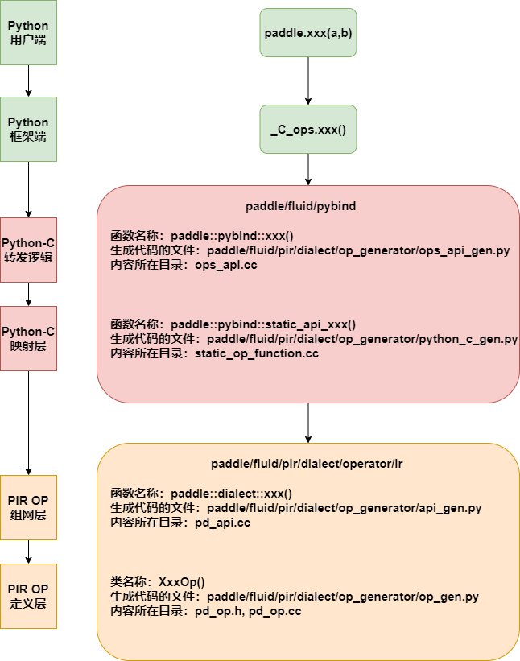

# 从 CodeGen 视角看 PIR 组网 API
> 阅读本文你将了解：
> - PIR 组网 API，从 Python 到 C++ 的调用层次
> - PIR 组网 API 的代码自动生成

## 1. Introduction

### 1.1 作为深度学习框架，我们需要一个什么样的 API 体系？

用户侧的角度：简洁的编程前端接口，易于理解和使用；丰富和完备的函数，强的表达能力

开发者的角度：提升开发效率；降低维护成本，易于维护


### 1.2 什么是 CodeGen？

代码自动生成（Code generation）是指根据指定规范或高级描述，自动生成源代码或其他软件部件的过程。代码自动生成的目标是提高生产力，减少错误，提高软件的可维护性。代码自动生成有不同的技术，包括基于模板的代码生成、基于模型的代码生成等。代码自动生成在现代软件开发中被广泛应用，例如在神经网络、编译器、数据库等领域中都有应用。它可以大大提高软件开发的效率，同时减少人工出错的可能性。


### 1.3 为什么要在 Paddle 中引入 CodeGen？

Paddle 作为主流的深度学习框架之一，功能已经十分丰富，代码量十分庞大。为了实现更多的硬件接入 Paddle 体系，也开放给第三方的硬件平台修改 Paddle 主框架的权限，与此同时也增加了框架的维护成本。鉴于此，引入CodeGen 来解决这些问题。CodeGen 能够给 paddle 带来以下收益：

1. 减少框架代码量：相关代码通过简单的 yaml 文件和 Python 脚本在编译阶段(或构建阶段)自动生成，大大减少了 Paddle 的可见代码量；
2. 降低开发成本：如果要进一步往 Paddle 中增加新的算子，只需要配置 yaml 文件、添加对应的 Kernel 文件和Python 端接口代码，即可完成添加；
3. 实现 Op 定义统一，降低维护成本：通过固定的机制来生成相关代码，规范了代码添加规则，降低框架维护升级成本。

对于 PIR 的组网 API 来说，引入 CodeGen 可以根据配置文件，方便地生成：

1. PIR Pyhon-C 转发逻辑 API 生成与 pybind 绑定（`ops_api.cc`）
2. PIR Python-C API 生成（`static_op_function.cc`, `static_op_function.h`）
3. PIR 静态图组网接口（`pd_api.cc`, `pd_api.h`）
4. PaddleDialect 的 Op 声明和实现（`pd_op.cc`, `pd_op.h`）

同时，依据 "**yaml 配置文件 + Python 脚本**" 的范式设计自动生成相关代码，提升了代码的可维护性


### 1.4 Paddle 内现存的 CodeGen

> 摘自 [Paddle 代码自动生成机制讲解](https://github.com/PaddlePaddle/community/blob/master/pfcc/paddle-code-reading/code_gen/code_gen_ops.md) ，感兴趣的同学可以详细阅读

除了 PIR 外，Paddle 核心训练框架中，目前主要存在三套 CodeGen 设计体系：即动态图、静态图、旧动态图，但旧动态图在完全退场后，旧动态图的CodeGen体系也预计会被完全清除。

<p align="center">

</p>


## 2. PIR 组网 API 调用逻辑 (From Python To Cpp)

### 2.1 在 Python 端对 PIR 进行静态图组网

我们可以把静态图组网抽象理解为：构造 program，然后向 program 的 block 里面不断地添加指定的 op

组网代码样例：

```python
import paddle

paddle.enable_static()		# paddle 默认为动态图, 所以此处需要显式地开启静态图模式
with paddle.pir_utils.IrGuard():	# <---------- 使用 IrGuard 切换至 pir 模式
    main_program = paddle.static.Program()
    startup_program = paddle.static.Program()
    # 指定向哪对 main_program 和 startup_program 里添加 op
    with paddle.static.program_guard(main_program=main_program, startup_program=startup_program):
        x = paddle.static.data('x', [5, 2], dtype='float32')	# <---- 添加 data op
        out = paddle.sum(x, axis=1, keepdim=True)    			# <---- 添加 sum op
        print(out)
        print(main_program)
```

在当前，只需要将原有的静态图组网代码，使用 `paddle.pir_utils.IrGuard()` 上下文管理器进行管理，即可切换至 PIR 模式下静态图组网。

>  `paddle.pir_utils.IrGuard()` 的作用有两个：
>
> 1. 使能 PIR 组网和执行的环境变量：`FLAGS_enable_pir_api`, `FLAGS_enable_pir_in_executor`
> 2. 替换旧静态图下的相关函数：如 `paddle.static.Program` 替换为 `paddle.pir.Program`

通过输出可以看到 PIR 组网结果

```bash
# out:
OpResult(define_op_name=pd_op.sum, index=0, dtype=pd_op.tensor<5x1xf32>, stop_gradient=True)

# main_program:
{
 (%0) = "pd_op.data" () {dtype:(pd_op.DataType)float32,name:"x",place:(pd_op.Place)Place(undefined:0),shape:(pd_op.IntArray)[5,2],stop_gradient:[true]} : () -> pd_op.tensor<5x2xf32>
 (%1) = "pd_op.full_int_array" () {dtype:(pd_op.DataType)int64,place:(pd_op.Place)Place(cpu),stop_gradient:[true],value:[(Int64)1]} : () -> pd_op.tensor<1xi64>
 (%2) = "pd_op.sum" (%0, %1) {dtype:(pd_op.DataType)Undefined,keepdim:true,stop_gradient:[true]} : (pd_op.tensor<5x2xf32>, pd_op.tensor<1xi64>) -> pd_op.tensor<5x1xf32>
}
```


### 2.2 API 调用层次

当我们在静态图的 PIR 模式下，使用 python 调用组网 API `paddle.sum` 时，自顶 (python) 到下 (C++) 发生了如下调用：

<p align="center">

</p>


#### 2.2.1 Python API 侧

可以在 `paddle.sum` api 源码里看到，`paddle.sum` 会调用 `_C_ops.sum`：

```python
# python/paddle/tensor/math.py
def sum(x, axis=None, dtype=None, keepdim=False, name=None):
    # ...
    
    if in_dynamic_or_pir_mode():	# <------ 动态图和 pir 构图分支
        return _C_ops.sum(x, axis, dtype, keepdim)
    else:							# <------ 旧静态图构图分支
	    # ...
        helper = LayerHelper('sum', **locals())
        if dtype_flag:
            out = helper.create_variable_for_type_inference(dtype=dtype)
        else:
            out = helper.create_variable_for_type_inference(dtype=x.dtype)
        helper.append_op(
            type='reduce_sum',
            inputs={'X': x},
            outputs={'Out': out},
            attrs=attrs,
        )
        return out    
```

可以看到 pir 构图与动态图共用一个判断分支，pir 的构图逻辑已经下沉到 C++ 的 Python-C 转发逻辑

那么，Python-C 转发逻辑 `sum` 是如何和 Python API 侧的 `_C_ops.sum` 做绑定的？

1. 首先 `_C_ops.sum` 里的 `_C_ops` 是 paddle 包中的一个子模块，`_C_ops` 里的 `__all__`变量是该子模块的所有内容：

   ```python
   # python/paddle/_C_ops.py
   from paddle.base import core
   
   __all__ = []
   
   
   for name in dir(core.eager.ops):	# <-------- 动态图专用 api
       globals()[name] = getattr(core.eager.ops, name)
       __all__.append(name)
   
   for name in dir(core.pir.ops):		# <-------- Python-C 转发 api, 大部分是动静统一的
       globals()[name] = getattr(core.pir.ops, name)
       if name not in __all__:
           __all__.append(name)
   ```

2. `core.pir.ops` 是 pybind 的 module，是在 `paddle/fluid/pybind/pir.cc` 里做了绑定

   ```C++
   // paddle/fluid/pybind/pir.cc
   void BindPir(pybind11::module *module) {
     auto ir_module = module->def_submodule("pir");
     // 绑定其他的 Module ... 
     auto ops_modules = ir_module.def_submodule("ops");
     BindOpsAPI(&ops_modules);
     // 绑定其他的 Module ... 
   }
   ```

3. `BindOpsAPI` 是将 CodeGen 和手写的 Python-C 转发 api 都绑定到 ops_modules 里

   ```c++
   // paddle/fluid/pybind/ops_api.cc
   void BindOpsAPI(pybind11::module *module) {
     if (PyModule_AddFunctions(module->ptr(), OpsAPI) < 0) {	// <----- 绑定 CodeGen 的 api
       PADDLE_THROW(phi::errors::Fatal("Add C++ api to core.ops failed!"));
     }
     if (PyModule_AddFunctions(module->ptr(), ManualOpsAPI) < 0) {	// <----- 绑定手写的 api
       PADDLE_THROW(phi::errors::Fatal("Add C++ api to core.ops failed!"));
     }
   }
   ```

4. `OpsAPI` 为一组函数声明，需要按照 `PyModule_AddFunctions` 函数的要求进行声明

   ```c++
   // paddle/fluid/pybind/ops_api.cc
   static PyMethodDef OpsAPI[] = {
   
   {"abs", (PyCFunction)(void (*)(void))abs, METH_VARARGS | METH_KEYWORDS, "C++ interface function for abs."},
   {"abs_", (PyCFunction)(void (*)(void))abs_, METH_VARARGS | METH_KEYWORDS, "C++ interface function for abs_."},
   {"accuracy", (PyCFunction)(void (*)(void))accuracy, METH_VARARGS | METH_KEYWORDS, "C++ interface function for accuracy."},
   {"acos", (PyCFunction)(void (*)(void))acos, METH_VARARGS | METH_KEYWORDS, "C++ interface function for acos."},
   ...
   };
   ```

   

#### 2.2.2 Python-C 转发逻辑

在 python api 侧调用 `_C_ops.sum`，对应于由 pybind 绑定的位于 `paddle/fluid/pybind/ops_api.cc` 文件下的 C++ 函数 `static PyObject *sum(PyObject *self, PyObject *args, PyObject *kwargs)`

> 注：paddle/fluid/pybind/ops_api.cc 在 cmake 编译构建阶段产生

```c++
static PyObject *sum(PyObject *self, PyObject *args, PyObject *kwargs) {
  if (egr::Controller::Instance().GetCurrentTracer() == nullptr) {
    VLOG(6) << "Call static_api_sum";
    return static_api_sum(self, args, kwargs);		// <--------- pir 分支
  } else {
    VLOG(6) << "Call eager_api_sum";
    return eager_api_sum(self, args, kwargs);		// <--------- 动态图分支
  }
}
```

可以看到，`sum` 函数只是根据当前是否处于动态图模式，做了一个转发：如果当前不是动态图模式（即当前是 pir 模式），则进入 pir 构图的逻辑；如果当前处于动态图模式，则进入 eager 模式的构图逻辑。


#### 2.2.3 Python-C 映射层

`static_api_sum` 对 python 侧传入的参数映射成为 C++ 类型，然后进而调用 PIR 组网 API

```C++
// paddle/fluid/pybind/static_op_function.cc
PyObject *static_api_sum(PyObject *self, PyObject *args, PyObject *kwargs) {
  try {
    // Get Value from args
    PyObject *x_obj = PyTuple_GET_ITEM(args, 0);
    auto x = CastPyArg2Value(x_obj, "sum", 0);

    // Parse Attributes
    PyObject *axis_obj = PyTuple_GET_ITEM(args, 1);
    PyObject *dtype_obj = PyTuple_GET_ITEM(args, 2);
    PyObject *keepdim_obj = PyTuple_GET_ITEM(args, 3);

    // Check for mutable attrs
    pir::Value axis;

    if (PyObject_CheckIROpResult(axis_obj)) {
      axis = CastPyArg2Value(axis_obj, "sum", 1);
    } else if (PyObject_CheckIRVectorOfOpResult(axis_obj)) {
      std::vector<pir::Value> axis_tmp =
          CastPyArg2VectorOfValue(axis_obj, "sum", 1);
      axis = paddle::dialect::stack(axis_tmp, /*axis*/ 0);

    } else {
      std::vector<int64_t> axis_tmp = CastPyArg2Longs(axis_obj, "sum", 1);
      axis = paddle::dialect::full_int_array(
          axis_tmp, phi::DataType::INT64, phi::CPUPlace());
    }
    phi::DataType dtype = CastPyArg2DataTypeDirectly(dtype_obj, "sum", 2);
    bool keepdim = CastPyArg2Boolean(keepdim_obj, "sum", 3);

    // Call ir static api
    // <---------- 调用 PIR 组网 API ---------->
    auto static_api_out = paddle::dialect::sum(x, axis, dtype, keepdim);
    return ToPyObject(static_api_out);

  } catch (...) {
    ThrowExceptionToPython(std::current_exception());
    return nullptr;
  }
}

```

> 注：`paddle/fluid/pybind/static_op_function.cc` 在 cmake 编译构建阶段产生


#### 2.2.4 PIR op 组网 API

`paddle::dialect::sum` 调用 pir::Builder 的 build 函数，该函数会调用 pir::Op 的生成函数，并且插入到当前 block 中。 pir::Op 生成函数的解析在 2.2.5，插入 block 方法的解析在 2.2.6

```c++
// paddle/fluid/pir/dialect/operator/ir/pd_api.cc
pir::OpResult sum(const pir::Value& x,
                  const std::vector<int64_t>& axis,
                  phi::DataType dtype,
                  bool keepdim) {
  CheckValueDataType(x, "x", "sum");	// <--------- 输入数据类型检查
  paddle::dialect::SumOp sum_op =
      ApiBuilder::Instance().GetBuilder()->Build<paddle::dialect::SumOp>(
          x, axis, dtype, keepdim);		// <--------- 调用 pir::Op 生成函数，以及插入到当前 block 中
  return sum_op.result(0);				// <--------- 返回该 op 的 OpResult
}
```

抽象出这一层有利于提高代码的复用性。比如在组合算子中，pir 模式下就会复用 `paddle::dialect::sum` 进行组网


#### 2.2.5 pir::Op 生成函数

会调用 infer meta, 并且以此构建 `pir::Operation::Create` 的需要的 `pir::OperationArgument` 参数

```c++
// paddle/fluid/pir/dialect/operator/ir/pd_op.cc
void SumOp::Build(pir::Builder &builder, pir::OperationArgument &argument, pir::Value x_, const std::vector<int64_t>& axis, phi::DataType dtype, bool keepdim) {
  VLOG(4) << "Start build SumOp";


  // 将 axis 转换为 pir::Value
  paddle::dialect::FullIntArrayOp full_axis_op = builder.Build<paddle::dialect::FullIntArrayOp>(axis, phi::DataType::INT64, phi::CPUPlace());
  pir::OpResult axis_ = full_axis_op->result(0);
    
  // 构造输入
  std::vector<pir::Value> argument_inputs = {x_, axis_};
  argument.AddInputs(argument_inputs);

  // 构造 op 属性
  pir::Attribute attr_dtype = paddle::dialect::DataTypeAttribute::get(pir::IrContext::Instance(), dtype);
  argument.AddAttribute("dtype", attr_dtype);
  pir::Attribute attr_keepdim = pir::BoolAttribute::get(pir::IrContext::Instance(), keepdim);
  argument.AddAttribute("keepdim", attr_keepdim);

  // 构造 op 输出
  paddle::dialect::DenseTensorType x = x_.type().dyn_cast<paddle::dialect::DenseTensorType>(); (void)x;

  // 构造 dense out
  paddle::dialect::IrTensor ir_tensor_x(paddle::dialect::TransToPhiDataType(x.dtype()),
                                                      x.dims(),
                                                      x.data_layout(),
                                                      x.lod(),
                                                      x.offset());
  // infermeta 
  paddle::dialect::IrMetaTensor meta_x(&ir_tensor_x);
  paddle::dialect::IrTensor dense_out;
  paddle::dialect::IrMetaTensor meta_out(&dense_out);

  phi::SumInferMeta(meta_x, axis, dtype, keepdim, &meta_out, phi::MetaConfig(false, false));

  std::vector<pir::Type> argument_outputs;
  pir::Type out_dense_tensor_type = paddle::dialect::DenseTensorType::get(pir::IrContext::Instance(), paddle::dialect::TransToIrDataType(dense_out.dtype()), dense_out.dims(), dense_out.layout(), dense_out.lod(), dense_out.offset());
  argument_outputs.push_back(out_dense_tensor_type);
  argument.AddOutputs(argument_outputs.begin(), argument_outputs.end());
  ::pir::PassStopGradientsDefaultly(argument);

}

```


#### 2.2.6 静态图组网：PIR 组网 API 如何将 op 插入到当前的 program 的 block 中？

先回顾 2.2.4 里代码：

```c++
  paddle::dialect::SumOp sum_op =
      ApiBuilder::Instance().GetBuilder()->Build<paddle::dialect::SumOp>(
          x, axis, dtype, keepdim);
```

1. ApiBuilder::Instance().GetBuilder() ：获取 pir::Builder

2. pir::Builder::Build

   ```c++
   // paddle/pir/core/builder.h
   template <typename OpTy, typename... Args>
   OpTy Builder::Build(Args &&...args) {
     OperationArgument argument(context_->GetRegisteredOpInfo(OpTy::name()));	// <--- 实例化 OperationArgument, 该 OperationArgument 将用来 pir::Operation 的创建
     OpTy::Build(*this, argument, std::forward<Args>(args)...);	// <----  pir::Op 生成函数, 对应于 2.2.5
     Operation *op = Build(std::move(argument));		// <------- Builder::Build 函数的重载函数
     return OpTy(op);
   }
   ```

3. Builder::Build 函数的重载函数

   ```c++
   // paddle/pir/core/builder.h
   Operation *Builder::Build(OperationArgument &&argument) {
     return Insert(Operation::Create(std::move(argument)));
   }
   ```

   Operation::Create 为 Operation 实际开内存，然后返回 Operation 的所有权给 Builder::Insert 函数

4. Builder::Insert 函数

   ```c++
   // paddle/pir/core/builder.h
   Operation *Builder::Insert(Operation *op) {
     if (insertion_point_.first) {
       insertion_point_.first->insert(insertion_point_.second, op);
     } else if (forbid_insert_without_position_) {
       IR_THROW("Insertion position not set, insert failed.");
     }
     return op;
   }
   ```

   Insert 函数实际上是向插入点（Block::Iterator），插入该 op。

至此我们就完成了 SumOp 的组网。

**那么问题来了：在当前的例子中，哪里设置了 op 的初始插入点？**

在 python 侧，我们使用 `program_guard` 指定组网的 main_program 和 startup_program，`program_guard` 会调用 C++ 侧的 `set_global_program`, 进而调用 `APIBuilder` 单例的 `SetProgram` 函数，使用 `pir::builder` 的 `SetInsertionPointToEnd` 函数设置 op 的初始插入点


## 3. PIR 组网 API 代码生成逻辑

PIR 组网的执行路径中：Python-C 转发逻辑，Python-C 映射层，PIR OP 组网层，PIR OP 定义层，这些 C++ 代码基本都依赖于代码自动生成，下图分别展示了各个层级中函数代码位置和用于 CodeGen 的脚本路径

<p align="center">

</p>


### 3.1 PIR 定义和组网层生成

PIR 的 OP 定义和组网 API 层的生成执行流程如下：

<p align="center">

</p>


PIR 的 OP 定义和组网 API 层 CodeGen 执行流程类似，以下分析以 PIR OP 定义层代码生成的执行流程为例：

可以看到，yaml 文件经过 `parse_op.py` 解析后生成静态图规范格式的 yaml 文件，补充原始的yaml配置的缺省配置。解析生成的 yaml 文件会和 `op_compat.yaml` 一起输入给 op_gen.py。`op_compat.yaml` 主要功能是参数名字映射和增加原始 `ops.yaml` 中没有的信息。`op_gen.py` 会根据 `f-string` 规定的模板，生成 PIR OP 定义的具体代码。拿生成的 `pd_op.h` 文件举例，其单个 PIR OP 声明的 `f-string` 模板如下：

```python
// paddle/fluid/pir/dialect/op_generator/op_gen.py
OP_DECLARE_TEMPLATE = """
class {op_name} : public pir::Op<{op_name}{interfaces}{traits}> {{
 public:
  using Op::Op;
  static const char *name() {{ return "{dialect_op_name}"; }}
  {attribute_declare}
  static constexpr uint32_t attributes_num = {attribute_num};
  static OpInfoTuple GetOpInfo();
  static void Build({build_args});
  {build_mutable_attr_is_input}
  {build_attr_num_over_1}
  {build_mutable_attr_is_input_attr_num_over_1}
  void VerifySig();
{get_kernel_type_for_var_declare}
{parse_kernel_key_declare}
{get_inputs_and_outputs}
{exclusive_interface}
}};
"""
```

`pd_op.h` 生成的执行流程如下

1. 实例化 `op_compat.yaml` 的解析器，便于获取 op 的补充信息
2. 从 yaml 中获取所有的 op 的完整配置文件，遍历每一个 op：
   - 获取 op 的完整信息，如输入、输出和属性的名称，属性类型和属性缺省值等
   - 生成 `traits` 的列表，生成 `interfaces` 的列表
   - 构造 `exclusive_interface_str`, `op_class_name`
   - 构造 `get_kernel_type_for_var_declare_str`，`parse_kernel_key_str`
   - 构造输入输出访问器, 即 `get_inputs_and_outputs`
   - 依次构造 `build_mutable_attr_is_input`，`build_attr_num_over_1`
   - 对于含 inplace 的 op，生成 non-inplace 和 inplace 两种 op 声明
3. 写入 `pd_op.h`


### 3.2 Python-C 层的生成

PIR 的 Python-C 层的代码生成执行流程如下：

<p align="center">

</p>

对于 Python-C 映射层，在拥有了 op 完整的配置文件信息后，我们就可以将 `PyObject *args` 和 `PyObject *kwargs` 映射成正确的 C++ 类型。

对于 Python-C 转发层，以白名单列表的方式控制代码生成。具体来说，控制逻辑如下：

1. 不生成 Python-C 转发接口函数的情况：

   * op 不在 `ops.parsed.yaml` 和 `op_compat.yaml` 这些配置文件中

   - op 的 infer meta 函数不存在且 op_name 不在 `PD_MANUAL_OP_LIST` 名单中
   - op_name 在 `PD_MANUAL_API_LIST` 名单中
   - op_name 以 \_grad, \_grad\_, xpu 结尾
   - op_name 在 `NO_NEED_GEN_STATIC_ONLY_APIS` 名单中

   > `NO_NEED_GEN_STATIC_ONLY_APIS` 名单的 op 不生成 Python-C 转发接口函数的原因是：现在 python 端还没用到这几个api，所以没有生成，用到的时候应该就就会移除了

2. 只生成含有静态图分支的接口转发接口函数的情况：

   - 在 `NEED_GEN_STATIC_ONLY_APIS` 名单中

   > 这些 op 只生成含有静态图分支的接口转发接口函数的原因是：没有对应的新动态图下的 API


## 4. PIR 组网 API 推全中的一些思考

1. PIR 组网 API 的代码生成触发时机是 **cmake 构建**时期。具体可见 `paddle/fluid/pir/dialect/CMakeLists.txt`，以下是触发 `op_gen.py` 脚本的代码：

   ```cmake
   # paddle/fluid/pir/dialect/CMakeLists.txt
   execute_process(
     COMMAND
       ${PYTHON_EXECUTABLE} ${op_gen_file} --op_yaml_files ${op_yaml_files}
       --op_compat_yaml_file ${op_compat_yaml_file} --namespaces ${op_namespace}
       --dialect_name ${dialect_name} --op_def_h_file ${op_header_file_tmp}
       --op_def_cc_file ${op_source_file_tmp} --op_vjp_cc_file
       ${op_vjp_source_file_tmp})
   ```

   将 PIR 组网 API 的代码的自动生成置于 cmake 构建时期的原因是：可以在触发实际编译前，就生成包含 op 声明、定义和函数接口的完整代码文件，有效避免了并发编译时可能出现的依赖文件缺失的问题。

2. 当前的 PIR 组网，就用户的感知而言能做到无缝切换，因为在 python 用户端，用户都是调用 `paddle.xxx`。且 `_C_ops.xxx` 提供了一个动静结合的接口，使大部分 api 都能复用 python 代码，降低了迁移成本

3. 与旧 IR 组网方式相比，PIR 的组网绝大部分逻辑都下沉至 C++ 进行，包括但不限于数据类型检查，向 block 中插入 op。这样较好的避免了旧 IR 组网时 python 端和 C++ 端同步的问题。同时大多数 C++ 代码都可以通过配置文件的方式，通过 CodeGen 脚本生成，提升了开发效率，也使得维护成本大大降低。

4. Python 中的 f-string 和 Jinja 模板都是用于字符串格式化的工具。
  - f-string 的语法简单明了，可以轻松控制字符串的显示方式，但是当表达式变得复杂时，可能会降低代码的可读性。当前 PIR 相关的代码自动生成采用 f-string 作为模板。
  - 而当前 paddle 框架里的旧静态图使用了 [Jinja](https://jinja.palletsprojects.com/en/3.1.x/) 作为生成模板，Jinja 模板具有丰富的控制结构（如条件语句、循环等），可以较轻松处理复杂的字符串生成逻辑，也可以自定义过滤器和函数，可以方便地扩展其功能。
  - 后续可以考虑使用 jinja 模板进行 PIR 的代码自动生成，进一步获取 CodeGen 的拓展性和可维护性的优势。


---

参考资料：

\[1\]: https://github.com/PaddlePaddle/community/blob/master/pfcc/paddle-code-reading/code_gen/code_gen_ops.md

\[2\]: https://github.com/PaddlePaddle/Paddle/issues/56849