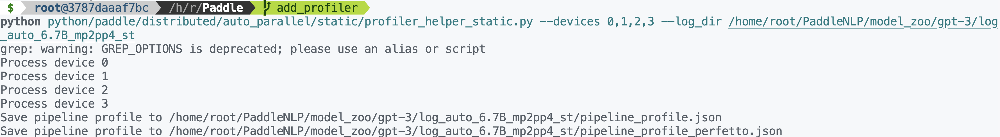
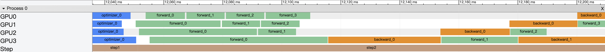

# 可视化静态图自动并行时序图工具使用手册

由于当下大模型的训练时间较长，分布式训练时序图的可视化对于调试和分析模型的训练过程非常重要。当下没有工具能够直接给出各个GPU设备上不同Job的运行区间，本可视化工具用来实现这个功能。

本工具使用分为两步，第一步为生成时序图数据，第二步为使用python脚本可视化时序图。

## 1. 生成时序图数据

本工具将可视化功能集成到了命令行参数中，以下以PaddleNLP中的使用样例：

```bash
log_dir=log_auto_1.3B_st
rm -rf $log_dir
 
export FLAGS_embedding_deterministic=1
export FLAGS_cudnn_deterministic=1

nsys profile --stats=true -t cuda,nvtx -o 1.3B_st --capture-range=cudaProfilerApi --force-overwrite true \
python -m paddle.distributed.launch --log_dir $log_dir --devices "0,1,2,3" \
         ./tools/auto.py \
         -c ./ppfleetx/configs/nlp/gpt/auto/pretrain_gpt_1.3B_dp8.yaml \
         -o Global.local_batch_size=4 \
         -o Global.micro_batch_size=1 \
         -o Engine.max_steps=50 \
         -o Engine.logging_freq=10 \
         -o Engine.eval_freq=100 \
         -o Engine.save_load.save_steps=1000 \
         -o Model.use_recompute=False \
         -o Model.hidden_dropout_prob=0 \
         -o Model.attention_probs_dropout_prob=0 \
         -o Model.hidden_size=1024 \
         -o Distributed.pipeline.schedule_mode=1F1B \
         -o Distributed.pipeline.auto_parallel_profiler=1 \
         -o Distributed.dp_degree=1 \
         -o Distributed.mp_degree=1 \
         -o Distributed.pp_degree=4 \
         -o Distributed.sharding.sharding_degree=1 \
         -o Distributed.sharding.sharding_stage=1 \
         -o Profiler_auto.memory_stats=True \
         -o Engine.verbose=3 \
         -o Model.hidden_dropout_prob=0 \
         -o Model.attention_probs_dropout_prob=0 \
         -o Profiler_auto.nvprof_start=0 \
         -o Profiler_auto.nvprof_end=5 \
```

其中 `Distributed.pipeline.auto_parallel_profiler=1` 为启动可视化功能的命令行参数。你可以使用 `Profiler_auto.nvprof_start` 和 `Profiler_auto.nvprof_end` 来控制可视化的时间区间。

在训练结束后，会在 `log_dir` 目录下生成每个设备的时序图数据，存储在 workerlog.0, workerlog.1, workerlog.2, workerlog.3 中。

## 2. 可视化时序图

在 Paddle 目录下有一个 `python/paddle/distributed/auto_parallel/static/profiler_helper_static.py` 脚本，用来可视化时序图。使用方法如下：

```bash
python python/paddle/distributed/auto_parallel/static/profiler_helper_static.py --devices 0,1,2,3 --log_dir /home/root/PaddleNLP/model_zoo/gpt-3/log_auto_1.3B_st
```

其中 `--devices` 为需要可视化的设备，`--log_dir` 为时序图数据所在的目录。

  

脚本会生成 `Chrome tracing` 格式的文件，可以使用 Chrome 浏览器打开，也可以使用 [perfetto](https://ui.perfetto.dev/) 打开 `pipeline_profile_perfetto.json`。perfetto 提供了更好看的界面以及更流畅的体验，更推荐使用。

perfetto 可视化效果如下：

  

Chrome Tracing 可视化效果如下：

  


## 3. 多机环境下的可视化

由于多机环境下，每个设备的时序图数据会分别存储在不同的机器上，因此需要将时序图数据收集到一台机器上，再进行可视化。请用户在每台机器上运行训练命令，然后将每台机器上的时序图数据按照如下方式放在一台机器上：

```
log_dir
    - m0
        - workerlog.0
        - workerlog.1
        - workerlog.2
        - workerlog.3
    - m1
        - workerlog.0
        - workerlog.1
        - workerlog.2
        - workerlog.3
    ...
```

然后在任意一台机器上运行可视化脚本并指定 `--log_dir` 参数为 `log_dir` 目录以及开启 `--multi_machine` 参数即可。

```bash
python python/paddle/distributed/auto_parallel/static/profiler_helper_static.py --devices 0,1,2,3 --log_dir $log_dir --multi_machine
```


