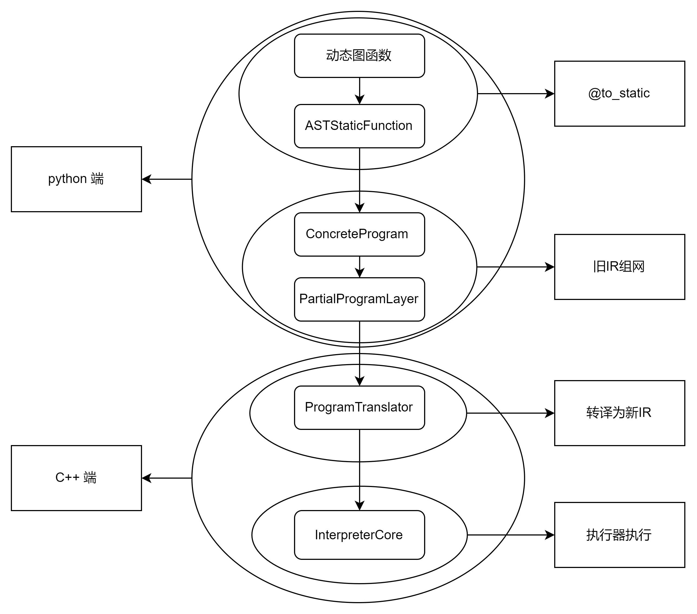

目前我们通过动态图组网 -> AST翻译 -> 静态图表示 -> ProgramTranslator -> 新IR下的静态图表示 -> NewIRInterpreter 这样的路径支持了在新IR下飞桨的动转静功能。

一 、 python 端流程

1. paddle.jit.to_static 将函数转换为 StaticFunction 类（这里主要介绍 ASTStaticFunction）
```
import paddle

def f(x):
   return 2*x+3
f = paddle.jit.to_static(f) # f 此时是 ASTStaticFunction 对象。
```

2. ASTStaticFunction 的 __call__ 函数会调用 _perform_call 函数
```
x = paddle.to_tensor([1,2,3])
f(x) # <- 调用 _perform_call 函数
```
在调用 _perform_call 时通过 self.get_concrete_program 生成 ConcreteProgram 和 PartialProgramLayer,
```
 def _perform_call(self, *args, **kwargs):
     # 1. trace ops from dygraph layers and cache the generated program.
     // ...
     try:
         concrete_program, partial_program_layer = self.get_concrete_program(
             *args, **kwargs, is_train=self._is_train_mode()
         )
         # 2. synchronize self.training attribute.
         // ...

         # 3. return outputs.
         try:
             return partial_program_layer(args)
         except Exception as e:
             // ...
     except Exception as e:
         // ...
```

3. 在 self.get_concrete_program 中，
ASTStaticFuntion 的 ProgramCache 用以缓存生成的 ConcreteProgram 和 PartialProgramLayer，存储的键即为 CacheKey
```    
def get_concrete_program(self, *args, **kwargs):
 // ...
 # 1. unify args/kwargs and replace Tensor with InputSpec
 // ...

 // 得到Input_Spec"占位符"
 (
     input_args_with_spec,
     input_kwargs_with_spec,
 ) = self._function_spec.args_to_input_spec(args, kwargs)

 # 2. generate cache key
 cache_key = CacheKey(
     self._function_spec,
     input_args_with_spec,
     input_kwargs_with_spec,
     self._class_instance,
     **self._kwargs,
     with_hook=with_hook,
     is_train=is_train,
 )

  # 3. check whether hit the cache or build a new program for the input arguments
  concrete_program, partial_program_layer = self._program_cache[
      cache_key
  ]
 return concrete_program, partial_program_layer
```
在 ProgramCache 的 __getitem__ 函数中，如果 CacheKey 没有命中的话，则调用 _build_once 来构造 ConcreteProgram 和 PartialProgramLayer
```
 def _build_once(self, cache_key):
     // ...
     try:
         concrete_program = ConcreteProgram.from_func_spec(
             func_spec=cache_key.function_spec,
             input_spec=cache_key.input_args_with_spec,
             input_kwargs_spec=cache_key.input_kwargs_with_spec,
             class_instance=cache_key.class_instance,
             **cache_key.kwargs,
         )
     except Exception as e:
         // ...
         else:
             raise

     partial_program = partial_program_from(
         concrete_program, cache_key.class_instance is not None
     )
     // ...
     return concrete_program, partial_program
```
4. ConcreteProgram 主要负责组网阶段，首先将原本的动态图代码转为抽象语法树（AST），可以通过对树的节点进行替换或修改，将动态图代码改为符合静态图执行的代码，

同时组网阶段并不读入实际数据，所以在静态图中还需要一种特殊的变量来表示输入数据，一般称为“占位符”，动转静提供了 InputSpec 接口配置该“占位符”，用于表示输入数据的描述信息。
并以此作为编译期的 InferShape 推导起点，即用于推导输出 Tensor 的 shape。
```
 def from_func_spec(
     func_spec, input_spec, input_kwargs_spec, class_instance, **kwargs
 ):
     # Transforms dygraph function into static function and caches it.
     dygraph_function = func_spec.dygraph_function
     static_func = convert_to_static(dygraph_function)  # <- AST 转写为静态图代码
     
     main_program, startup_program = framework.Program(), framework.Program()
      
     // 组网过程
     with framework.program_guard(main_program, startup_program):
         with _to_static_mode_guard_(is_to_static=True), UniqueNameGuard(
             new_name_generator
         ):
             # 1. Adds `paddle.static.data` layers for input if needed
             static_inputs = func_spec.to_static_inputs_with_spec(
                 input_spec, main_program
             )
             _kwargs = func_spec.to_static_inputs_with_spec(
                 input_kwargs_spec, main_program
             )

             # 2. Builds program only once and returns the output Variables.
             with param_guard(
                 get_parameters(class_instance, False)
             ), param_guard(get_buffers(class_instance, False)):
                 try:
                     if _kwargs:
                         outputs = static_func(*inputs, **_kwargs) 
                     else:
                         outputs = static_func(*inputs) <- 组网过程，将其中的 OP 加入到 startup_program 和 main_program 中。
                 except BaseException as e:
                     // ...

             # 3. Gets all ParamBases and buffered VarBases in the function
             all_parameters_and_buffers = (
                 ProgramTranslator.get_instance()._params_recorder.pop(
                     main_program
                 )
             )

             if outputs is not None:
                 need_wrap_into_list = (
                     not isinstance(outputs, (tuple, list))
                     or len(outputs) == 1
                 )
                 if need_wrap_into_list:
                     outputs = [outputs]

     main_program = update_op_callstack_with_origin_info(main_program)

     return ConcreteProgram(
         inputs=static_inputs,
         outputs=outputs,
         parameters=all_parameters_and_buffers,
         function=dygraph_function,
         name_generator=new_name_generator,
         main_program=main_program,
         startup_program=startup_program,
         **kwargs,
     )

```
5. Partial Program Layer 主要是负责实际 Program 的运行，与其余动态图的部分进行组合。 他是由 ConcreteProgram 创建得到的。
如果是训练的阶段，会同时创建前反向的 program，以此在后面的过程中可以创建反向的节点。在旧IR下，创建program时还会进行 inplace pass 对program进行优化。但我们在后面还会对旧 IR 进行转译，因此这里就不会进行inplace pass
PartialProgramLayer 的 __call__ 函数内的 _legacy_C_ops.run_program 来调用 C++ 端具体执行计算.
```
 def __call__(self, inputs):
     with UniqueNameGuard(self._name_generator):
         in_vars, out_vars, in_var_names = self._prepare(inputs)
         self._cast_fp16_if_pure_fp16(in_vars)
         attrs = self._prepare_attributes()
         attrs.extend(["x_names", in_var_names])

         self._sync_lr_value_with_scheduler()

         with tensor_name_guard(in_vars, in_var_names):
             _legacy_C_ops.run_program(
                 self._valid_vars(in_vars),
                 self._valid_vars(self._params),
                 self._valid_vars(out_vars),
                 self._create_scope_vec(
                     program_id=self.program_id, use_scope_cache=True
                 ),
                 self._double_grads,
                 self._cuda_graph_vec,
                 *attrs
             )

         self._update_stop_gradient(out_vars)
         restored_nest_out = self._restore_out(out_vars)
         return self._remove_no_value(restored_nest_out)
```
二、C++ 端流程

1. _legacy_C_ops.run_program 绑定在 eager_legacy_custom_python_api.h文件中 的 eager_api_run_program
将从 python 端传入的参数全部转为 C++ 端的变量
```
static PyObject *eager_api_run_program(PyObject *self,  // TOREMOVE
                                       PyObject *args,
                                       PyObject *kwargs) {
  PyThreadState *tstate = nullptr;
  try {
    // 获取参数以及映射关系。
    auto X = GetTensorListFromArgs("run_program", "X", args, 0, true);
    auto Params = GetTensorListFromArgs("run_program", "Params", args, 1, true);
    auto Out = GetTensorPtrListFromArgs("run_program", "Out", args, 2, true);
    auto OutScope =
        GetScopePtrListFromArgs("run_program", "OutScope", args, 3, false);
    auto DOut = GetTensorPtrListFromArgs("run_program", "DOut", args, 4, true);
    framework::AttributeMap attrs;
    // TODO(zengjinle): support CUDA Graph on eager mode
    ConstructAttrMapFromPyArgs(
        "run_program", args, 6, PyTuple_GET_SIZE(args), attrs);

    tstate = PyEval_SaveThread();
    run_program_ad_func(X, Params, Out, OutScope, DOut, attrs); <- 执行前向计算
    PyEval_RestoreThread(tstate);
    tstate = nullptr;
    Py_RETURN_NONE;
  } catch (paddle::platform::EnforceNotMet &exception) {
    // ...
    return nullptr;
  } catch (...) {
    // ...
    return nullptr;
  }
}
```

2. run_program_ad_func

确认需要计算梯度的参数信息，并在之后生成需要反向节点的信息。将 tensor 在内存中转为连续，调用 RunProgramAPI

```
inline void run_program_ad_func(
    const std::vector<paddle::Tensor>& x,
    const std::vector<paddle::Tensor>& params,
    std::vector<paddle::Tensor*>& out,                   // NOLINT
    std::vector<paddle::framework::Scope*>& step_scope,  // NOLINT
    std::vector<paddle::Tensor*>& dout,                  // NOLINT
    const paddle::framework::AttributeMap& attrs) {
  // Prepare Autograd Meta
  // ...

  VLOG(2) << "start run run_program with require_any_grad = "
          << require_any_grad;
  auto x_tmp = Trans2ContiguousTensors(x);
  auto params_tmp = Trans2ContiguousTensors(params);
  // Call forward function
  // if require_any_grad is False, don't save any middle vars.
  RunProgramAPI(
      x_tmp, params_tmp, out, step_scope, dout, require_any_grad, attrs); // <- 具体计算的API
  
  // 生成反向计算的 grad_node 以接入动态图中。
  VLOG(2) << "start run run_program grad";
  // ...
  }
}
```

3. RunProgramAPI 
这里主要通过 ConstructFowardIrProgram 实现 旧 IR 到新 IR 下的切换。
```
inline void RunProgramAPI(
    const std::vector<paddle::Tensor> &x,
    const std::vector<paddle::Tensor> &params,
    std::vector<paddle::Tensor *> &out,                   // NOLINT
    std::vector<paddle::framework::Scope *> &step_scope,  // NOLINT
    std::vector<paddle::Tensor *> &dout,                  // NOLINT
    bool require_any_grad,
    const paddle::framework::AttributeMap &attrs) {

  // prepare input, output, params, forward program, backward program, etc.
  // ...

  auto &interpretercore_info_cache =
      paddle::framework::InterpreterCoreInfoCache::Instance(); <- 生成执行器缓存
  std::shared_ptr<paddle::framework::InterpreterCore> interpreter_core =
      nullptr;
  if (!interpretercore_info_cache.Has(
          program_id, global_inner_scope, /*is_grad=*/false)) {

    // Step 1. share input_vars & parameters into scope
    // ...
    
    // Step 2. create new interpretercore
    if (FLAGS_enable_new_ir_in_executor) {
      // 转译旧 IR 
      auto ir_program =
          paddle::framework::ConstructFowardIrProgram(forward_global_block,
                                                      backward_global_block,
                                                      output_names,
                                                      x,
                                                      input_names,
                                                      params,
                                                      place);
      interpreter_core =
          paddle::framework::CreateNewIRInterpreterCoreInfoToCache(
              std::move(ir_program),
              place,
              /*is_grad=*/false,
              program_id,
              global_inner_scope);
    } else {
      // ...
    }
    
    // Step 3. get all eager gc vars
    // ...
    
  } else {
    //执行器缓存命中部分代码
    // ...
  }

  // interpretercore run
  if (forward_global_block->OpSize() > 0) {
    paddle::platform::RecordEvent record_event(
        "interpreter_core_run",
        paddle::platform::TracerEventType::UserDefined,
        1);
    interpreter_core->Run({});
  }
  // ...
}
```

4. ConstructFowardIrProgram 即 program translate 翻译旧 IR 到 新 IR
* GetParameter
GetParameterOp 的作用是读取 Program 的某个权重，作为后续 Op 的输入，一般出现在 main_program 翻译后的结果中。
main_program 中的可训练参数原本作为 Block 的 Var 出现，但是并没有 Op 定义，因此需要通过插入 GetParameterOp 来满足新 IR 下 SSA 的要求。
在动转静下用到的 dataOp 可以看作是 GetParameterOp。
* SetParameter
执行 SetParameterOp 的作用相反，它得到某个 Op 的输入并将其保存到权重中去 ( 注意到 Program 中 parameter 会持有一块内存地址 ) 。
一般出现在 startup_program 的翻译结果中，在执行完权重初始化过程中，需要将其保存到 program 中以供下一次执行时使用。
* TranslateBlock
Block 内是包含 op_desc。 因此，会再使用 OpTranslator 来负责 Op 的转换。一般的算子都可以通过通用规则来进行翻译，但是对于一些情况特殊的案例，则使用 OpTranscriber 来进行处理。

PdOpLowerToKernelPass 的过程会通过 datatype，place，Layout 等信息来选择不同的 kernel，并且将这些 kernel 信息记录到 Op 中。
```
std::unique_ptr<::pir::Program> ConstructFowardIrProgram(
    const paddle::framework::BlockDesc *forward_global_block,
    const paddle::framework::BlockDesc *backward_global_block,
    const std::vector<std::string> &output_names,
    const std::vector<paddle::Tensor> &x,
    const std::vector<std::string> &x_names,
    const std::vector<paddle::Tensor> &params,
    const phi::Place &place) {
  auto ir_ctx = ::pir::IrContext::Instance();
  auto program = std::make_unique<::pir::Program>(ir_ctx);

  std::set<std::string> set_output_names;
  auto local_program =
      paddle::framework::ProgramDesc(*(forward_global_block->Program()));

  // add data op to program <- 为符合 SSA 原则，在旧 IR 中添加相关 OP 以方便转译。
  // ...
  paddle::translator::ProgramTranslator program_translator(&local_program,
                                                           program.get());

  program_translator.Translate(); <- 完成转译

  auto ir_res = paddle::dialect::PdOpLowerToKernelPass(program.get(), place); <- 将 IR 中的算子 Lower 到 Kernl 层上，其中增加记录了选择的 kernel 的信息。

  if (FLAGS_new_ir_apply_inplace_pass) {
    ::pir::PassManager pm(::pir::IrContext::Instance(), 3);
    pm.AddPass(::pir::CreateInplacePass());
    pm.Run(ir_res.get());
  }

  return ir_res;
}
```

5. NewIRInterpretorCore 执行器

1. 预分析阶段

创建 Scope、Instruction （缓存 kernel context, device context ）等执行的信息。

预分析，Instruction 之间的依赖关系，分析变量生命周期，确定在op执行结束后需要检查哪些变量的引用计数
以及是否使用多线程执行等信息。

2. 调度执行阶段, multithread version 多线程调度执行

调度后继op，将其加入到对应类型的线程池中

执行算子

回收变量

对于跨流的特殊处理
```
FetchList NewIRInterpreter::Run(const std::vector<std::string>& feed_names,
                                bool need_fetch) {
  SetDeviceId(place_);
  CheckCUDAGraphBeforeRun(feed_names);

#ifdef PADDLE_WITH_DNNL
  platform::AttachPointerHashToMKLDNNKey(this, place_);
#endif
  if (!is_build_) {
     ::pir::BuildScope(*ir_block_,
                      InnerScope(),
                      ss.str(),
                      &value_2_var_name_,
                      &variable_2_var_name_,
                      &var_name_2_id_,
                      &variable_list_,
                      &sub_blocks_);

    interpreter::BuildId2VarName(var_name_2_id_, &id_2_var_name_);
    SolvePersisableVarNames();

    BuildInstruction();

    PreAnalysis();

    // Run
    if (FLAGS_enable_new_ir_in_executor_trace_run || nccl_op_num_ > 1 ||
        ((execution_config_.used_for_jit || execution_config_.used_for_cinn) &&
         (sync_op_num_ == 0))) {
      LOG_FIRST_N(INFO, 1) << "New ir interpreter is running in BetaRun mode "
                              "with trace version.";
      TraceRunImpl(); <- 顺序执行
    } else {
      LOG_FIRST_N(INFO, 1) << "New ir interpreter is running in BetaRun mode "
                              "with multi thread version.";
      MultiThreadRunImpl(); <- 多线程执行
    }

    is_build_ = true;
    is_shared_results_build_ = true;
  } else {
    if (FLAGS_enable_new_ir_in_executor_trace_run || nccl_op_num_ > 1 ||
        ((execution_config_.used_for_jit || execution_config_.used_for_cinn) &&
         (sync_op_num_ == 0))) {
      TraceRunImpl();
    } else {
      MultiThreadRunImpl();
    }
  }

  if (HasLocalScope()) {
    ClearLoDTensorArrayInLocalScope();
  }
  // return Fetch Tensors
  Scope* inner_scope = InnerScope();
  if (FLAGS_enable_new_ir_in_executor) {
    framework::FetchList fetch_res;

    if (need_fetch) {
      for (auto& var_name : fetch_var_names_) {
        auto* var = inner_scope->FindVar(var_name);
        VLOG(0) << "fetch " << var_name << "[" << var << "]";
        fetch_res.push_back(var->Get<phi::DenseTensor>());
      }
    }
    VLOG(4) << "get fetch list size: " << fetch_res.size();
    return fetch_res;
  } else {
    auto* fetch_var = inner_scope->FindVar(interpreter::kFetchVarName);
    if (fetch_var && need_fetch) {
      auto fetch_list =
          std::move(*fetch_var->GetMutable<framework::FetchList>());
#ifdef PADDLE_WITH_CUDA
      if (platform::IsCUDAGraphCapturing()) {
        PADDLE_ENFORCE_EQ(fetch_list.empty(),
                          true,
                          platform::errors::InvalidArgument(
                              "Cannot fetch data when using CUDA Graph."));
      }
#endif
      return fetch_list;
    } else {
      return {};
    }
  }
}
```

