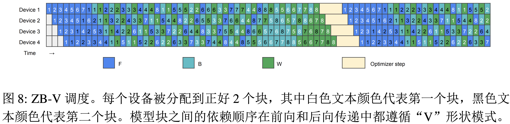

# ZB VPP 实现方案


Zero Bubble 是一种新的流水线并行策略，它是核心思想是将反向计算分为两部分，一部分计算输入的梯度，另一部分计算参数的梯度。ZB VPP 是 Zero Bubble 的 VPP 实现方案，它是一种半自动并行训练性能优化方案。为 Paddle 支持 Zero Bubble 的 Tracking issue 是 [为 Paddle 支持 Zero-Bubble 并行编排 PaddlePaddle/Paddle#62666](https://github.com/PaddlePaddle/Paddle/issues/62666)

ZB VPP 是一种根据计算图自动调度任务的并行训练方案，反向计算分为两部分 b 和 w。w 可以用于填充计算图中的空洞，以此来降低 Bubble 率。

想要实现自动调度任务，需要解决以下问题：

1. 如何将计算图分为两部分 b 和 w
2. 如何获得计算图的显存占用情况
3. 如何进行任务调度

在本设计方案中，我们暂时不考虑 ZB VPP 中的 rollback 操作。

第一个问题已经在 ZBH1 的实现中已经实现，具体见 [Tracking Issue](https://github.com/PaddlePaddle/Paddle/issues/62666)

ZB_VPP 的手动模拟结果如下图所示：

  


## 1. 如何获得计算图的显存占用情况

Zero Bubble 的 [源码](https://github.com/AndSonder/zero-bubble-pipeline-parallelism/blob/56a5ce6ee794315b851483b2d0112cea1251e0b6/megatron/core/pipeline_parallel/zb_schedules.py#L1248-L1253) 中给出的方案是通过模型的 hidden_size、num_attention_heads 和 seq_length 来估计显存占用情况。

但是 Paddle 中在进行流水并行编排的时候是不需要知道模型的具体参数的，因此我们需要通过其他方式来获得计算图的显存占用情况。一种可行的方案是根据静态图的计算图来估计显存占用情况。

Paddle 中有一个根据 program 来估计显存占用情况的工具，这个工具在 `Paddle/python/paddle/distributed/auto_parallel/static/cost/estimate_cost.py` 中。其中 `_estimate_max_memory_by_dist_op` 的实现思路是我们可以借鉴的。

## 2. 如何进行任务调度

在 ZB VPP 的官方实现中，任务调度需要在多卡视角下进行。但是 Paddle 在进行任务调度的时候是在单卡视角下进行的。现在我们有俩种方案：

1. 每张卡都重复做一遍任务调度，根据 pp_stage 确认自己的任务
2. 0 号卡做一遍任务调度，然后把调度的结果广播给其他卡

第一种方案的缺点是每张卡都需要做一遍任务调度，这样会浪费计算资源。

## 3. 任务调度的实现

编排的核心代码包含两个主要函数，一个是 `try_v_schedule`，一个是 `get_v_schedule`。

`try_v_schedule` 函数是 Zero Bubble VPP 的核心编排函数，它会尝试生成一个调度计划，`get_v_schedule` 函数则是调用 try_v_schedule 函数，尝试用不同的填充方案生成一个调度计划，最后返回最优的调度计划。

`try_v_schedule` 输入参数包括，fill_f 和 fill_b。fill_f 表示是否在 F 之后填充 w，fill_b 表示是否在 b 之后填充 w。`try_v_schedule` 会根据 fill_f 和 fill_b 的值生成一个调度计划。这个调度方案是一个二维数组，第一维表示每个 stage 的任务，第二维表示具体的任务。

在计算的过程中需要计算 bubble 率，以使用显存的等信息。在进行任务编排的时候可以参考 Zero Bubble 的源码，具体见 [Zero Bubble Pipeline Parallelism](https://github.com/AndSonder/zero-bubble-pipeline-parallelism/blob/2efcc0951fb16155cd88d3e7ed69305d1c22962d/megatron/core/pipeline_parallel/v_schedule.py#L46-L516)。ZB VPP 的编排过程是一个贪心算法，它会尝试在每个 stage 中填充 w，以此来降低 bubble 率。其大致流程如下：


```python
def try_v_schedule(fill_f, fill_b):
    # ... 初始化一些变量

    # 1. 插入F任务的chunk 0
    for i in range(self.n_stage):
        put(FORWARD, 0, i)

    # 2. 从最后一个卡开始,插入F任务的chunk 1
    for i in range(self.n_stage - 1, -1, -1):
        if i == self.n_stage - 1: # 最后一个卡直接插入F任务的chunk 1
            put(FORWARD, 1, i)  # 插入F任务的chunk 1
            continue
        tmp = end_time[self.get_id(0, 1, i + 1, 0)] + self.c_cost
        # 根据 max_mem 尽可能的插入 F 任务来降低 bubble 率
        while xxx:
            for j in range(i + 1):
                put(FORWARD, 0, j)  # 插入F任务的chunk 0
        put(FORWARD, 1, i)  # 插入F任务的chunk 1

    # 3. 插入第一个backward之前剩下的 F
    ...

    # 4. 逐步插入B和W任务,尽量填充泡沫
    for _ in range(2 * self.n_micro):
        # 4.1 检查内存,如果不够就先处理 pending_w 队列, 释放显存
        for i in range(self.n_stage):
            while mem[i] + self.fbw_mem[BACKWARD] > self.max_mem:
                assert len(pending_w[i]) > 0
                put_w(i)
        
        # Note(sonder): 这里默认也是 vpp_degree = 2，需要后续适配 vpp_degree > 2 的逻辑
        b0_ranks, b1_ranks = [], []

        # 4.2 根据条件分别将每个stage插入b0或b1列表
        for i in range(self.n_stage):
            # 如果 B 任务的 chunk 1 数量大于等于 chunk 0 数量,则插入 b0_ranks
            if count[i][3] >= count[i][2]:
                b0_ranks.append(i)
            elif i == self.n_stage - 1: # 如果是最后一个卡,则插入 b1_ranks
                b1_ranks.append(i)
            else:
                fa_id = self.get_id(1, 1, i + 1, count[i][3])
                if end_time[fa_id] >= 0 or count[i][2] >= self.n_micro:
                    b1_ranks.append(i)
                else:
                    b0_ranks.append(i)
        b_ranks = [] # B任务列表
        # Node(sonder): 为什么要先加入 b1_ranks 再加入 b0_ranks?
        # 因为 backward 依赖关系和 forward 是相反的，backward 的 chunk 0 依赖 chunk 1

        # 4.3. 先插入b1_ranks中的B任务
        # Note(sonder): 这里是倒序插入，再结合图看一下为啥是倒序插入
        for i in reversed(b1_ranks):
            b_ranks.append((i, 1)) # (stage编号, chunk编号)

        # 4.4 再插入b0_ranks中的B任务
        for i in b0_ranks:
            b_ranks.append((i, 0)) # (stage编号, chunk编号)

        # 4.5. 插入B任务,尽量填充泡沫
        # Note(sonder): 单卡视角下，一次只会插入一个 B 任务 b0/b1
        for i, _chunk_ in b_ranks: 
            ...

        # 4.6. 插入F任务,尽量填充泡沫
        # Note(sonder): 单卡视角下，一次只会插入一个 F 任务
        for i in range(self.n_stage):
            ...
            while 空隙足够大:
                put_w(i)

            if end_time[fa_id] + self.c_cost - cur_time[i] > get_max_stage_bubble(i) - stage_bubble[i] and len(pending_w[i]) > 0:
                if fill_f:
                    put_w(i) 
            # 插入F任务
            put(FORWARD, put_item, i)

    # 5. 处理掉 pending_w 队列
    for i in range(self.n_stage):
        while len(pending_w[i]) > 0:
            put_w(i)

    # 6. 计算 bubble 率 等信息
    ...
    # 7. 返回调度计划、bubble 率等信息
```


后续实现的时候可以考虑封装成多个子函数，以便于代码的可读性和可维护性。

`get_v_schedule` 函数的实现思路是遍历所有的填充方案，然后调用 `try_v_schedule` 函数，最后返回最优的填充方案。

```python
def get_v_schedule():
    best_schedule = None
    best_bubble = float('inf')
    for fill_f in [True, False]:
        for fill_b in [True, False]:
            schedule, bubble = try_v_schedule(fill_f, fill_b)
            if bubble < best_bubble:
                best_schedule = schedule
                best_bubble = bubble
    return best_schedule
```


