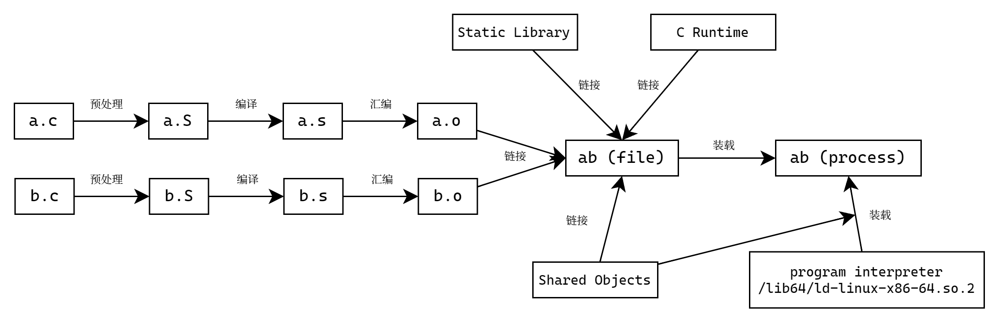
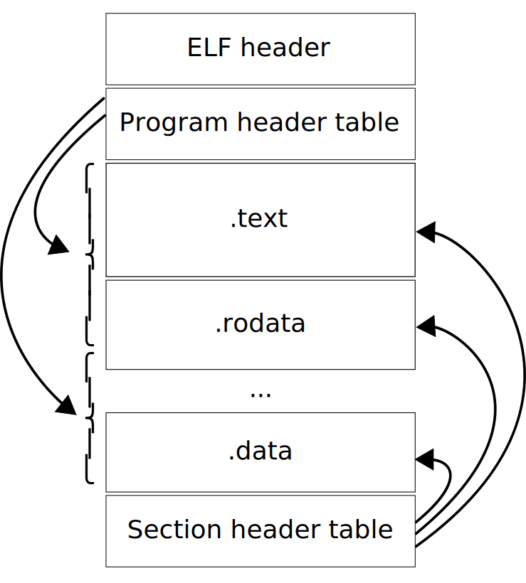
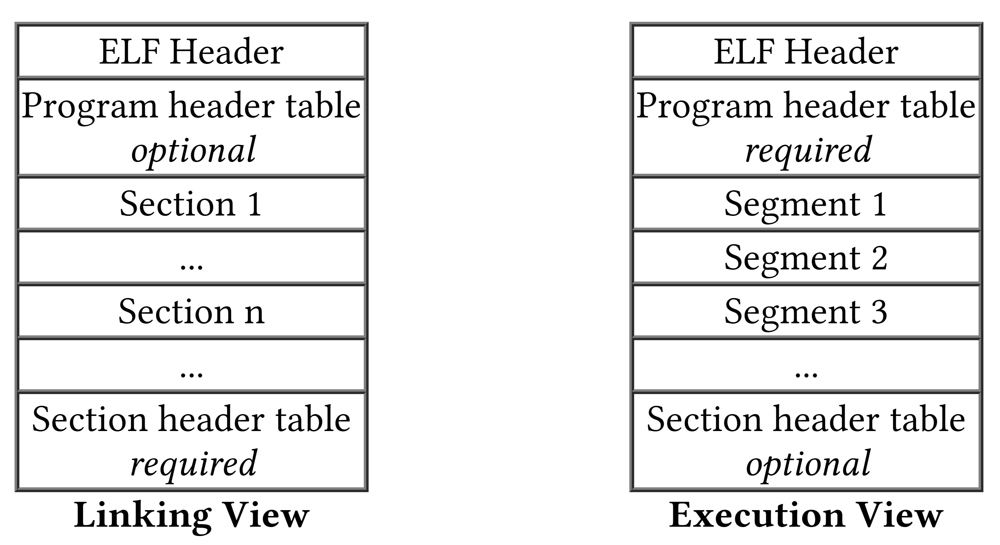
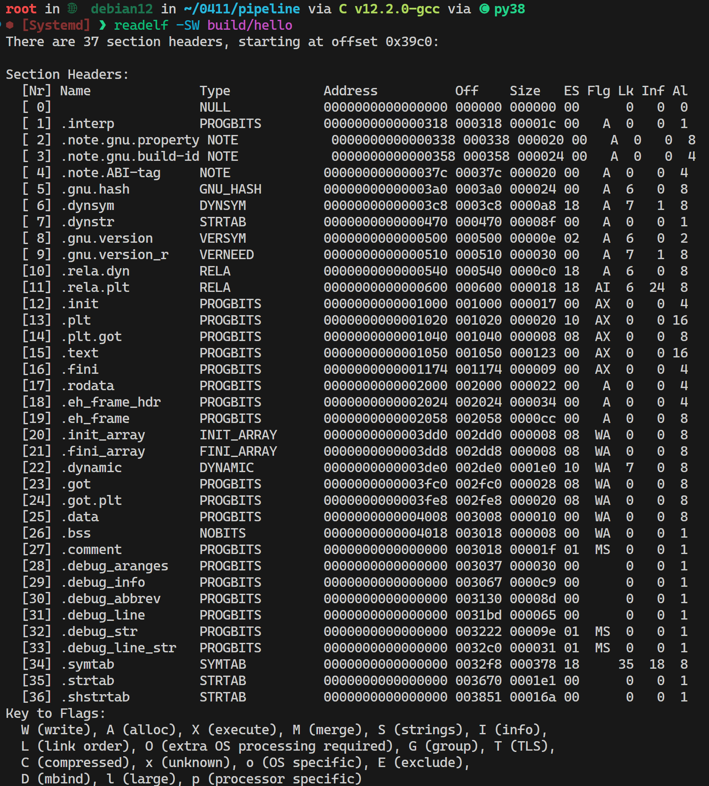
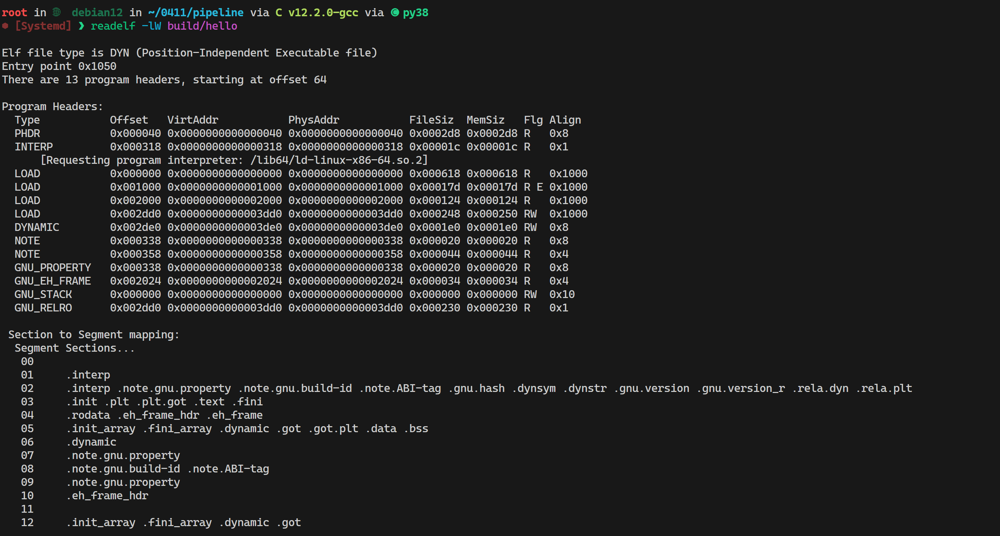
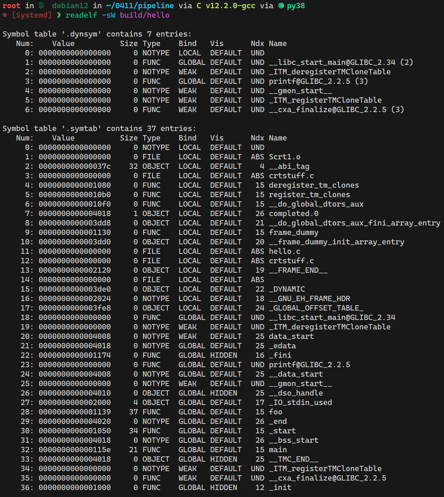
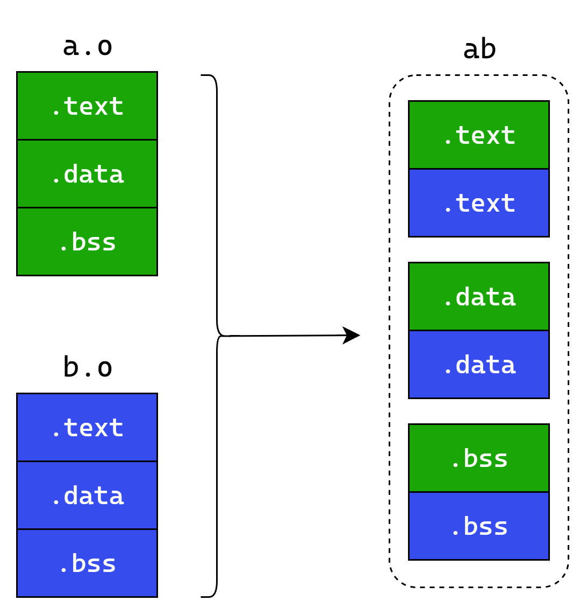

> 在编译多 CUDA 架构的 Paddle 的时候，如果 CUDA 架构数大于等于 6 个，则会出现链接错误，本文档主要解释梳理该错误的原因，以及可能的解决方法。

<details close>
<summary>报错信息</summary>

```
...
/usr/lib/gcc/x86_64-linux-gnu/12/../../../x86_64-linux-gnu/crti.o: in function `_init':
(.init+0x7): relocation truncated to fit: R_X86_64_REX_GOTPCRELX against undefined symbol `__gmon_start__'
paddle/phi/CMakeFiles/phi.dir/common/place.cc.o: in function `common::PD_Exception::~PD_Exception()':
place.cc:(.text._ZN6common12PD_ExceptionD2Ev[_ZN6common12PD_ExceptionD5Ev]+0xf): relocation truncated to fit: R_X86_64_REX_GOTPCRELX against symbol `vtable for common::PD_Exception' defined in .data.rel.ro._ZTVN6common12PD_ExceptionE[_ZTVN6common12PD_ExceptionE] section in paddle/phi/CMakeFiles/phi.dir/common/place.cc.o
paddle/phi/CMakeFiles/phi.dir/common/place.cc.o: in function `common::PD_Exception::~PD_Exception()':
place.cc:(.text._ZN6common12PD_ExceptionD0Ev[_ZN6common12PD_ExceptionD5Ev]+0xf): relocation truncated to fit: R_X86_64_REX_GOTPCRELX against symbol `vtable for common::PD_Exception' defined in .data.rel.ro._ZTVN6common12PD_ExceptionE[_ZTVN6common12PD_ExceptionE] section in paddle/phi/CMakeFiles/phi.dir/common/place.cc.o
paddle/phi/CMakeFiles/phi.dir/common/place.cc.o: in function `phi::CustomRegisteredDeviceMap::Instance()':
place.cc:(.text._ZN3phi25CustomRegisteredDeviceMap8InstanceEv+0xa): relocation truncated to fit: R_X86_64_PC32 against `.bss._ZGVZN3phi25CustomRegisteredDeviceMap8InstanceEvE30g_custom_registered_device_map'
place.cc:(.text._ZN3phi25CustomRegisteredDeviceMap8InstanceEv+0x11): relocation truncated to fit: R_X86_64_PC32 against `.bss._ZZN3phi25CustomRegisteredDeviceMap8InstanceEvE30g_custom_registered_device_map'
place.cc:(.text._ZN3phi25CustomRegisteredDeviceMap8InstanceEv+0x2b): relocation truncated to fit: R_X86_64_PC32 against `.bss._ZGVZN3phi25CustomRegisteredDeviceMap8InstanceEvE30g_custom_registered_device_map'
place.cc:(.text._ZN3phi25CustomRegisteredDeviceMap8InstanceEv+0x32): relocation truncated to fit: R_X86_64_PC32 against `.bss._ZZN3phi25CustomRegisteredDeviceMap8InstanceEvE30g_custom_registered_device_map'
place.cc:(.text._ZN3phi25CustomRegisteredDeviceMap8InstanceEv+0x54): relocation truncated to fit: R_X86_64_REX_GOTPCRELX against symbol `phi::CustomRegisteredDeviceMap::~CustomRegisteredDeviceMap()' defined in .text._ZN3phi25CustomRegisteredDeviceMapD2Ev[_ZN3phi25CustomRegisteredDeviceMapD5Ev] section in paddle/phi/CMakeFiles/phi.dir/common/place.cc.o
place.cc:(.text._ZN3phi25CustomRegisteredDeviceMap8InstanceEv+0x5b): relocation truncated to fit: R_X86_64_PC32 against `.bss._ZZN3phi25CustomRegisteredDeviceMap8InstanceEvE30g_custom_registered_device_map'
place.cc:(.text._ZN3phi25CustomRegisteredDeviceMap8InstanceEv+0x66): relocation truncated to fit: R_X86_64_PC32 against symbol `__dso_handle' defined in .data.rel.local section in /usr/lib/gcc/x86_64-linux-gnu/12/crtbeginS.o
...
```

</details>

## C/C++ 程序从源代码到二进制文件（ELF）的过程



我们常说的编译器通常指编译器套件，如 GCC，Clang。这些程序作为入口，可以自动地帮我们调用汇编器和链接器完成编译后续的步骤。

以 GCC 为例，`gcc hello.c -o hello` 就能将 `hello.c` 编译为 `hello`。在这背后，gcc 分别为我们自动调用了编译器 `cc1`、汇编器 `as`、链接器 `ld` （通常见到的 `collect2` 是 `ld` 的一个 wrapper）来完成程序的编译。在 `gcc` 命令后添加 `-v -Wl,-v` 参数即可看到详细的信息。

<details close>
<summary>GCC Verbose Mode</summary>

运行 `gcc -o build/hello -v hello.c`。

```
Using built-in specs.
COLLECT_GCC=gcc
COLLECT_LTO_WRAPPER=/usr/lib/gcc/x86_64-linux-gnu/12/lto-wrapper
OFFLOAD_TARGET_NAMES=nvptx-none:amdgcn-amdhsa
OFFLOAD_TARGET_DEFAULT=1
Target: x86_64-linux-gnu
Configured with: ../src/configure -v --with-pkgversion='Debian 12.2.0-14' --with-bugurl=file:///usr/share/doc/gcc-12/README.Bugs --enable-languages=c,ada,c++,go,d,fortran,objc,obj-c++,m2 --prefix=/usr --with-gcc-major-version-only --program-suffix=-12 --program-prefix=x86_64-linux-gnu- --enable-shared --enable-linker-build-id --libexecdir=/usr/lib --without-included-gettext --enable-threads=posix --libdir=/usr/lib --enable-nls --enable-clocale=gnu --enable-libstdcxx-debug --enable-libstdcxx-time=yes --with-default-libstdcxx-abi=new --enable-gnu-unique-object --disable-vtable-verify --enable-plugin --enable-default-pie --with-system-zlib --enable-libphobos-checking=release --with-target-system-zlib=auto --enable-objc-gc=auto --enable-multiarch --disable-werror --enable-cet --with-arch-32=i686 --with-abi=m64 --with-multilib-list=m32,m64,mx32 --enable-multilib --with-tune=generic --enable-offload-targets=nvptx-none=/build/gcc-12-bTRWOB/gcc-12-12.2.0/debian/tmp-nvptx/usr,amdgcn-amdhsa=/build/gcc-12-bTRWOB/gcc-12-12.2.0/debian/tmp-gcn/usr --enable-offload-defaulted --without-cuda-driver --enable-checking=release --build=x86_64-linux-gnu --host=x86_64-linux-gnu --target=x86_64-linux-gnu
Thread model: posix
Supported LTO compression algorithms: zlib zstd
gcc version 12.2.0 (Debian 12.2.0-14) 
COLLECT_GCC_OPTIONS='-o' 'build/hello' '-v' '-mtune=generic' '-march=x86-64' '-dumpdir' 'build/'
 /usr/lib/gcc/x86_64-linux-gnu/12/cc1 -quiet -v -imultiarch x86_64-linux-gnu hello.c -quiet -dumpdir build/ -dumpbase hello.c -dumpbase-ext .c -mtune=generic -march=x86-64 -version -fasynchronous-unwind-tables -o /tmp/cc7gXxFo.s
GNU C17 (Debian 12.2.0-14) version 12.2.0 (x86_64-linux-gnu)
        compiled by GNU C version 12.2.0, GMP version 6.2.1, MPFR version 4.1.1-p1, MPC version 1.3.1, isl version isl-0.25-GMP

warning: MPFR header version 4.1.1-p1 differs from library version 4.2.0.
GGC heuristics: --param ggc-min-expand=100 --param ggc-min-heapsize=131072
ignoring nonexistent directory "/usr/local/include/x86_64-linux-gnu"
ignoring nonexistent directory "/usr/lib/gcc/x86_64-linux-gnu/12/include-fixed"
ignoring nonexistent directory "/usr/lib/gcc/x86_64-linux-gnu/12/../../../../x86_64-linux-gnu/include"
#include "..." search starts here:
#include <...> search starts here:
 /usr/lib/gcc/x86_64-linux-gnu/12/include
 /usr/local/include
 /usr/include/x86_64-linux-gnu
 /usr/include
End of search list.
GNU C17 (Debian 12.2.0-14) version 12.2.0 (x86_64-linux-gnu)
        compiled by GNU C version 12.2.0, GMP version 6.2.1, MPFR version 4.1.1-p1, MPC version 1.3.1, isl version isl-0.25-GMP

warning: MPFR header version 4.1.1-p1 differs from library version 4.2.0.
GGC heuristics: --param ggc-min-expand=100 --param ggc-min-heapsize=131072
Compiler executable checksum: cc72d2b9b5048fedc2be9051c917b40b
COLLECT_GCC_OPTIONS='-o' 'build/hello' '-v' '-mtune=generic' '-march=x86-64' '-dumpdir' 'build/'
 as -v --64 -o /tmp/ccq7OzJg.o /tmp/cc7gXxFo.s
GNU assembler version 2.40 (x86_64-linux-gnu) using BFD version (GNU Binutils for Debian) 2.40
COMPILER_PATH=/usr/lib/gcc/x86_64-linux-gnu/12/:/usr/lib/gcc/x86_64-linux-gnu/12/:/usr/lib/gcc/x86_64-linux-gnu/:/usr/lib/gcc/x86_64-linux-gnu/12/:/usr/lib/gcc/x86_64-linux-gnu/
LIBRARY_PATH=/usr/lib/gcc/x86_64-linux-gnu/12/:/usr/lib/gcc/x86_64-linux-gnu/12/../../../x86_64-linux-gnu/:/usr/lib/gcc/x86_64-linux-gnu/12/../../../../lib/:/lib/x86_64-linux-gnu/:/lib/../lib/:/usr/lib/x86_64-linux-gnu/:/usr/lib/../lib/:/usr/lib/gcc/x86_64-linux-gnu/12/../../../:/lib/:/usr/lib/
COLLECT_GCC_OPTIONS='-o' 'build/hello' '-v' '-mtune=generic' '-march=x86-64' '-dumpdir' 'build/hello.'
 /usr/lib/gcc/x86_64-linux-gnu/12/collect2 -plugin /usr/lib/gcc/x86_64-linux-gnu/12/liblto_plugin.so -plugin-opt=/usr/lib/gcc/x86_64-linux-gnu/12/lto-wrapper -plugin-opt=-fresolution=/tmp/ccdgB1Hm.res -plugin-opt=-pass-through=-lgcc -plugin-opt=-pass-through=-lgcc_s -plugin-opt=-pass-through=-lc -plugin-opt=-pass-through=-lgcc -plugin-opt=-pass-through=-lgcc_s --build-id --eh-frame-hdr -m elf_x86_64 --hash-style=gnu --as-needed -dynamic-linker /lib64/ld-linux-x86-64.so.2 -pie -o build/hello /usr/lib/gcc/x86_64-linux-gnu/12/../../../x86_64-linux-gnu/Scrt1.o /usr/lib/gcc/x86_64-linux-gnu/12/../../../x86_64-linux-gnu/crti.o /usr/lib/gcc/x86_64-linux-gnu/12/crtbeginS.o -L/usr/lib/gcc/x86_64-linux-gnu/12 -L/usr/lib/gcc/x86_64-linux-gnu/12/../../../x86_64-linux-gnu -L/usr/lib/gcc/x86_64-linux-gnu/12/../../../../lib -L/lib/x86_64-linux-gnu -L/lib/../lib -L/usr/lib/x86_64-linux-gnu -L/usr/lib/../lib -L/usr/lib/gcc/x86_64-linux-gnu/12/../../.. /tmp/ccq7OzJg.o -lgcc --push-state --as-needed -lgcc_s --pop-state -lc -lgcc --push-state --as-needed -lgcc_s --pop-state /usr/lib/gcc/x86_64-linux-gnu/12/crtendS.o /usr/lib/gcc/x86_64-linux-gnu/12/../../../x86_64-linux-gnu/crtn.o
COLLECT_GCC_OPTIONS='-o' 'build/hello' '-v' '-mtune=generic' '-march=x86-64' '-dumpdir' 'build/hello.'
```

</details>

### 编译和汇编阶段

在编译阶段，编译器 `cc1` 读取源代码文件 `hello.c`，解析处理其中的 `#include`、`#define` 等宏语句，这一部分为预处理操作（可通过 `gcc -E hello.c -o hello.S -v` 查看）。之后，编译器将宏展开后的文件编译为汇编文件（可通过 `gcc -S hello.c -o hello.s` 查看）。

在汇编阶段，汇编器 `as` 将汇编文件 `hello.s` 转译为二进制目标文件 `hello.o`。

### 链接阶段

在链接阶段，链接器 `ld` 将多个目标文件（Object file）的 Section 合并，解析并重定位符号，将其链接为一个完整的文件。

在深入链接阶段之前，需要先说明一下 Linux/Unix 上的 ELF（Executable and Linking Format）文件格式。

## ELF 文件格式

ELF 文件主要有三种类型，它们有着相同的文件结构，只是在 Section 和 Segment 上有所差别。三种类型分别是：

- Relocatable file (.o)
- Executable file (.out)
- Shared object file (.so)



Program header table（描述 Segments）和 Section header table（描述 Sections）是对 ELF 文件的不同视角划分，在链接阶段，链接器关注的是 Section 层面，而在程序转载执行阶段，装载器关注的是 Segment 层面。



### Header

ELF 文件的前 64 Bytes 是 ELF Header，记录了一些元信息，包括 ELF 格式版本、程序入口地址、Program headers 和 Section Headers 的偏移与数量等等。

### Sections

Section 由 Section header table 描述和索引，不同的 Section 用于不同的用途。下面是一些常见的 Section 类型：

- .text：程序的代码指令部分
- .data：程序的数据部分
- .bss：程序需要初始化的全局变量
- .rela.text：程序代码部分需要重定位的符号
- .rela.data：程序数据部分需要重定位的符号
- .symtab：程序的 Symbol table，用于索引程序的 Symbol，在运行时，并不需要该 Section。
- .dyntab：程序的 Dynamic symbol table，用于在运行时加载动态链接库。



### Segments

Segment 由 Program header table 描述和索引，主要用于程序在运行的装载，指定文件偏移与内存映射。Segment 一般由多个 Section 组成。



### Symbols

Symbol 是程序汇编中的一个标记符号，一般来说，程序的函数和全局变量都是 Symbol。Symbol 分为 Global、Local、Weak 等类型。

- Global：全局符号在链接时外部可见，且不允许重名
- Local：局部符号在链接时外部不可见，且每个文件可以包含重名的局部符号
- Weak：弱符号类似于全局符号，在链接时外部可见，允许与全局符号重名，只是优先级更低。



## 文件合并与符号解析

在链接阶段，链接器整个单个或多个目标文件，解析并重定位符号，将其链接为一个完整的文件。

链接器的行为由 Linker Script 控制，链接器 `ld` 的默认 linker script 可以通过 `ld --verbose` 查看

链接器首先将各个目标文件中相同功能的 Section 合并，分配地址。



然后，链接器会查看每个目标文件的重定位符号表，在所有的输入文件中查找其中需要重定位的符号，将解析出的地址填充在相应的位置。

为了说明本文开头提到的 Paddle 编译报错的原因，我们以 `ill.c` 程序为例来演示：

```c
int foovar = 2;

int main() {
  int *bar = &foovar;
  return sizeof(bar);
}
```

在 `ill.c` 中，我们定义了一个全局变量 `foovar`，并赋值为 `2`，避免编译器将其放在 `.bss` Section，而是放在 `.data` Section。接着，在 `main` 函数中，我们取 `foovar` 的地址，保存在局部变量 `bar` 中。

编译 `ill.c` 至 `ill.o`：

```bash
gcc -c ill.c -o ill.o
```

查看 `ill.o` 的 Sections：
```
readelf -SW ill.o
```
```
There are 21 section headers, starting at offset 0x630:

Section Headers:
  [Nr] Name              Type            Address          Off    Size   ES Flg Lk Inf Al
  [ 0]                   NULL            0000000000000000 000000 000000 00      0   0  0
  [ 1] .text             PROGBITS        0000000000000000 000040 000016 00  AX  0   0  1
  [ 2] .rela.text        RELA            0000000000000000 0003c8 000018 18   I 18   1  8
  [ 3] .data             PROGBITS        0000000000000000 000058 000004 00  WA  0   0  4
  [ 4] .bss              NOBITS          0000000000000000 00005c 000000 00  WA  0   0  1
  [ 5] .debug_info       PROGBITS        0000000000000000 00005c 000084 00      0   0  1
  [ 6] .rela.debug_info  RELA            0000000000000000 0003e0 0000f0 18   I 18   5  8
  [ 7] .debug_abbrev     PROGBITS        0000000000000000 0000e0 000067 00      0   0  1
  [ 8] .debug_aranges    PROGBITS        0000000000000000 000147 000030 00      0   0  1
  [ 9] .rela.debug_aranges RELA            0000000000000000 0004d0 000030 18   I 18   8  8
  [10] .debug_line       PROGBITS        0000000000000000 000177 000052 00      0   0  1
  [11] .rela.debug_line  RELA            0000000000000000 000500 000060 18   I 18  10  8
  [12] .debug_str        PROGBITS        0000000000000000 0001c9 000058 01  MS  0   0  1
  [13] .debug_line_str   PROGBITS        0000000000000000 000221 000042 01  MS  0   0  1
  [14] .comment          PROGBITS        0000000000000000 000263 000020 01  MS  0   0  1
  [15] .note.GNU-stack   PROGBITS        0000000000000000 000283 000000 00      0   0  1
  [16] .eh_frame         PROGBITS        0000000000000000 000288 000038 00   A  0   0  8
  [17] .rela.eh_frame    RELA            0000000000000000 000560 000018 18   I 18  16  8
  [18] .symtab           SYMTAB          0000000000000000 0002c0 0000f0 18     19   8  8
  [19] .strtab           STRTAB          0000000000000000 0003b0 000013 00      0   0  1
  [20] .shstrtab         STRTAB          0000000000000000 000578 0000b8 00      0   0  1
Key to Flags:
  W (write), A (alloc), X (execute), M (merge), S (strings), I (info),
  L (link order), O (extra OS processing required), G (group), T (TLS),
  C (compressed), x (unknown), o (OS specific), E (exclude),
  D (mbind), l (large), p (processor specific)
```

查看 `ill.o` 的重定位符号表：

```bash
readelf --relocs ill.o
```
```
Relocation section '.rela.text' at offset 0x3c8 contains 1 entry:
  Offset          Info           Type           Sym. Value    Sym. Name + Addend
000000000007  000800000002 R_X86_64_PC32     0000000000000000 foovar - 4
```

反汇编 `ill.o`：
```
objdump -d ill.o
```
```
ill.o:     file format elf64-x86-64


Disassembly of section .text:

0000000000000000 <main>:
   0:   55                      push   %rbp
   1:   48 89 e5                mov    %rsp,%rbp
   4:   48 8d 05 00 00 00 00    lea    0x0(%rip),%rax        # b <main+0xb>
   b:   48 89 45 f8             mov    %rax,-0x8(%rbp)
   f:   b8 08 00 00 00          mov    $0x8,%eax
  14:   5d                      pop    %rbp
  15:   c3                      ret
```

其中的 
```
   4:   48 8d 05 00 00 00 00    lea    0x0(%rip),%rax        # b <main+0xb>
```
即是取 `foovar` 相对 `PC` 寄存器的地址，将其保存在寄存器 `rax` 里。在编译阶段，编译器无法确定 `foovar` 的地址，于是就先填充为 `0`，交由链接器做后续解析处理。值得注意的是，这里编译器只预留了 4 个字节作为 `foovar` 的地址，这为后面埋下了伏笔。

为了复现报错原因，我们专门编写一段 Linker script `ill.lds`:

```
SECTIONS
{
  . = 0x10000;
  .text : { *(.text) }            /* PC will be at 0x1000b */
                        
  . = 0x1000b + 0x7fffffff - 0x2; /* 0x80010008 */
                                  /* -0x02 caused by section alignment, 
                                  .data section can't be at 0x8001000a, 
                                  but 0x8001000c */
  .data : { *(.data) }
}
```

Linker script 有特定的语法。简单来说，上面的脚本描述了生成文件的 Section 分配结构：

- `. = 0x10000;` 指定当前脚本的偏移地址为 `0x10000`；
- `.text : { *(.text) }` 表示将所有输入文件的 `.text` Section 合并放在当前偏移地址；
- `. = 0x1000b + 0x7fffffff - 0x2;` 再次指定当前脚本的偏移地址；
    - `0x1000b` 是执行到 `lea    0x0(%rip),%rax` 时 `PC` 寄存器的地址；
    - `0x7fffffff` 是 $2^{31} - 1$；
- `.data : { *(.data) }` 表示将所有输入文件的 `.data` Section 合并放在当前偏移地址；

首先，然后通过 `ld -T ill.lds ill.o -o ill` 手动链接。此时可以成功链接。

如果我们此时将 `. = 0x1000b + 0x7fffffff - 0x2;` 这一行修改为 `. = 0x1000b + 0x7fffffff - 0x1;`，即将 `.data` 的地址向高地址方向推动一字节，再次链接，则会出现报错信息：

```
ill.c:4:(.text+0x7): relocation truncated to fit: R_X86_64_PC32 against symbol `foovar' defined in .data section in ill.o
```

这一段报错信息的意思是：`foovar` 的地址的相对偏移已经超过了 32-bit 有符号整数的范围。

32-bit 有符号整数的范围是 $-2^{31} \sim 2^{31} - 1$，`.text` 位于低地址，`.data` 位于高地址，所以最大的偏移量为 $2^{31} - 1$，即 `0x7fffffff`，也就是说 `.data` 的最大起始地址为 `0x1000b + 0x7fffffff = 0x8001000a`。但是，每个 Section 都有内存对齐要求，在上面我们可以看到，`.data` 要求 4 字节对齐，也就是说，`.data` 的起始地址必须能被 4 整除，所以链接器实际上将 `.data` 放在了 `0x8001000c` 这个位置，此时，`.data` 相当于 `PC` 的偏移量为 `0x8001000c - 0x1000b = 0x80000001`，超过了 `0x7fffffff`，于是链接器报错。

当我们指定 `.data` 的偏移地址为 `0x1000b + 0x7fffffff - 0x2 = 0x80010008` 时，偏移量在合法范围内，所以可以成功链接。

我们可能会好奇，为什么即使我们是在 64 位系统上，可以用 8 个字节来访问内存地址空间，但编译器只预留 4 个字节呢？这是因为，绝大部分程序只用 4 个字节的地址偏移就可以正常工作，这样可以减少程序的体积（几乎是一倍），所以 GCC 默认只预留 4 个字节。如果需要，可以指定 `-mcmodel=large` 来让 GCC 不对地址空间做限制。

## 解决方案
- 减少每个目标文件的体积
    - 移除无用代码
    - 移除无用头文件
- 分模块构建

## 参考资源

- [System V Application Binary Interface - DRAFT - 24 April 2001](https://refspecs.linuxfoundation.org/elf/gabi4+/contents.html)
- [System V Application Binary Interface AMD64 Architecture Processor Supplement Draft Version 0.95](https://refspecs.linuxfoundation.org/elf/x86_64-abi-0.95.pdf)