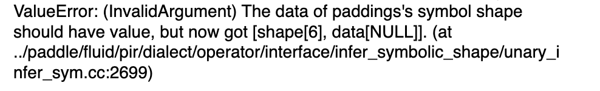
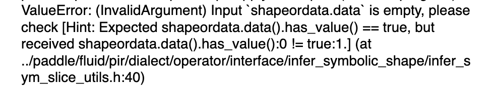

## 本文档用于发布 PaddleTest 中发现的符号推导相关 BUG

## Bug 复现指南

1. 下载 PaddleTest 仓库
``` bash
git clone https://github.com/PaddlePaddle/PaddleTest.git
```

2. 编译安装 Paddle 包
``` bash
cd Paddle/build
cmake .. -DPYTHON_EXECUTABLE=/usr/bin/python3.10 \
        -DWITH_GPU=ON     \
        -DWITH_PROFILER=OFF     \
        -DPY_VERSION=3.10      \
        -DWITH_DISTRIBUTE=OFF  \
        -DON_INFER=ON     \
        -DWITH_TESTING=ON    \
        -DWITH_CINN=ON

make -j 32
python -m pip uninstall paddlepaddle-gpu -y
python -m pip install python/dist/paddlepaddle_gpu-0.0.0-cp310-cp310-linux_x86_64.whl
```
3. 运行 PaddleTest 中的子图单测
### 方法1
直接使用 python 运行单测，
例如layercase/sublayer1000/Clas_cases/CSWinTransformer_CSWinTransformer_base_384/SIR_236.py
然后直接运行 
``` bash
python SIR_236.py  
```
和CI的单测代码类似，这时不会走CE测试框架的逻辑。

### 方法2
切换目录
``` bash
cd PaddleTest/framework/e2e/PaddleLT_new
```

设置环境变量
``` bash
export FLAGS_prim_all=True # 开启组合算子策略
export FLAGS_prim_enable_dynamic=true #组合算子允许动态Shape
export FLAGS_print_ir=1 # 会打印日志，供RD调试
export FLAGS_enable_pir_api=1 # 会开启新IR
export FLAGS_cinn_new_group_scheduler=1
export FLAGS_group_schedule_tiling_first=1
export FLAGS_cinn_bucket_compile=1
export FRAMEWORK=paddle # 设置FRAMEWORK，paddle/torch
export PLT_SET_DEVICE="gpu" # gpu/cpu
export PLT_DEVICE_ID=0 # 设置 device_id

source ./scene/set_pts_env.sh # 设定默认环境变量
```

找到 layertest.py，找到代码最后几行，设定需要排查的 子图（layerfile）和 测试配置（testing）

*注意：执行路径下应该没有framework/e2e/PaddleLT_new，只用写layertest/…/ 后面的路径*
``` python
if __name__ == "__main__":
    layerfile = "layercase/sublayer1000/Clas_cases/CSWinTransformer_CSWinTransformer_base_384/SIR_236.py" # 子图case路径
    testing = "yaml/dy^dy2stcinn_eval.yml"  # 配置yaml设定为dy^dy2stcinn_eval.yml即可
    single_test = LayerTest(title="your_name", layerfile=layerfile, testing=testing)
    single_test._case_run()
```

运行 layertest.py，python 版本要与编译安装的 python 版本一致
``` bash
python layertest.py
# python layertest.py > SIR_35.txt 2>&1
``` 

## Bug 列表
|Bug 编号 |Bug 目录 | Bug描述 | 认领人 |
|---|---|---|---|
|✅1|[SIR_32.py](https://github.com/PaddlePaddle/PaddleTest/blob/develop/framework/e2e/PaddleLT_new/layercase/sublayer160/Seg_cases/isanet_isanet_resnet50_os8_cityscapes_769x769_80k/SIR_32.py)| | [ooooo-create](https://github.com/ooooo-create) [✅Paddle#69167](https://github.com/PaddlePaddle/Paddle/pull/69167),[✅PaddleTest#2981](https://github.com/PaddlePaddle/PaddleTest/pull/2981)|
|✅2 | [SIR_35.py](https://github.com/PaddlePaddle/PaddleTest/blob/develop/framework/e2e/PaddleLT_new/layercase/sublayer160/Seg_cases/isanet_isanet_resnet50_os8_cityscapes_769x769_80k/SIR_35.py) | | [ooooo-create](https://github.com/ooooo-create) [✅Paddle#69167](https://github.com/PaddlePaddle/Paddle/pull/69167),[✅PaddleTest#2981](https://github.com/PaddlePaddle/PaddleTest/pull/2981)|
|3|[kron_3_func.py](https://github.com/PaddlePaddle/PaddleTest/blob/develop/framework/e2e/PaddleLT_new/layerApicase/math_sublayer/kron_3_func.py)|
 | |

