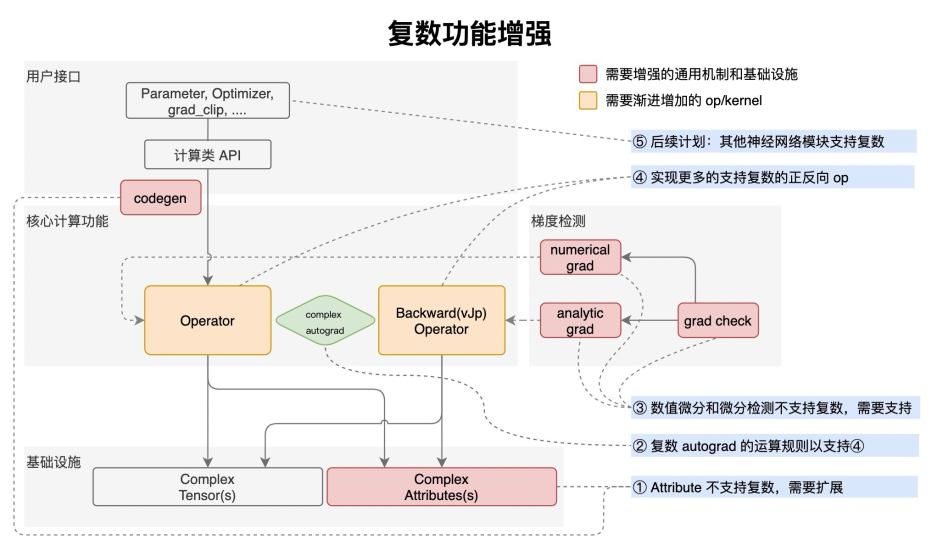

### 姓名
张玉涛
### 实习项目
**算子支持复数计算专项:** 本项目主要负责新增支持复数的算子，为已有算子添加复数 kernel, 以及为相关 API 添加复数功能支持等。

### 本周工作
本周主要工作如下：

1. **添加复数算子支持**

本周提交PR: 
 - [Partial_concat算子的复数支持](https://github.com/PaddlePaddle/Paddle/pull/58336) 已合入
 - [tril和tril_grad、triu和triu_grad、tril_triu和tril_triu_grad 算子的复数支持](https://github.com/PaddlePaddle/Paddle/pull/58532) 已合入
 - [unzip 算子的复数支持](https://github.com/PaddlePaddle/Paddle/pull/58839)
2. **熟悉复数的整体机制**

   

3. **问题疑惑与解答**
* 测试`un_stack`算子的复数支持情况时, 梯度检查一直出错, 该怎么查看详细的日志来确定错误出现位置?
  
    答：可以使用`GLOG_v=6 python test_xxx_op.py` 来输出日志信息定位错误, 通过分析日志发现底层的`sum op`会去找`add_n kernel`,正常应该去找`reduce_sum`, 正在解决此问题。

### 下周工作

1. 解决`unstack`算子在复数支持时的问题 

2. 完成`kernel_type:phi`中算子的复数支持工作

### 导师点评
请联系导师点评

