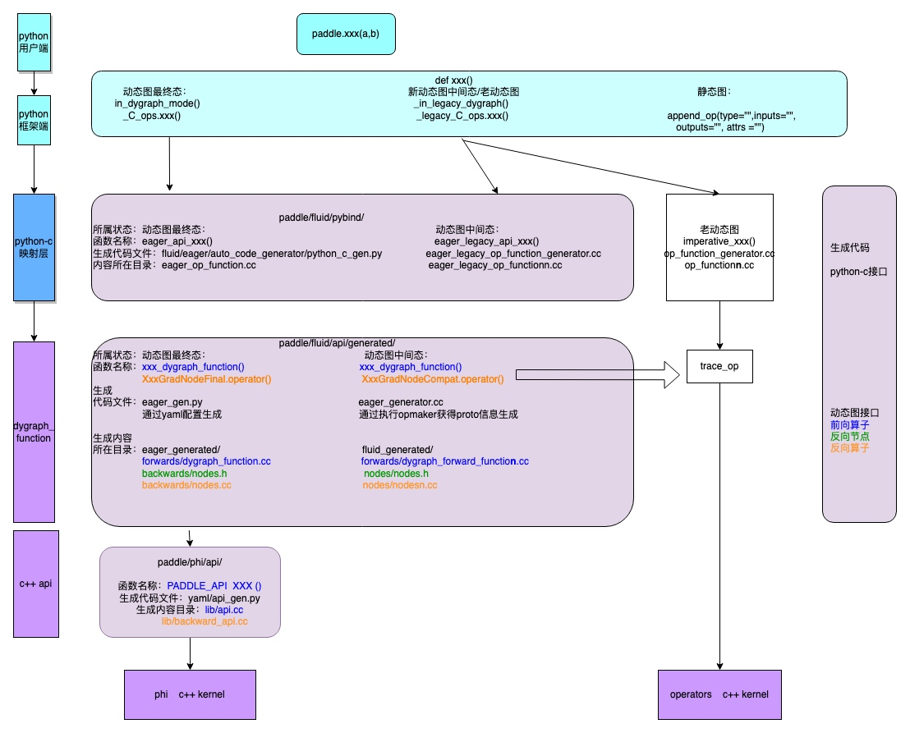

### 姓名
张玉涛
### 实习项目
**算子支持复数计算专项:** 本项目主要负责新增支持复数的算子，为已有算子添加复数 kernel, 以及为相关 API 添加复数功能支持等。

### 本周工作
本周主要工作如下：

1. **添加复数算子支持**

本周提交PR: 
 - [unstack和unstack_grad、add_n算子的复数支持](https://github.com/PaddlePaddle/Paddle/pull/59079) 已合入
 - [unbind、broadcast、broadcast_tensors和broadcast_tensor_grad 算子的复数支持](https://github.com/PaddlePaddle/Paddle/pull/59122)
 - [pad3d、multiplex和multiplex_grad 算子的复数支持](https://github.com/PaddlePaddle/Paddle/pull/59277) 

2. **了解Paddle的分层**

   

3. **问题疑惑与解答**
* 支持`multiplex`算子的复数工作时, 当传入的数据类型为complex类型时,提示类型不匹配?
    答：因为此算子属性含有index类型，且要求此类型为int32类型，而在算子定义的时候，只定义了算子的kernel的数据类型和输入的张量相同，此时应该保持index属性的原有数据类型，在算子定义中添加如下代码，来保持原有数据类型。
    
    ```yaml
    data_transform :
        skip_transform : index
    ```


### 下周工作

1. 完成`assgin_value`、`fill_any_like`和`fill_constant`这三个基础算子的复杂支持工作

2. 逐步实现`kernel_type:phi`中算子的复数支持工作

### 导师点评
请联系导师点评