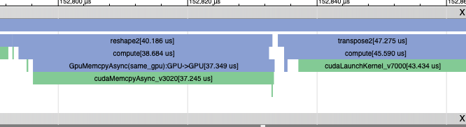

### 姓名
王龙志

### 实习项目
量化算子集成

### 本周工作

1. **编写完善 weight_only 的 PIR 的 pass** 
编写 fused_weight_only_linear_pass, 使得 PaddleNLP 中无需进行手动组网完成 weight_only 的量化，
相关 PR：
https://github.com/PaddlePaddle/Paddle/pull/59366

2. **迁移 quant_linear_fuse_pass 到 PIR**
将 quant_linear_fuse_pass 迁移到 PIR 中，目前 
3. **补充完善 quant_linear_fuse_pass 在 bert 上的性能分析** 
使用 paddle 的 profiler 分析 quant_linear_fuse_pass 在 bert 上的性能瓶颈

### 下周工作
1. 完成 quant_linear_fuse_pass 的 PIR 的迁移。
2. 分析原生量化推理在 bert 模型上的性能瓶颈并解决。

### 导师点评

