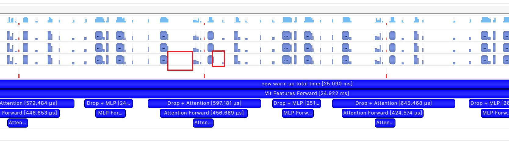

### 姓名
吴晨灿

### 实习项目
开源模型加速复现

### 本周工作

1. **学习Vision Transformer**

	* 了解Vit基本模型架构和模型各层的参数含义
	* 在[PaddleDetection](https://github.com/PaddlePaddle/PaddleDetection)，[PaddleClas](https://github.com/PaddlePaddle/PaddleClas)上对Vit模型进行静态和动态图推理测试


2. **优化现有Vit模型的Multi-Head Attention**

	* 对[PaddleClas Vit mha](https://github.com/PaddlePaddle/PaddleClas/blob/release/2.5/ppcls/arch/backbone/model_zoo/vision_transformer.py#L115)进行算子融合优化
	* 对算子融合优化前后进行性能测试，数据精度为fp32和fp16
    * 相关PR：https://github.com/PaddlePaddle/PaddleClas/pull/3013

3. **问题疑惑与解答**


	* 对推理耗时进行测试时，测试时间不稳定，应该如何获得精确的计时？

        答：在推理/训练时，开始的第一轮GPU会进行warmup，所以第一轮往往会比后续的计算要慢很多

        正确的做法是在准备计时前，先进行10次warmup，再循环100次，记录目标程序的执行耗时，取平均值，减少误差

        在测试耗时时，不要在目标程序中添加`print`输出等，因为这些操作会阻塞线程的异步执行

        在测试cuda耗时时，使用`paddle.device.cuda.synchronize()`进行cuda任务同步

        ```python
        warmup_times = 10
        test_times = 100

        # warmup
        for i in range(warmup_times):
            run()
        
        # test
        paddle.device.cuda.synchronize()
        time_begin = time.time()
        for i in range(test_times):
            run()
        paddle.device.cuda.synchronize()
        time_end = time.time()
        ```


### 下周工作

1. 在Vit模型的优化中还存在一些问题，比如`transpose/reshape`等操作，让cuda kernel之间存在特别大的间隙，对Vit encoder进行重写，消除其中的gap



### 导师点评
请联系导师填写
1. 能够快速熟悉大模型相关部署流程和上手代码优化工作，积极思考讨论问题，并提供详细的数据佐证。
2. 能够做到积极推动项目进程，并取得一定成果，继续加油！
