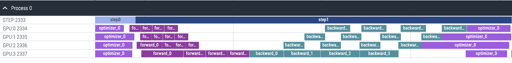

### 姓名

卢畅

### 实习项目

静态图半自动并行执行架构升级

### 本周工作

当下没有工具能够直接给出各个GPU设备上不同Job的运行区间，因此我们需要设计一个可视化工具来实现这个功能。

本周的主要工作依然和可视化工具有关，主要工作内容如下：

1. **添加用命令行控制可视化工具相关逻辑**

为了方便用户使用，我们需要添加一个命令行参数，用于控制可视化工具的开关。我们将其命名为 `Distributed.pipeline.auto_parallel_profiler` ，默认为 `False` ，当用户将其设置为 `True` 时，可视化工具将会被启用。使用实例代码如下：

```bash
nsys profile --stats=true -t cuda,nvtx -o 1.3B_st --capture-range=cudaProfilerApi --force-overwrite true \
python -m paddle.distributed.launch --log_dir $log_dir --devices "0,1,2,3" \
         ./tools/auto.py \
         -c ./ppfleetx/configs/nlp/gpt/auto/pretrain_gpt_1.3B_dp8.yaml \
         ...
         -o Distributed.pipeline.auto_parallel_profiler=1 \
         ...
         -o Profiler_auto.nvprof_start=0 \
         -o Profiler_auto.nvprof_end=5 \
```

其中 `Profiler_auto.nvprof_start` 和 `Profiler_auto.nvprof_end` 用于控制可视化工具的起始和结束时间，单位为分钟。在上面的例子中，可视化工具将会在第0分钟开始，第5分钟结束。这样的设计方案符合之前nsys用户的使用习惯。

2. **为可视化工具添加Step行**

在可视化工具中，添加训练部署的Step行，用于标记训练的阶段。该方案的实现思路为，利用原有Paddle nsight相关代码在每个Step开始和结束时候将时间信息打印出来，然后利用python脚本将其解析出来，最后将其添加到可视化工具中。


```c++
// paddle/fluid/platform/device/gpu/cuda/cuda_profiler.cc
  ...
  eventAttrib.messageType = NVTX_MESSAGE_TYPE_ASCII;
  eventAttrib.message.ascii = name.c_str();

  if (FLAGS_auto_parallel_profiler) {
    struct timeval time_now {};
    gettimeofday(&time_now, nullptr);
    double push_time = (time_now.tv_sec * 1000) + (time_now.tv_usec / 1000.0);
    VLOG(0) << "NVTX range push: " << name
            << ", time: " << std::to_string(push_time);
  }
  dynload::nvtxRangePushEx(&eventAttrib);
}
```

由于在C++端无法直接获得Step的信息，因此我们需要在python端添加相关代码，具体实现代码如下：

```python
def process_step_log(log_data, device_id):
    start_pattern = r'.*?NVTX range push: (\d+), time: (\d+.\d+)'
    end_pattern = r'.*?NVTX range pop, time: (\d+.\d+)'
    start_matches = re.findall(start_pattern, log_data)
    end_matches = re.findall(end_pattern, log_data)

    step_info = []
    for start_match, stop_match in zip(start_matches, end_matches):
        step_id, start_time = start_match
        stop_time = stop_match
        if int(step_id) >= len(step_info):
            for _ in range(int(step_id) - len(step_info) + 1):
                step_info.append([float('inf'), 0])
        step_info[int(step_id)] = [start_time, stop_time]
    return step_info
```

添加Step行后的可视化效果如下：

  


3. **修复Job开始时间和结束时间统计不准确的逻辑bug**

在本周的工作中，我发现了一些代码中的逻辑bug，主要为使用之前使用的 cpu 时间加 cuda event 之间的差值来计算 cuda 时间，这样的计算方式是不准确的，因为每个任务开始的时间准确来说应该是第一个计算算子开始的时间，而不是 `RunImpl` 开始的时间。同理最后一个任务结束的时间也应该是最后一个算子结束的时间，而不是 `RunImpl` 结束的时间。因此我们需要修改代码，将 `RunImpl` 开始和结束的时间改为第一个算子开始和最后一个算子结束的时间。

此外我使用了`cudaStreamAddCallback`替换了之前的`cudaEventRecord`。在回调函数中统计了每个Job的开始和结束时间，这样的实现方式更加准确。因为`cudaStreamAddCallback`所添加的回调函数是插入到stream的任务队列中的，当callback之前的任务都执行完毕后，才会执行callback函数，因此我们可以在callback函数中统计Job的开始和结束时间。

4. **完善使用文档**

为了方便用户使用，我写了一个使用文档，用于指导用户如何使用可视化工具。

5. **确定了多机可视化方案**

我和导师讨论了多机可视化的方案，最终确定了为可视化脚本添加多机的选项。在开启多机选项时，用户需要按照要求将不同机器上的可视化脚本的输出文件合并到一个文件夹中，然后运行脚本，脚本会自动将不同机器上的log信息合并到一起并生成可视化结果。

### 下周工作

1、编码实现多机可视化方案

2、完善可视化工具的使用文档

3、着手开始下一阶段的工作：优化分布式流水并行的性能


### 导师点评

...