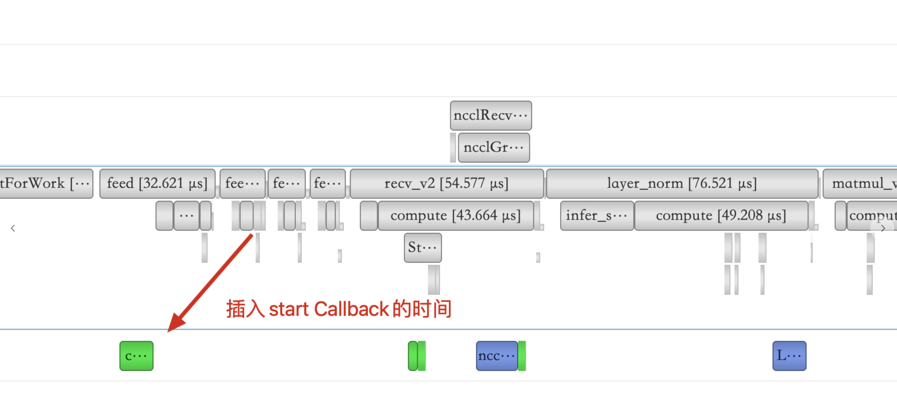

### 姓名

卢畅

### 实习项目

静态图半自动并行执行架构升级

### 本周工作

本周对可视化工具进行收尾工作并着手进行静态图性能优化的准备工作，主要内容如下：

**1. Llama2适配工作收尾**

由于本工具只适用于静态图，之前的设计中，可视化工具的启动参数放在了training_logs中，由于动态图中并用不到这些参数，因此将其移动到 `run_pretrain_auto.py` 下。

此外，将启动相关代码用 `guard` 的方式包裹起来，这样并添加了 `job_schedule_profiler` 的 `guard` 工具方便用户使用。

相关PR：

- https://github.com/PaddlePaddle/Paddle/pull/59634
- https://github.com/PaddlePaddle/PaddleNLP/pull/7343

**2. 修复可视化工具中的逻辑bug**

在观察可视化工具的时候发现对于 Forward 任务，有时候会出现卡2的F1在卡1的F1结束之前结束的情况，这是不符合预期的，因为卡2需要等待卡1传过来的数据，因此卡2的F1应该在卡1的F1结束之后结束。

经过排查发现是由于 `feed` 算子有时候是在recv_v2之前插入的，就导致了卡1发送数据之前卡2就开始的情况。

  

由于feed算子严格来讲不是计算算子，它做的是数据拷贝，而且也不在计算流上。故在判断是否需要插入计算流的时候，需要将feed算子排除在外。这个错误的修复写在了支持新ir的pr中。

相关PR：

- https://github.com/PaddlePaddle/Paddle/pull/59195/files

**3. 学习分布式论文**

学习了一些分布式相关的论文，主要包括：

1）Efficient large-scale language model training on gpu clusters using megatron-lm

2）Megatron-LM- Training Multi-Billion Parameter Language Models Using Model Parallelism

3）Zero: memory optimizations toward training trillion parameter models

**4. 将通信算子注册到PHI**

原本计划c_gen_nccl_id、c_comm_init、c_comm_init_all、c_comm_init_multitrainer都注册到PHI下，但是迁移的时候发现由于 `UniqueId` PHI 下无法支持因此只将 `c_comm_init_all` 注册到了PHI下。

相关PR：

-  https://github.com/PaddlePaddle/Paddle/pull/59672

**5. 更新可视化工具使用文档**

更新了可视化工具的使用文档，主要更新LLama2的使用文档，以及添加了多机环境下的可视化使用文档。

相关PR：

-  https://github.com/PFCCLab/Camp/pull/53

**6. 着手准备静态图性能优化工作**

在多卡环境下跑通LLama2，由于显存受限因此先hack一下代码，在实际run之前直接exit退出，不实际跑模型就不会有临时变量的显存占用。通过调整num_hidden_layers，调一个在这个hack的情况下刚好能跑起来的PP2MP2的配置。

### 下周工作

1、分析LLama2模型run之前的耗时，挖掘程序的耗时热点，看哪部分耗费时间比较多需要专门优化

### 导师点评

