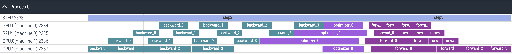
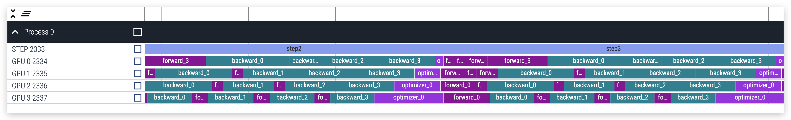

### 姓名

卢畅

### 实习项目

静态图半自动并行执行架构升级

### 本周工作

当下没有工具能够直接给出各个GPU设备上不同Job的运行区间，因此我们需要设计一个可视化工具来实现这个功能。

本周的主要工作依然和可视化工具有关，主要工作内容如下：

**1. 将可视化工具起始条件和nvprof解耦**

在之前的设计中，可视化工具的起始条件和nvprof是耦合在一起的，这样的设计方案不够灵活，因此我们需要将其解耦。解耦后用户可以使用命令行参数 `job_schedule_profiler_start` 和 `job_schedule_profiler_stop` 控制可视化工具的起始和结束时间。

**2. 更改 CalculateStreamTimer 中获取计算流的逻辑**

在之前的设计中，每一次 `Run` 都会获取计算流并通过 `SetStream` 方法设置计算流。每一次都获取计算流是没有必要的，因此将该逻辑更改为在 `ProgramInterpreter` 初始化时将 `place_` 传入 `CalculateStreamTimer` 中，然后在 `CalculateStreamTimer` 内部通过 `place_` 获取计算流。

1,2两点修复完毕后，初步PR合入：

- https://github.com/PaddlePaddle/Paddle/pull/58313

**3. 支持多机训练下的可视化**

多机模式下需要用户手动将多台机器上的数据拷贝到一个目录下并按照如下格式组织，下面以一个2机2卡的测试环境举例。log 文件夹结构：

```
multi_machine_logs
├── machine0
│   ├── workerlog.0
│   └── workerlog.1
├── machine1
│   ├── workerlog.0
│   └── workerlog.1
```

运行时候添加 --multi_machine 命令

```
python python/paddle/distributed/auto_parallel/static/profiler_helper_static.py --devices 0,1 --log_dir /home/workspace/PaddleNLP/model_zoo/gpt-3/log_auto_6.7B_mp2pp4_st/multi_machine_logs/ --multi_machine
```

可视化效果如下：

  


相关PR：

- https://github.com/PaddlePaddle/Paddle/pull/59179

**4. 支持新IR下的可视化工具的使用**

新IR下的实现逻辑与旧IR下的实现逻辑基本一致，不同点在于新IR会默认走 `TraceRunInstructionList` 需要进行适配。

相关PR：

- https://github.com/PaddlePaddle/Paddle/pull/59195/files

**5. 适配Llama2**

PaddleNLP 针对 llm 重构了一套训练逻辑，因此需要对可视化工具进行适配。主要适配逻辑为在 `run_pretrain_auto.py` 中添加根据命令行参数控制可视化工具运行区间的相关代码。适配完成后，可视化工具可以正常运行。

```
task_name="llama_7b_pp2_mp4_st"
rm -rf output/$task_name/
rm -rf "output/$task_name""_log"

export SOT_LOG_LEVEL=4
export PYTHONPATH=../../:$PYTHONPATH

export FLAGS_embedding_deterministic=1
export FLAGS_cudnn_deterministic=1

export CUDA_DEVICE_MAX_CONNECTIONS=1

python -u  -m paddle.distributed.launch \
     --gpus "0,1,2,3" \
     --log_dir "output/$task_name""_log" \
     run_pretrain_auto.py \
     --model_type "llama" \
     --model_name_or_path "meta-llama/Llama-2-7b" \
     --tokenizer_name_or_path "meta-llama/Llama-2-7b" \
     --input_dir "./data" \
     --output_dir "output/$task_name" \
     --split 949,50,1 \
     --max_seq_length 2048 \
     --per_device_train_batch_size 1 \
     --per_device_eval_batch_size 1 \
     --gradient_accumulation_steps 4 \
     --use_flash_attention 0 \
     --use_fused_rms_norm 0 \
     --fp16 0 \
     --fp16_opt_level "O2"  \
     --scale_loss 1024 \
     --pipeline_parallel_degree 4 \
     --tensor_parallel_degree 1 \
     --sharding_parallel_degree 1 \
     --sharding "stage1" \
     --learning_rate 0.0001 \
     --min_learning_rate 0.00001 \
     --max_steps 10 \
     --save_steps 5000 \
     --weight_decay 0.01 \
     --warmup_ratio 0.01 \
     --max_grad_norm 1.0 \
     --logging_steps 1\
     --dataloader_num_workers 1 \
     --sharding "" \
     --eval_steps 1000 \
     --report_to "visualdl" \
     --disable_tqdm true \
     --continue_training 0\
     --recompute 1 \
     --do_train \
     --do_eval 0 \
     --device "gpu" \
     --data_impl "mmap" \
     --parallel_mode "auto" \
     --job_schedule_profiler_start 0 \
     --job_schedule_profiler_end 5 \
```

可视化结果：

  


### 下周工作

1、算子注册到phi: c_gen_nccl_id、c_comm_init、c_comm_init_all、c_comm_init_multitrainer

2、论文学习：
    1）Efficient large-scale language model training on gpu clusters using megatron-lm
    2）Megatron-LM- Training Multi-Billion Parameter Language Models Using Model    Parallelism
    3）Zero: memory optimizations toward training trillion parameter models
    4）Reducing Activation Recomputation in Large Transformer Models

3、可视化工具的使用文档完善


### 导师点评

