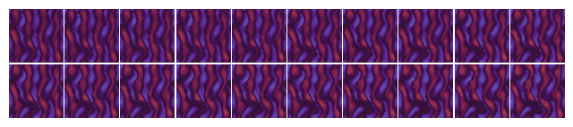

### 姓名

徐苏勇

Github ID：[xusuyong](https://github.com/xusuyong)

### 实习项目

[科学计算领域拓展专项](https://github.com/PaddlePaddle/community/blob/master/hackathon/hackathon_5th/%E3%80%90PaddlePaddle%20Hackathon%205th%E3%80%91%E9%A3%9E%E6%A1%A8%E6%8A%A4%E8%88%AA%E8%AE%A1%E5%88%92%E9%9B%86%E8%AE%AD%E8%90%A5%E9%A1%B9%E7%9B%AE%E5%90%88%E9%9B%86.md#%E9%A1%B9%E7%9B%AE%E5%8D%81%E4%B8%89%E7%A7%91%E5%AD%A6%E8%AE%A1%E7%AE%97%E9%A2%86%E5%9F%9F%E6%8B%93%E5%B1%95%E4%B8%93%E9%A1%B9)

### 本周工作

1. **改造PaddleScience下的案例laplace2d的代码为Hydra的形式**
    - 理解并跑通了DeepONet、laplace2d等案例，熟悉了PaddleScience用PINN和神经算子的算法解偏微分方程的基本逻辑
    - 改造laplace2d案例的代码的代码，使之能使用[Hydra](https://hydra.cc/)库，方便实验管理和解析。PR地址：[modify laplace2d to hydra style](https://github.com/PaddlePaddle/PaddleScience/pull/575)
2. **学习理解用DDPM算法从低分辨数据重构高分辨率数据**
    - 学习理解DDPM算法，复现文献 **A Physics-informed Diffusion Model for High-fidelity Flow Field Reconstruction** (<a href="https://www.sciencedirect.com/science/article/pii/S0021999123000670">Journal of Computational Physics</a> | <a href="https://arxiv.org/abs/2211.14680">arXiv</a>)，理解作者是如何将物理知识融入DDPM算法，模型预测的结果：

    - 学习使用SU2
3. **问题疑惑与解答**
    - 问题：原始的DDPM/DDIM采样算法是从输入高斯噪声开始，生成的是随机的图片难以控制，如何让它生成我们想要的高分辨率数据？

        答：为了解决这个问题，需要一个有指导的数据生成程序，其中使用低精度CFD数据作为生成高精度CFD数据的条件。反向扩散过程的马尔可夫性质意味着生成x0的过程不必从xT开始，而是可以从任何时间步长t∈{1，…，t}开始，前提是xT可用。该属性允许用户在后向扩散过程的特定时间步长选择中间样本，并将其发送到马尔可夫链的剩余部分以获得x0。
### 下周工作

1. 学习物理信息扩散模型，理解它是如何将物理信息加入DDPM算法的。
2. 调研SU2与DDPM的结合使用方式

### 导师点评

1. 苏勇这周了解了PaddleScience的基础代码结构和基本使用方法，并且对DDPM有了初步的认知。
2. 在了解PINN-DDPM这个算法的过程中，可以先不着急解其内部的实现细节和具体数学原理以及复现工作，可以结合源代码和提供的预训练模型，优先关注该模型的输入和输出分别是什么。同时也不着急将这个模型用Paddle复现，前期可以基于pytorch打通SU2+ddpm的链路
3. SU2同理，优先了解其必要的输入数据和输出数据。
