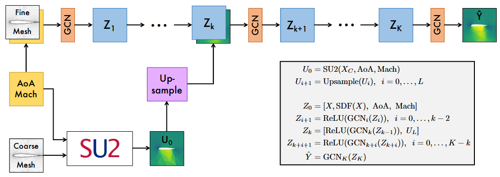
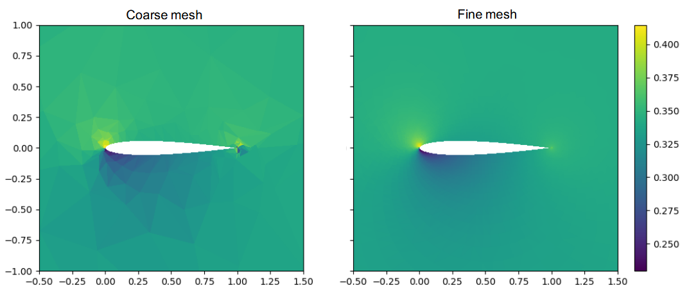

### 姓名
徐苏勇

Github ID：[xusuyong](https://github.com/xusuyong)

### 实习项目
[科学计算领域拓展专项](https://github.com/PaddlePaddle/community/blob/master/hackathon/hackathon_5th/%E3%80%90PaddlePaddle%20Hackathon%205th%E3%80%91%E9%A3%9E%E6%A1%A8%E6%8A%A4%E8%88%AA%E8%AE%A1%E5%88%92%E9%9B%86%E8%AE%AD%E8%90%A5%E9%A1%B9%E7%9B%AE%E5%90%88%E9%9B%86.md#%E9%A1%B9%E7%9B%AE%E5%8D%81%E4%B8%89%E7%A7%91%E5%AD%A6%E8%AE%A1%E7%AE%97%E9%A2%86%E5%9F%9F%E6%8B%93%E5%B1%95%E4%B8%93%E9%A1%B9)

### 本周工作

1. **调研[物理信息扩散模型](https://arxiv.org/abs/2211.14680)论文并跑通代码，理解它是如何将物理方程的导数加入DDPM算法的。使用预训练模型复现原文。**
	* 跑通PINN-DDPM的代码，原文作者的案例是2维 Kolmogorov flow，由不可压Navier-Stokes方程控制：

$$
\begin{aligned}
	  \frac{\partial\omega(\mathbf{x},t)}{\partial t}+\mathbf{u}(\mathbf{x},t)\cdot\nabla\omega(\mathbf{x},t)& =\frac1{Re}\nabla^2\omega(\mathbf{x},t)+f(\mathbf{x}),\quad\mathbf{x}\in(0,2\pi)^2,t\in(0,T],  \\
	  \nabla\cdot\mathbf{u}(\mathbf{x},t)& =0,\quad\mathbf{x}\in(0,2\pi)^2,t\in(0,T],  \\
	  \omega(\mathbf{x},0)& =\omega_0(\mathbf{x}),\quad\mathbf{x}\in(0,2\pi)^2,  \\
	  \end{aligned}
$$
求解方程使用的是 2048 × 2048 均匀网格，然后将这些数据下采样到 256 × 256 网格作为groud truth和PINN-DDPM模型的训练集。做了两个实验研究扩散模型对高保真流场的重构能力。第一个实验的任务是从低分辨率场重建高分辨率场，其中低分辨率场从高分辨率场均匀下采样，即 64 × 64 → 256 × 256（4× 上采样）。第二个实验的任务是从随机采样的点（采样了 5%）（不一定是等距的）重建高分辨率场。第二项任务旨在从稀疏的感官观测数据中重建密集场。其中方程的导数信息是加在U-net中以上下文嵌入的方式加入模型的，加入物理信息后能够提高精度（比一般的DDPM）。

2. **调研[CFD-GCN](https://arxiv.org/abs/2007.04439)论文并跑通代码。理解整个模型的流程，使用预训练模型复现原文。**
	* 学习理解CFD-GCN的framework：使用SU2在粗糙网格上求解，将SU2的输出结果up-sample后嵌入图卷积神经网络训练。数据集由SU2在精细网格上求解得到。其中粗网格有353个点，细网格有6684个点，都是在pointwise软件导出的.su2文件生成的mesh数据。
	

3. **研究SU2与DDPM的结合使用方式，对比1. 直接使用SU2在精细网格中求解和2. 先用SU2在粗网格中求解再利用DDPM推理重建高分辨率，这两种方式所花费的时间。结果表明DDPM能显著提高效率。**
	
	* SU2的输出是点集，DDPM的输入是图像。对比了一下，直接用SU2求解精细网格要20分钟。用SU2求解稀疏的网格只要14秒，然后超分给DDPM推理只要两分钟。
	
4. **问题疑惑与解答**

	- DDPM的推理过程中，如何将低分辨率数据嵌入以及在哪个时刻嵌入比较好？
	
	    答：增加 $p_{g(X)}^{(\mathrm{train})}$ 和$p_{g(X)}^{(\mathrm{test})}$之间相似度的一种方法是将高斯噪声添加到低保真数据样本中，使得$p_{g(X)}^{(\mathrm{train})}$和 $p_{g(X)}^{(\mathrm{test})}$都从$p_X^{(\mathrm{train})}$和$p_X^{(\mathrm{test})}$被吸引到高斯分布，然后变得更加相似。这样就将低分数据嵌入了DDPM的推理过程中。
	
	    在实践中，从区间 [0， $\frac{T}{2}$] 中选择 t，以获得更准确、噪声更小的数据重建。

### 下周工作

1. 尝试将mesh数据转换成图片数据并实现SU2与DDPM的结合使用
2. 撰写调研文档

### 导师点评

请联系导师填写

1. 苏勇本周跑通了SU2的运行以及DDPM的推理，打通流程，理解了二者的数据处理格式和计算流程，并进行了耗时测试，验证了SU2+DDPM的技术价值
2. 下周可以将主要精力放在（二维）Mesh数据转成图片并输入到DDPM中，同时迁移一下RegAE案例到PaddleScience仓库中。
