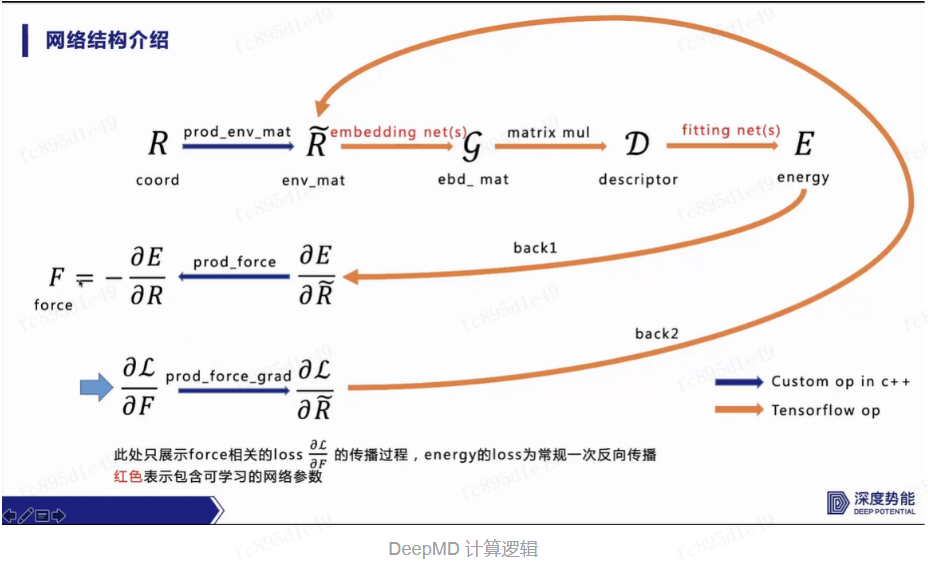
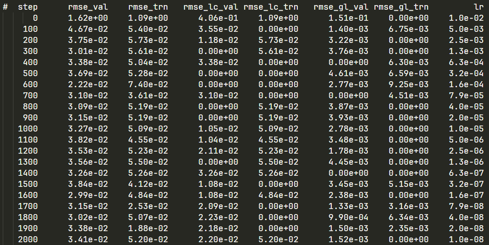
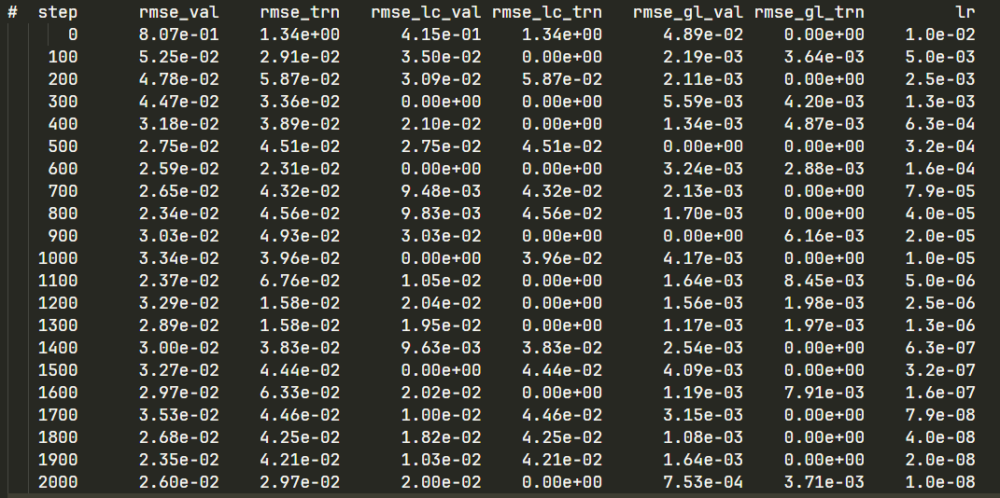

### 姓名
徐苏勇

Github ID：[xusuyong](https://github.com/xusuyong)

### 实习项目
[科学计算领域拓展专项](https://github.com/PaddlePaddle/community/blob/master/hackathon/hackathon_5th/%E3%80%90PaddlePaddle%20Hackathon%205th%E3%80%91%E9%A3%9E%E6%A1%A8%E6%8A%A4%E8%88%AA%E8%AE%A1%E5%88%92%E9%9B%86%E8%AE%AD%E8%90%A5%E9%A1%B9%E7%9B%AE%E5%90%88%E9%9B%86.md#%E9%A1%B9%E7%9B%AE%E5%8D%81%E4%B8%89%E7%A7%91%E5%AD%A6%E8%AE%A1%E7%AE%97%E9%A2%86%E5%9F%9F%E6%8B%93%E5%B1%95%E4%B8%93%E9%A1%B9)

### 本周工作

1. **学习deepmd-kit**
   
   * 学习分子动力学背景知识

      在分子动力学模拟（Molecular Dynamics Similation，MD 模拟）计算中，物质被看作是由原子构成的 基本单元，通过模拟这些基本单元在时间上的演化，就可以探究物质的动力学性质，从而帮助人们更 好地理解和预测物质的行为和性质，在材料、物理、化学、生物以及环境等领域都发挥着重要作用。
   
      普林斯顿的鄂维南团队在2018年提出一种基于机器学习的分子动力学方法DeePMD[2]。使用由AIMD方法得到的数据训练DNN网络，将训练好的DNN网络作为原子的势函数，提供给LAMMPS等分子动力学模拟软件进行计算。在加快了模拟速度的同时，保证了模拟结果可以达到AIMD方法的精度。结合机器学习的分子动力学是目前很有前景的方向之一.
   
   * 学习开源软件包deepmd-kit
      
   
2. **修改water_tensor案例代码为paddlepaddle形式**

   * 跑通tensorflow版本，lcurve输出：
      
   * 跑通paddle版本，lcurve输出：
      
   * 测试部分代码还未修改完成
3. **问题疑惑与解答**

### 下周工作

1. 修改water_tensor的测试部分代码

### 导师点评

很快能上手 DeePMD-kit 套件，对齐 dipole-tensor 后可以开始接入自定义算子和跑通 zinc_protein
