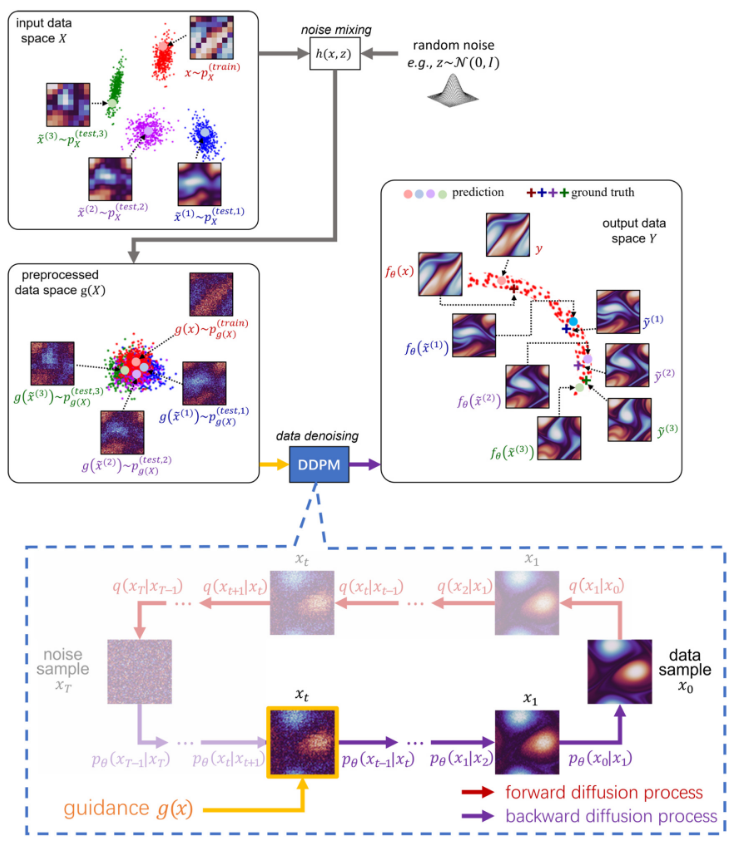
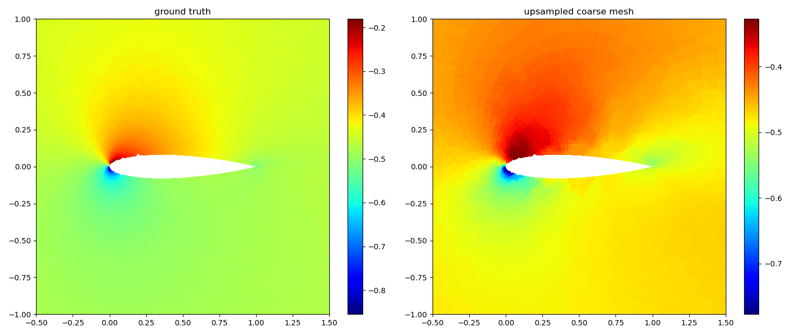
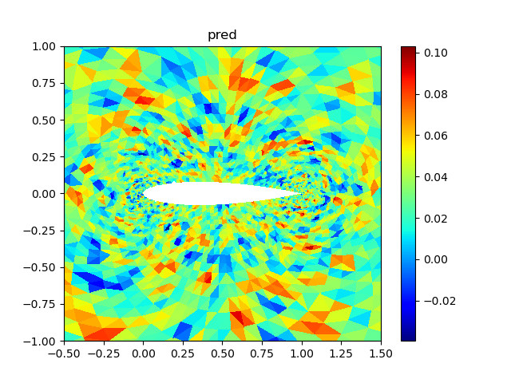

# 流体力学问题中的SU2与DDPM结合应用

## 简介

**关于 SU2 的介绍：**

SU2（Stanford University Unstructured）是一个开源的计算流体力学（CFD）软件套件，由斯坦福大学开发。它旨在解决复杂的流体动力学和传热问题，提供了强大的数值模拟工具。SU2支持结构化和非结构化网格，能够处理多种流动问题，包括气体动力学、燃烧、湍流等。其灵活性和可扩展性使其成为学术界和工业界广泛应用的工具之一。然而，在处理高精度网格时，SU2的计算效率相对较低，这促使了对与其他方法的结合研究，以在高复杂性问题中提高数值求解效率。

**关于 DDPM（Denoising Diffusion Probabilistic Models）的介绍：**

DDPM是一种基于概率模型的图像生成和去噪方法。它通过引入概率扩散过程，即通过逐步去噪的方式生成图像，从而提高了生成模型的性能。DDPM的关键思想是在随机噪声的影响下，逐渐将图像还原为其真实分布。这种模型在计算机视觉领域取得了显著的成功，并在图像生成、去噪和超分辨率等任务中表现出色。在流体力学的背景下，DDPM的应用可以为低分辨率数值解提供更加精确和高分辨率的重建，为复杂流体问题的模拟提供更加准确的数值结果。将SU2与DDPM结合的方法有望在高精度网格上提高数值求解速度，并在流体力学领域探索新的模拟与预测方法。

**研究背景：**

当涉及复杂的流体力学问题时，高精度的网格通常是必不可少的，然而，传统求解器如SU2在处理这样的网格时却显得速度较慢。相反，在低精度网格上，SU2的求解速度却非常快。为了克服这一挑战，本研究旨在探索将SU2与DDPM模型相结合的方法。我们计划首先利用SU2在低精度网格上进行求解，然后利用经过训练的DDPM模型来重建高分辨率的解。这种结合使用的方法有望在高精度网格上提高求解速度，并为复杂流体力学问题提供更加精确的解决方案。通过本研究，我们希望为流体力学领域的模拟与预测提供新的思路和方法。

### 模型结构



## 安装SU2

SU2支持手动从源代码编译，也可以通过预编译可执行程序安装使用，其目前已经提供了支持Linux、macOS、Windows操作系统的安装程序。源代码及安装程序可以在网址：**https://su2code.github.io/download.html** 下载。

## SU2+DDPM基本理论原理

对于所有实验，我们使用NACA0012翼型，表示为具有6684个节点的精细网格，相同翼型的粗网格具有353个节点。直接从SU2用精细网格数值模拟中获得的数据，从中随机采样6400个点并转换成80×80的形状，被认为是在使用DDPM模型重建的高保真度数据，并在数据集中被称为ground truth。由于DDPM模型要在相同的输入和输出网格上运行，也就是说，低精度的数据只需在粗网格上运行SU2模拟，并将输出插值到完整的网格大小，使其具有与目标相同的分辨率。

## 代码逻辑整理

```python
import numpy as np
import matplotlib.pyplot as plt
from mesh_utils import get_mesh_graph
import matplotlib.tri as tri
np.random.seed(0)
# Load dataset
nodes, edges, elems, marker_dict = get_mesh_graph('mesh_NACA0012_fine.su2')
high_resolution_data = np.load("cfd_outcome3d.npy", allow_pickle=True) #(63,6684,3)
ucm_data = np.load("ucm_outcome3d.npy", allow_pickle=True) #(63,6684,3)

# 生成6684个点的索引
all_indices = np.arange(nodes.shape[0])
# 翼型边界索引
special_indices = np.unique(marker_dict['airfoil'])
# 从剩下的索引中随机选择点
remaining_indices = np.setdiff1d(all_indices, special_indices)
random_indices = np.random.choice(remaining_indices, size=6400-len(special_indices), replace=False)
# 将特殊点和随机点合并
selected_indices = np.concatenate((special_indices, random_indices))

X_u_train = nodes[selected_indices, :]
Ground_Truth = high_resolution_data[:, selected_indices, :] #(63,6400,3)
ucm = ucm_data[:, selected_indices, :] #(63,6400,3)
```

将数据转换成可以输入DDPM的形状并保存

```python
Ground_Truth=Ground_Truth.transpose((0, 2, 1)).reshape(63,3,80,80)
ucm = ucm.transpose((0, 2, 1)).reshape(63,3,80,80)
np.save("Ground_Truth.npy", Ground_Truth)
np.savez("ucm.npz", u3232=ucm)
```

## 跑通入门案例

下图左边是groud truth，右边是输入的低精度数据



DDPM的预测结果：（DDPM模型还没有进行充分的训练，所以重建的结果不对，但至少证明方案流程是可行的）



对比1. 直接使用SU2在精细网格中求解和2. 先用SU2在粗网格中求解再利用DDPM推理重建高分辨率，这两种方式所花费的时间。结果表明DDPM能显著提高效率。

SU2的输出是点集，DDPM的输入是图像。对比了一下，直接用SU2求解精细网格要20分钟。用SU2求解稀疏的网格只要14秒，然后超分给DDPM推理只要两分钟。
## 研究意义

1. **数值求解效率的提高：** 通过将SU2与DDPM模型相结合，您的研究旨在在处理高精度网格时提高数值求解的效率。这对于解决复杂的流体动力学问题尤为重要，因为高精度网格通常涉及到更加细致的物理现象和复杂的流场结构。
2. **跨学科应用：** 将流体力学领域的数值模拟与概率图模型相结合，体现了跨学科的研究方法。这种融合可能会为不同学科领域的研究者提供新的思路和方法，推动相关领域的交叉创新。
3. **提供更准确的数值解：** 利用DDPM模型对低精度数值解进行重建，有望提供更加准确和高分辨率的数值解。这对于工程实践和科学研究中需要高精度结果的场景具有实际价值。
4. **新颖的流体力学建模方法：** 您的研究探索了一种新颖的流体力学建模方法，结合了传统的数值求解工具和先进的概率图模型。这种新的方法可能为流体力学问题的建模和求解提供更多选择，并有望拓宽领域内的研究范式。
5. **对于复杂流体问题的解决方案：** 在处理复杂流体力学问题时，提供更加精确和高效的数值解决方案具有实际应用的意义。这可能在航空航天、汽车工程、气象学等领域产生重要影响。

## 参考资料

* [1] Filipe de Avila Belbute-Peres, Thomas D. Economon, and J. Zico Kolter. 2020. Combining differentiable PDE solvers and graph neural networks for fluid flow prediction. In Proceedings of the 37th International Conference on Machine Learning (ICML'20). JMLR.org, Article 224, 2402–2411. (<a href="https://arxiv.org/abs/2007.04439">arXiv</a>)
* [2] D. Shu, Z. Li, and A. Barati Farimani, *A Physics-Informed Diffusion Model for High-Fidelity Flow Field Reconstruction*, Journal of Computational Physics **478**, 111972 (2023).(<a href="https://www.sciencedirect.com/science/article/pii/S0021999123000670">Journal of Computational Physics</a> | <a href="https://arxiv.org/abs/2211.14680">arXiv</a>)
* 参考GitHub地址：
  * https://github.com/locuslab/cfd-gcn
  * https://github.com/BaratiLab/Diffusion-based-Fluid-Super-resolution

SU2相关网站：

- SU2 Home Page: **https://su2code.github.io**
- GitHub repository: **https://github.com/su2code/SU2**
- CFD Online: **http://www.cfd-online.com/Forums/su2/**

关于 SU2 的技术细节，可参阅以下 AIAA 期刊文章："SU2: An open-source suite for multiphysics simulation and design," AIAA Journal, 54(3):828-846, 2016. http://arc.aiaa.org/doi/10.2514/1.J053813