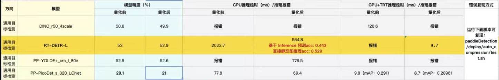

### 姓名

冉崇治

Github ID：[ranchongzhi](https://github.com/ranchongzhi)

### 实习项目

[套件压缩能力建设](https://github.com/PaddlePaddle/community/blob/master/hackathon/hackathon_5th/%E3%80%90PaddlePaddle%20Hackathon%205th%E3%80%91%E9%A3%9E%E6%A1%A8%E6%8A%A4%E8%88%AA%E8%AE%A1%E5%88%92%E9%9B%86%E8%AE%AD%E8%90%A5%E9%A1%B9%E7%9B%AE%E5%90%88%E9%9B%86.md#%E9%A1%B9%E7%9B%AE%E5%8D%81%E5%85%AB%E5%A5%97%E4%BB%B6%E5%8E%8B%E7%BC%A9%E8%83%BD%E5%8A%9B%E5%BB%BA%E8%AE%BE)

### 本周工作

为PaddleDetection套件接入自动化压缩功能，主要完成以下四个检测模型的压缩与推理，并尝试解决其中的报错。

- DINO_r50_4scale_2x
- RT-DETR-L
- PP-YOLOE+_crn_I_80e
- PP-PicoDet_s_320_LCNet

原始情况如下：

目前的结果：

Nvidia GPU测试环境：

- 硬件：NVIDIA Tesla V100 单卡
- 软件：CUDA 11.2, cudnn 8.1.0, TensorRT-8.0.3.4
- 测试配置：batch_size: 1

|模型|模型精度(%,gpu上)||GPU+TRT推理延时(ms)||备注|
|-|-|-|-|-|-|
||量化前|量化后|量化前|量化后||
|DINO_r50_4scale_2x|**50.82**|**50.72**|**95.0**|**86.9**|config.exp_disable_tensorrt_ops(["reshape2", "slice", "stack", "elementwise_add"])|
|RT-DETR-L|**53.09**|**52.92**|**32.7**|**26.7**||
|PP-YOLOE+_crn_I_80e|**52.88**|**52.52**|**12.4**|**7.2**||
|PP-PicoDet_s_320_LCNet|**29.06**|**28.82**|**3.6**|**3.3**|仅量化conv2d|

CPU测试环境：

- Intel(R) Xeon(R) Gold 6148 CPU @ 2.40GHz
- cpu thread: 10

|模型|cpu精度(%)||CPU推理延时(ms)||备注|
|-|-|-|-|-|-|
||量化前|量化后|量化前|量化后||
|DINO_r50_4scale||||||
|RT-DETR-L|**52.54**|**52.95**|**3392.0**|**966.2**|仅量化conv2d和depthwise_conv2d，注释掉fc_mkldnn_pass,fc_act_mkldnn_fuse_pass|
|PP-YOLOE+_crn_I_80e|**52.88**|**52.65**|**522.6**|**539.5**||
|PP-PicoDet_s_320_LCNet|**29.06**|**28.58**|**42.0**|**46.7**|仅量化conv2d|

1. **DINO_r50_4scale_2x**
    - 出现问题主要是使用TensorRT以dynamic shape mode进行推理时，形状范围信息收集不准确，原始代码是只使用coco数据集的随机一张图像去收集形状范围信息。修改代码，找到h和w最小、h为800时w最大的图像以及w为800时h最大的图像，利用这四张图像去收集形状，最终解决问题。
    - 目前cpu端推理报错的问题还在尝试解决
2. **RT-DETR-L**
    - gpu+TensorRT推理时，由于该模型的预处理是将图像全部resize成640\*640大小，所以关闭TensorRT的dynamic shape mode，直接使用固定的输入形状640\*640进行推理，解决量化前推理报错的问题。
    - cpu推理精度异常，参考[Paddle/issues/55290](https://github.com/PaddlePaddle/Paddle/issues/55290)，修改量化配置文件，重新压缩，并删除两个pass，解决精度问题。
3. **PP-YOLOE+_crn_I_80e**
   - 仅需关闭TensorRT的dynamic shape mode，直接使用固定的输入形状640\*640进行推理，即可正常推理。
4. **PP-PicoDet_s_320_LCNet**
   - 量化前可以正常推理，精度正常。
   - 量化后精度下降和严重，推测是网络比较小，量化算子太多导致精度受到影响，于是在量化配置中去掉了depthwise_conv2d的量化，重新跑一遍压缩，然后用新模型推理，最后指标恢复正常。
5. **问题疑惑与解答**
    - 问题a：在使用PaddleDetection尝试导出DINO推理模型的时候，遇到了错误，我发现代码ppdet/modeling/transformers/dino_transformer.py中有个地方变量的形状好像不对，我修改之后，才能正常导出，这个是不是paddle环境的问题？

        答：
            不是环境的问题，确实会有这个报错，参考这个PR把改动改回去可以了：https://github.com/PaddlePaddle/PaddleDetection/pull/8423/files

### 下周工作

1. 尝试修复DINO中cpu推理的bug，同时cpu端部分模型量化后推理没有加速，尝试使用profile工具分析原因，等问题修复之后，提交PR到PaddleDetection仓库。
2. 尝试复现和修复PaddleClas套件接入ACT过程中的bug。

### 导师点评

