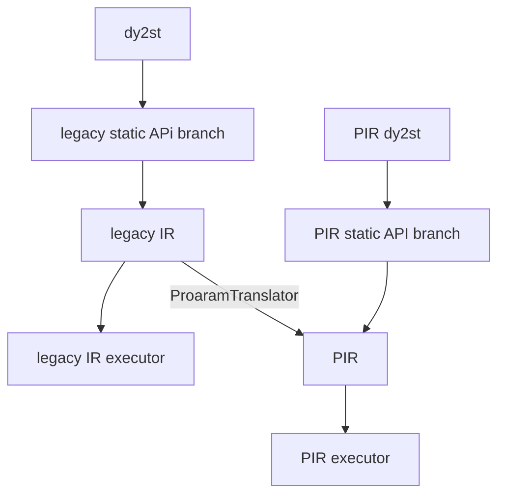
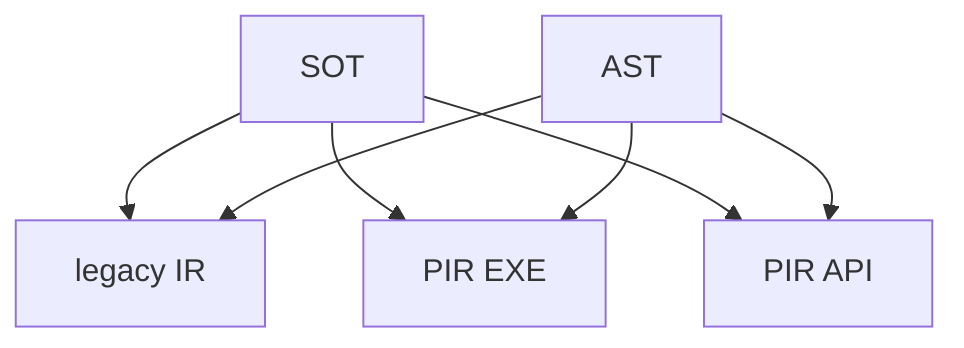

### 姓名

田川

### 实习项目

PIR 动转静组件建设与单测验证推全

### 本周工作

#### 1. **动转静单测机制推全**

任务完结:

* pr: ([#58356](https://github.com/PaddlePaddle/Paddle/pull/58356)、[#58389](https://github.com/PaddlePaddle/Paddle/pull/58389)、[#58458](https://github.com/PaddlePaddle/Paddle/pull/58458)、[#58464](https://github.com/PaddlePaddle/Paddle/pull/58464)、[#58465](https://github.com/PaddlePaddle/Paddle/pull/58465)、[#58490](https://github.com/PaddlePaddle/Paddle/pull/58490)、[#58499](https://github.com/PaddlePaddle/Paddle/pull/58499))
* 更加详细的描述可以查看[上周周报](./[WeeklyReport]2023.10.24~2023.10.31.md)


#### 2. **pir 动转静推全验证 第一阶段: 机制完善**

对现有的单测机制进行调整

##### 背景

从流程图的`dy2st`开始垂直向下为早期 `legacy IR` 形成的动转静模式。

在现阶段如果想要执行`PIR executor`的话需要经过一层`ProaramTranslator`转写。

我们的目标就是让他使用一套完整的`PIR dy2st`, 我们也称之为最终态(理想态), 也就是右侧`PIR dy2st`垂直向下的部分。




##### 目标

从背景可以看出我们目前需要支持的单测有三种 IR 工作模式, 以及两种 dy2st 模式。

这样组合之后我们就能得到新机制需要运行的单测组合: 2*3=6 (如下图)




##### 修改

本次修改可以在 https://github.com/PaddlePaddle/Paddle/pull/58630/files 中查看

1. 模式修改

原有机制会对`ToStaticMode.PIR_AST` 和 `IrMode.LEGACY_IR` 进行组合, 这明显不合理, 我们不可能在一个执行器中跑两套 IR 模式

所以首先对组合模式进行了修改，将`ToStaticMode.PIR_AST` 模式下沉至 `IrMode.PIR_EXE`, 这样我们就能对不同动转静模式和 IR 模式进行组合测试

`PIR_EXE`对应的就是走的`ProaramTranslator`达到运行`PIR executor`的模式。
`PIR_API`对应的就是走的全 PIR 模式, 也就是我们的最终态。


```diff
class ToStaticMode(Flag):
-    LEGACY_AST = auto()
-    PIR_AST = auto()
+    AST = auto()
+    SOT = auto()

class IrMode(Flag):
    LEGACY_IR = auto()
-    PIR = auto()
+    PIR_EXE = auto()
+    PIR_API = auto()

...
```

2. 为新的组合模式添加装饰器

此处的`test_legacy_and_pir`其实更应该叫`test_legacy_and_pir_exe`

```diff
def test_legacy_and_pir(fn):
-    fn = set_ir_mode(IrMode.LEGACY_IR | IrMode.PIR)(fn)
+    fn = set_ir_mode(IrMode.LEGACY_IR | IrMode.PIR_EXE)(fn)
+    return fn
+
+
+def test_legacy_and_pir_api(fn):
+    fn = set_ir_mode(IrMode.LEGACY_IR | IrMode.PIR_API)
+    return fn
+
+
+def test_legacy_and_pir_api_and_pir_exe(fn):
+    fn = set_ir_mode(IrMode.LEGACY_IR | IrMode.PIR_API | IrMode.PIR_EXE)
+    return fn
```

##### 确认支持情况

任务列表: https://github.com/PaddlePaddle/Paddle/issues/58633


### 下周工作

1. pir 动转静推全验证

### 导师点评


请联系导师填写


