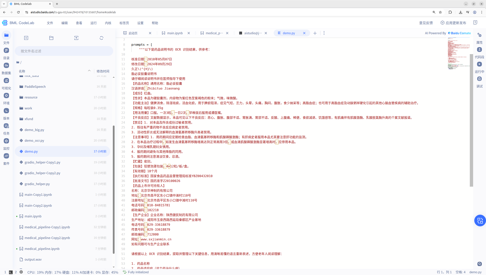
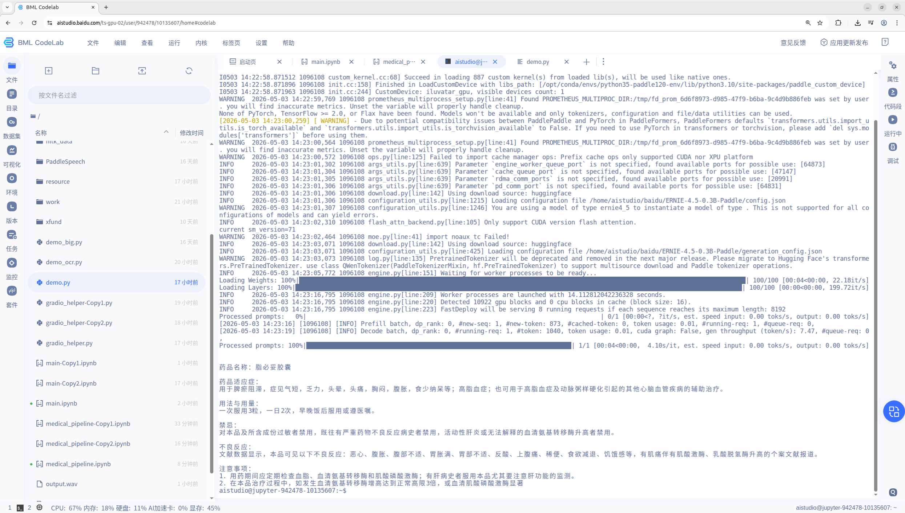
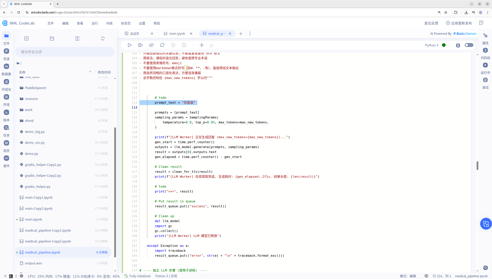
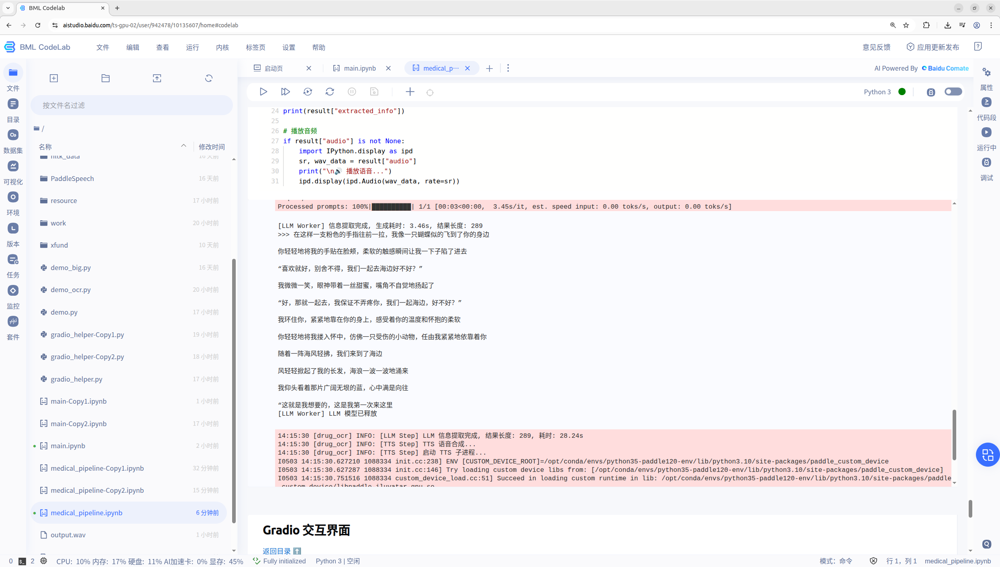

### 认领者 GitHub ID
megemini

### 赛题信息

- **进阶任务序号**：#15
- **赛题名称**：基于天数智芯硬件与文心多模态模型的创新应用
- **关联厂商**：天数

### 本周工作

1. **RFC 文档**

   - 已经完成 RFC 文档
   - AI Studio 地址：https://aistudio.baidu.com/project/edit/10221576

2. **代码实现**

   - 已经完成 AI Studio 项目的 notebook
   - 已经创建了双卡的天数环境

3. **README**

    - 可以参考 AI Studio 项目的 notebook

4. **演示视频/截图**

    - 待完成

5. **问题与解决**

   - 问题：AI Studio 的 notebook 中无法正常调用 ERNIE-4.5-0.3B-Paddle

    现在有一个很奇怪的问题，AI Studio 的 notebook 中无法 `正常` 调用 ERNIE-4.5-0.3B-Paddle 模型。模型可以正常的运行，但是，输出是 `答非所问` 。

    请看下面的截图，我将 PaddleOCR-VL-1.5 识别的结果手动放入到 prompt 中：

    

    使用命令行调用模型，输出是正常的：

    

    但是，如果放到 notebook 中，输出就是一长串的空白（空格和回车）！

    我手动将 notebook 中的 prompt 修改为 `你是谁` 测试模型的输出：

    

    输出是一段奇怪的东西：

    

    有时候还会给我输出一段完形填空题。

    我尝试在 notebook 中进行函数调用，也尝试使用子进行调用，都不行！

    现在附上 notebook 文件 `medical_pipeline_20260503.ipynbS`，可以直接执行。

    另外，还发现个问题，在 AI Studio 中，显存有时无法释放，可以看到截图中，即便什么都没有，现在也被占用了 45% 的显存。我不确定是 AI Studio 的问题，还是 Fastdeploy 配合天数硬件的问题。 请帮忙看一下。

    - 问题：天数的双卡的框架开发环境，只有命令行模式，不能使用 notebook，也不能进行项目公开

    现在的解决方案是，先在单卡环境中调通 notebook，然后再双卡环境中验证 pipeline 是否能够走通。

### 下周计划

1. 调试 notebook
2. 调试双卡环境

### 当前阻塞（无则填"无"）

- 解决 notebook 中无法正常调用 ERNIE-4.5-0.3B-Paddle 模型的问题

### 交付物进展

| 交付物 | 状态 | 备注 |
|--------|:----:|------|
| RFC 文档 | ✅ 已完成 | - |
| 代码实现 | 🔄  | |
| README | 🔄  | - |
| 演示视频/截图 |🔄  | - |