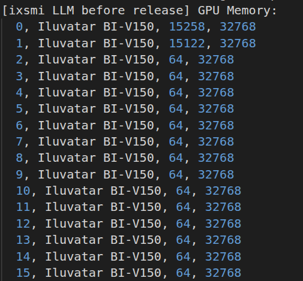
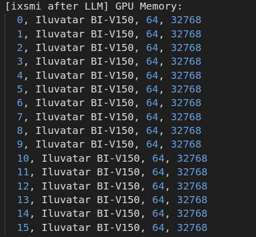
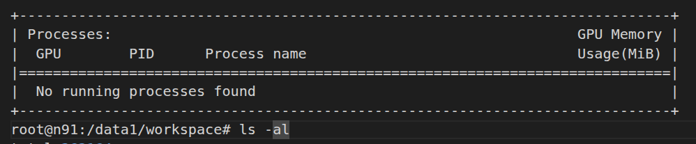
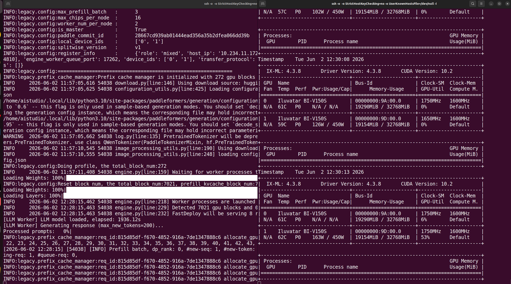

### 认领者 GitHub ID
megemini

### 赛题信息

- **进阶任务序号**：#15
- **赛题名称**：基于天数智芯硬件与文心多模态模型的创新应用
- **关联厂商**：天数

### 本周工作

1. **RFC 文档**

   - 已经完成 RFC 文档
   - AI Studio 地址：https://aistudio.baidu.com/project/edit/10221576

2. **代码实现**

   - 已经完成 AI Studio 项目的 notebook
   - 已完成 cli 的脚本，`drug_ocr_cli.py`

   1. 在 `drug_ocr_cli.py` 脚本中增加了 `ixsmi` 显存显示的步骤
   2. 在 `drug_ocr_cli.py` 脚本中增加了清理显存的步骤

   `ernie28b.log` 为日志文件，`output.wav` 为合成的音频文件。显存的清理情况以 ERNIE-4.5-21B-A3B-Paddle 模型为例，使用时，占用卡 0 和卡 1 各占约 15GB 的显存

   

   清理完 OCR 模型后，显存释放

   

   脚本执行完之后，进程全部被释放

   

   如果需要复现，可以参考以下步骤：

   ```markdown
     1. 安装依赖: pip install -r requirements.txt
     2. 上传脚本: vi drug_ocr_cli.py
     3. 将测试图片上传到服务器: mkdir resource;docker cp /root/megemini/test.jpg root_paddle-ixuca-330-0312:/data1/workspace/resource/test.jpg
     4. 手动下载 PaddleOCR-VL-1.5 模型: python /usr/local/bin/aistudio download --model PaddlePaddle/PaddleOCR-VL-1.5 --local_dir PaddleOCR-VL-1.5
        或者 PaddleOCR-VL-1.6: python /usr/local/bin/modelscope download --model PaddlePaddle/PaddleOCR-VL-1.6 --local_dir PaddleOCR-VL-1.6
        由于 PaddleOCR-VL-1.6 在 AI Studio 中还没有，因此这里使用 modelscope 下载。（另外，aistudio 这个下载工具实在是不好用，经常下载失败。）
       ERNIE-4.5-21B-A3B-Paddle 在 docker 中已经有了，不需要再下载
     5. 执行脚本: python drug_ocr_cli.py --image resource/test.jpg --no-split --ocr-tokens 4096 --llm-tokens 200 --ocr-model PaddleOCR-VL-1.6 --llm-model ERNIE-4.5-21B-A3B-Paddle

   ```

3. **README**

    - 可以参考 AI Studio 项目的 notebook

4. **演示视频/截图**

    

5. **问题与解决**

无

### 下周计划

无

### 当前阻塞（无则填"无"）

- AI Studio 环境极度不稳定

### 交付物进展

| 交付物 | 状态 | 备注 |
|--------|:----:|------|
| RFC 文档 | ✅ 已完成 | - |
| 代码实现 | ✅ 已完成 | |
| README | ✅ 已完成 | - |
| 演示视频/截图 | ✅ 已完成 | - |