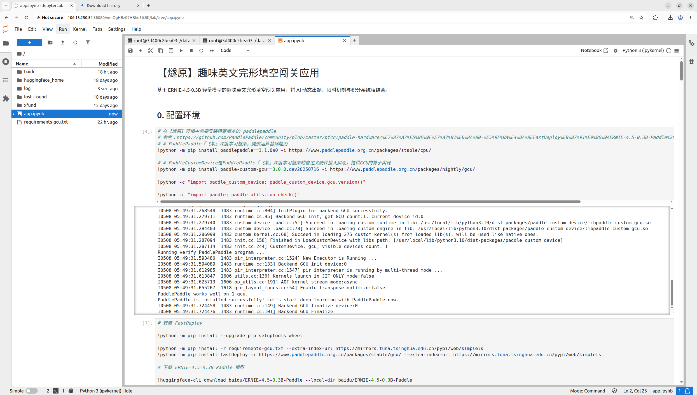
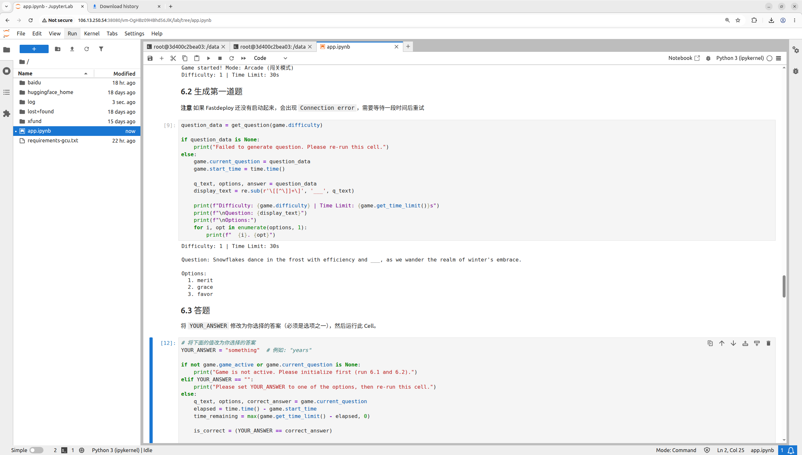
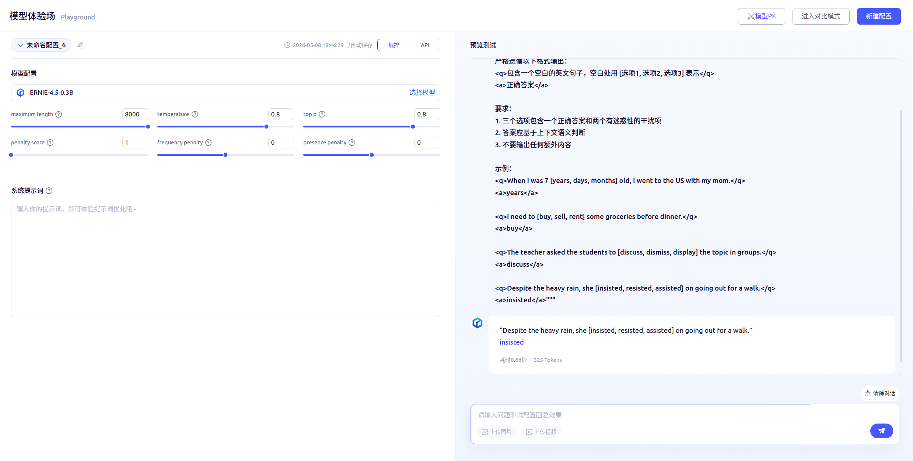

### 认领者 GitHub ID
megemini

### 赛题信息

- **进阶任务序号**：#17
- **赛题名称**：基于燧原卡为 FastDeploy 新增应用
- **关联厂商**：燧原

### 本周工作

1. **RFC 文档**

   - 已经完成 RFC 文档
   - AI Studio 地址：https://aistudio.baidu.com/projectdetail/10237267

2. **代码实现**

   - 已经完成 AI Studio 项目的 notebook

    已经在 燧原 的服务器上跑通了 notebook，可以正常调用 ERNIE-4.5-0.3B-Paddle 模型。

    notebook 见 app.ipynb

    在 燧原 的服务器上初始化：

    

    通过执行 cell 完成完形填空：

    

3. **README**

    - 可以参考 AI Studio 项目的 notebook

4. **演示视频/截图**

    - 待完成

5. **问题与解决**

   - 问题：ERNIE-4.5-0.3B-Paddle 生成效果问题

    之前在 RFC 中希望通过 `1` 个 prompt 就让模型生成问题和答案，使用的 prompt 如下：

    ```python
        prompt = f"""你是一位英语教育专家。请生成一道英文完形填空题。

    难度等级：{difficulty}（1最简单，5最难）

    严格遵循以下格式输出：
    <q>包含一个空白的英文句子，空白处用 [选项1, 选项2, 选项3] 表示</q>
    <a>正确答案</a>

    要求：
    1. 三个选项包含一个正确答案和两个有迷惑性的干扰项
    2. 答案应基于上下文语义判断
    3. 不要输出任何额外内容

    示例：
    <q>When I was 7 [years, days, months] old, I went to the US with my mom.</q>
    <a>years</a>

    <q>I need to [buy, sell, rent] some groceries before dinner.</q>
    <a>buy</a>

    <q>The teacher asked the students to [discuss, dismiss, display] the topic in groups.</q>
    <a>discuss</a>

    <q>Despite the heavy rain, she [insisted, resisted, assisted] on going out for a walk.</q>
    <a>insisted</a>"""

    ```

    但是，模型生成效果并不理想，可以参考 AI Studio 的模型体验场的生成效果：

    

    在多次尝试摸索 ERNIE-4.5-0.3B-Paddle 模型的能力边界之后，确定为现在的两阶段方式：

    1. 让模型根据难度生成一条英文句子
    2. 从句子中抽取一个单词，然后让模型给我几个同义词

    如此可以组合成一道完形填空题。

### 下周计划

1. 在 AI Studio 上创建 gradio 应用

### 当前阻塞（无则填"无"）

- 无

### 交付物进展

| 交付物 | 状态 | 备注 |
|--------|:----:|------|
| RFC 文档 | ✅ 已完成 | - |
| 代码实现 | 🔄  | |
| README | 🔄  | - |
| 演示视频/截图 |🔄  | - |