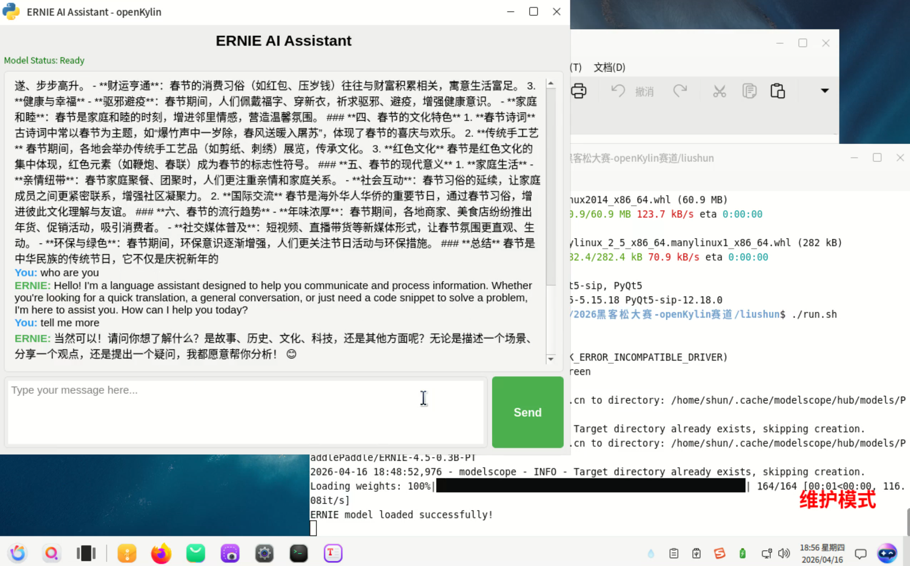

### 认领者 GitHub ID
megemini

### 赛题信息

- **进阶任务序号**：#28
- **赛题名称**：在 openKylin 桌面上运行的图形化 AI 助手 demo
- **关联厂商**：麒麟

### 本周工作

1. **RFC 文档**

   - 已经完成 RFC 文档
   - AI Studio 地址：https://gitee.com/openkylin/community-management/blob/master/2026%E9%BB%91%E5%AE%A2%E6%9D%BE%E5%A4%A7%E8%B5%9B-openKylin%E8%B5%9B%E9%81%93/liushun/README.md

2. **代码实现**

   - 已经完成 APP， PR 已经合入 https://gitee.com/openkylin/community-management/pulls/287

3. **README**

    - 参考 APP 的 README

4. **演示视频/截图**

    - 

5. **问题与解决**

   无

### 下周计划

PR 已合入，暂无其他计划

### 当前阻塞（无则填"无"）

- 无

### 交付物进展

| 交付物 | 状态 | 备注 |
|--------|:----:|------|
| RFC 文档 | ✅ 已完成 | - |
| 代码实现 | ✅ 已完成 | |
| README | ✅ 已完成 | - |
| 演示视频/截图 | ✅ 已完成| - |