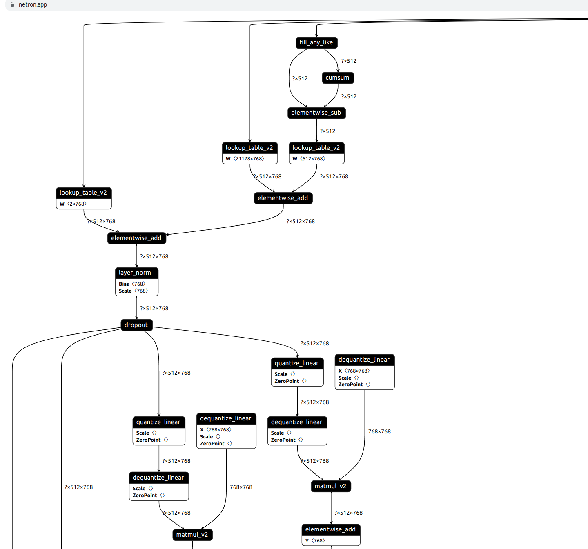

### 姓名
王龙志

### 实习项目
量化算子集成

### 本周工作

1. **编写将  matmul_v2 和 quant dequant op 融合替换成 quant_linear 的 pass** 
该 pass 将 quant dequant dequant_weight 以及 matmul_v2 以及后面的 elementwise_add op 替换成 quant_linear op 
相关 PR: https://github.com/PaddlePaddle/Paddle/pull/58637 

2. **完成 bert 模型的导出和量化**
完成 bert 模型的量化，为后面原生推理与 TRT 推理在语言大模型上进行对比分析打下基础

3. **修复 paddle trt 在 int8 模式下的推理 bug** 
相关 issue: https://github.com/PaddlePaddle/Paddle/issues/58674 
相关 PR: https://github.com/PaddlePaddle/Paddle/pull/58672

4. **学习 paddle trt 相关的 pass** 
继续学习 paddle trt 的有关 pass 的实现，为后续继续编写 pass 增加熟练度

### 下周工作
1. 该pass目前只完成了基本功能，可能还有不完善的地方, 待与导师沟通之后再进行完善
2. 编写其他算子融合的 pass
3. 学习其他竞品的相关优化思路

### 导师点评
本周在完成前期准备工作的基础上进展迅猛，距离第一个目标：完成Bert模型的量化、推理全流程已经十分接近了；同时还能在项目之余发现int8推理在PaddleTRT下的bug，可作为本周的亮点工作。接下来将进入到第一阶段的收尾工作，期望能在11月中旬完成pass的编写，并能完成Bert模型的量化推理一体化流程，对比与TRT的速度。其他融合pass将集中在量化反量化的融合。

对于竞品的调研也是一个很好的切入点，后续可以作为分享的题目，继续加油~
