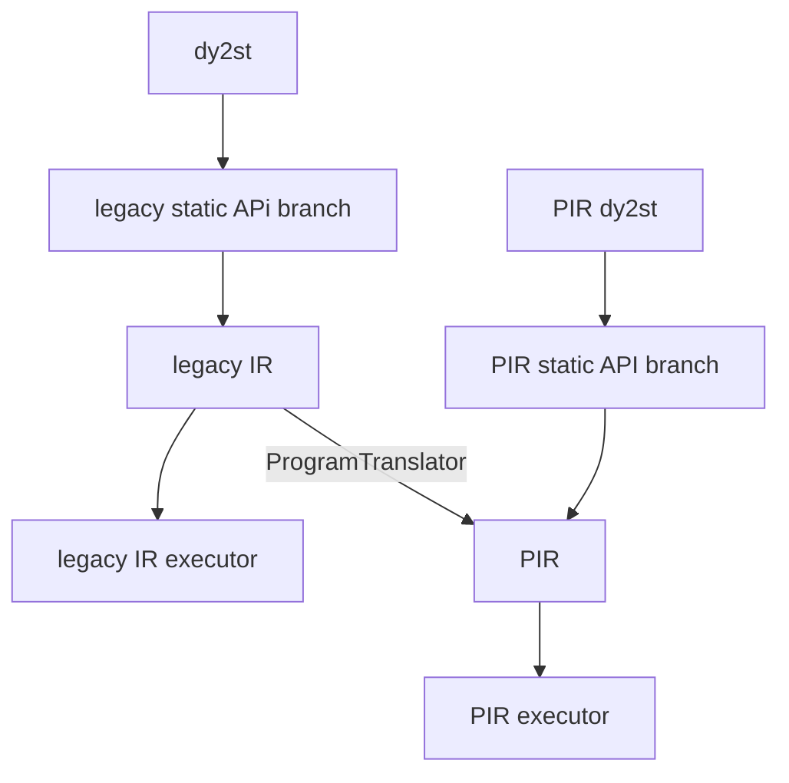
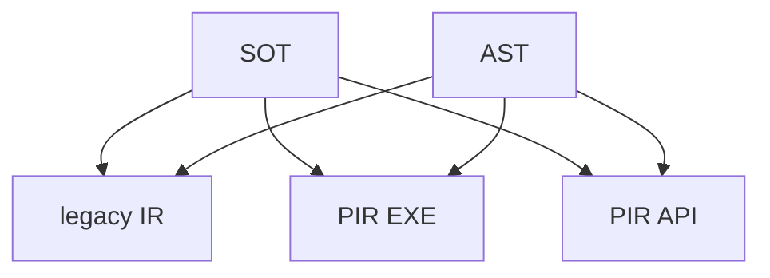

### 姓名

田川

### 实习项目

PIR 动转静组件建设与单测验证推全

### 本周工作

#### 1. **动转静单测机制推全**

归类任务列表 https://github.com/PaddlePaddle/Paddle/issues/58356

任务目标: 使用新的`dygraph_to_static_utils_new`完全替换原有旧`dygraph_to_static_util`机制

##### 从日志中分析新的单测机制

这是`test/dygraph_to_static/test_bert.py`文件下`TestBert`的日志

```bash
[creating Dy2StTestBase]
[creating TestBert]
Generating test_train_new_ir
fn_to_static_modes: ToStaticMode.LEGACY_AST|SOT
fn_ir_modes: IrMode.PIR
fn_disabled_test_cases: []
Generating test_train
fn_to_static_modes: ToStaticMode.LEGACY_AST
fn_ir_modes: IrMode.LEGACY_PROGRAM
fn_disabled_test_cases: []
Generating test_train_composite
fn_to_static_modes: ToStaticMode.LEGACY_AST|SOT
fn_ir_modes: IrMode.LEGACY_PROGRAM
fn_disabled_test_cases: []
[showing TestBert]
test_train__legacy_ast_legacy_program: <function to_legacy_program_test.<locals>.impl at 0x12975e480>
test_train_composite__legacy_ast_legacy_program: <function to_legacy_program_test.<locals>.impl at 0x12975e5c0>
test_train_composite__sot_legacy_program: <function to_legacy_program_test.<locals>.impl at 0x12975e700>
test_train_new_ir__legacy_ast_pir: <function TestBert.test_train_new_ir at 0x12975e200>
test_train_new_ir__sot_pir: <function TestBert.test_train_new_ir at 0x12975e340>
```

拆分到`test_train_new_ir`方法
```bash
[creating TestBert] # 生成单测的类
Generating test_train_new_ir    # 方法名
fn_to_static_modes: ToStaticMode.LEGACY_AST|SOT   # 运行测试的动转静模式
fn_ir_modes: IrMode.PIR   # 运行在哪个 IR 模式下
fn_disabled_test_cases: []
[showing TestBert] # 生成后的逻辑
test_train_new_ir__legacy_ast_pir: <function TestBert.test_train_new_ir at 0x12975e200> # 生成后的新名称，以及方法信息
test_train_new_ir__sot_pir: <function TestBert.test_train_new_ir at 0x12975e340>
```
IR模式: 截止 2023年10月28日 paddle 仓库下存在着两套 IR 模式, 一套叫 PIR, 一套叫旧 IR (对应日志显示的模式是`LEGACY_PROGRAM`)

动转静模式: 截止 2023年10月28日 paddle 仓库下存在着两套 动转静模式, 一套叫 AST(基于语法树), 一套叫 SOT(基于字节码)

生成后新名字的逻辑:
```python
f"{方法名}__{动转静模式}_{IR模式}"
```

这样的话我们就有四种单测情况: (`PIR + SOT`) + (`PIR + AST`) + (`legacy_program + SOT`) + (`legacy_program + AST`) = 4

其中`legacy_program + AST`就是最最最原始的单测机制，而`Dy2StTestBase`继承的默认情况会是 (`legacy_program + SOT`) + (`legacy_program + AST`) 

##### 遇到的一些问题:

复现demo

```python
class TestBert(Dy2StTestBase):
  def test_train():
    pass

class TestCase2(TestBert):
  def test_train():
    pass

  def test_train_new_ir():
    pass
```

这时候我们再来看日志：

```bash
...
[showing TestB]
test_train__legacy_ast_legacy_program: <function to_legacy_program_test.<locals>.impl at 0x11c872980>
test_train__sot_legacy_program: <function to_legacy_program_test.<locals>.impl at 0x11c872ac0>
test_train_new_ir__legacy_ast_pir: None
test_train_new_ir__sot_pir: None
```

我们会发现之前在处理类继承时, 前缀相同的会导致也被判定为重载方法

源码分析，这里为处理类继承，需要禁用父类的测试。这里的`fn_name`就是新生成的 test case

```diff
for fn_name, fn in original_test_cases.items():
            # Disable inherited test cases
            for base in bases:
                for attr in dir(base):
-                    if attr.startswith(fn_name):
+                    if attr.startswith(f"{fn_name}__"):
                        new_attrs[attr] = None
```

这里可以根据前面生成新名字的逻辑，只需要把原有的`fn_name`添加`__`就能正确禁用

任务完结:

* pr: ([#58356](https://github.com/PaddlePaddle/Paddle/pull/58356)、[#58389](https://github.com/PaddlePaddle/Paddle/pull/58389)、[#58458](https://github.com/PaddlePaddle/Paddle/pull/58458)、[#58464](https://github.com/PaddlePaddle/Paddle/pull/58464)、[#58465](https://github.com/PaddlePaddle/Paddle/pull/58465)、[#58490](https://github.com/PaddlePaddle/Paddle/pull/58490)、[#58499](https://github.com/PaddlePaddle/Paddle/pull/58499))


#### 2. **python端补齐OpResult的patch方法**

任务列表：https://github.com/PaddlePaddle/Paddle/issues/58118

PR: https://github.com/PaddlePaddle/Paddle/pull/58343

问题：在调用 c++ api `full`的时候会导致传入参数与原有逻辑不一致

##### 报错信息:

```bash
Traceback (most recent call last):
  File "/workspace/Paddle/build/test/prim/pir_prim/test_sink_decomp.py", line 92, in test_prim_backward
    res_ref = self.base_net()
  File "/workspace/Paddle/build/test/prim/pir_prim/test_sink_decomp.py", line 52, in base_net
    gradients = grad(new_out, (x, y))
  File "/workspace/Paddle/build/python/paddle/autograd/ir_backward.py", line 801, in grad
    input_grad = calc_gradient(outputs, inputs, grad_outputs, no_grad_set)
  File "/workspace/Paddle/build/python/paddle/autograd/ir_backward.py", line 694, in calc_gradient
    input_to_inputgrad_map = calc_gradient_helper(
  File "/workspace/Paddle/build/python/paddle/autograd/ir_backward.py", line 636, in calc_gradient_helper
    effective_forward_ops, _ = prune_ops(
  File "/workspace/Paddle/build/python/paddle/autograd/ir_backward.py", line 191, in prune_ops
    if some_in_set(op.operands_source(), inputs_set):
  File "/workspace/Paddle/build/python/paddle/autograd/ir_backward.py", line 168, in some_in_set
    if operand2value(value_list) & operand2value(value_set):
  File "/workspace/Paddle/build/python/paddle/pir/math_op_patch.py", line 273, in __impl__
    other_var_opresult = paddle.tensor.creation.fill_constant(
  File "/workspace/Paddle/build/python/paddle/tensor/creation.py", line 911, in fill_constant
    out = _C_ops.full(shape, value, dtype, place)
ValueError: 

--------------------------------------
C++ Traceback (most recent call last):
--------------------------------------
```

##### 分析原因:

原来 opresult 在 C++ 端 bind 了一套 eq 方法，现在我们在 python 端写了一套 eq 方法把原来的覆盖了。而 set 的 & 操作会调用到 OpResult 的 __eq__ 方法，导致 set 在 & 的时候有问题。

后续修复思路：修改 PIR backward 的代码逻辑


#### 3. **PIR 动转静推全验证 第一阶段: 机制完善**

对现有的单测机制进行调整

##### 背景

从流程图的`dy2st`开始垂直向下为早期 `legacy IR` 形成的动转静模式。

在现阶段如果想要执行`PIR executor`的话需要经过一层`ProaramTranslator`转写。

我们的目标就是让他使用一套完整的`PIR dy2st`, 我们也称之为最终态(理想态), 也就是右侧`PIR dy2st`垂直向下的部分。




##### 目标

从背景可以看出我们目前需要支持的单测有三种 IR 工作模式, 以及两种 dy2st 模式。

这样组合之后我们就能得到新机制需要运行的单测组合: 2*3=6 (如下图)




##### 修改

本次修改可以在 https://github.com/PaddlePaddle/Paddle/pull/58630/files 中查看

1. 模式修改

原有机制会对`ToStaticMode.PIR_AST` 和 `IrMode.LEGACY_IR` 进行组合, 这明显不合理, 我们不可能在一个执行器中跑两套 IR 模式

所以首先对组合模式进行了修改，将`ToStaticMode.PIR_AST` 模式下沉至 `IrMode.PIR_EXE`, 这样我们就能对不同动转静模式和 IR 模式进行组合测试

`PIR_EXE`对应的就是走的`ProaramTranslator`达到运行`PIR executor`的模式。
`PIR_API`对应的就是走的全 PIR 模式, 也就是我们的最终态。


```diff
class ToStaticMode(Flag):
-    LEGACY_AST = auto()
-    PIR_AST = auto()
+    AST = auto()
+    SOT = auto()

class IrMode(Flag):
    LEGACY_IR = auto()
-    PIR = auto()
+    PIR_EXE = auto()
+    PIR_API = auto()

...
```

2. 为新的组合模式添加装饰器

此处的`test_legacy_and_pir`其实更应该叫`test_legacy_and_pir_exe`

```diff
def test_legacy_and_pir(fn):
-    fn = set_ir_mode(IrMode.LEGACY_IR | IrMode.PIR)(fn)
+    fn = set_ir_mode(IrMode.LEGACY_IR | IrMode.PIR_EXE)(fn)
+    return fn
+
+
+def test_legacy_and_pir_api(fn):
+    fn = set_ir_mode(IrMode.LEGACY_IR | IrMode.PIR_API)
+    return fn
+
+
+def test_legacy_and_pir_api_and_pir_exe(fn):
+    fn = set_ir_mode(IrMode.LEGACY_IR | IrMode.PIR_API | IrMode.PIR_EXE)
+    return fn
```

##### 确认支持情况

任务列表: https://github.com/PaddlePaddle/Paddle/issues/58633


### 下周工作

1. PIR 动转静理想态推全验证
2. OpResult 方法补全

### 导师点评


动转静单测机制推全迅速，为 PIR 动转静最终态单测验证提供了基础，目前也已经对单测验证背景和目标有了较为深刻的理解，正在稳步推进中，LGTMeow 🐾


### 相关链接

* [PIR 文档以及代码规范](https://github.com/PaddlePaddle/community/tree/master/pfcc/paddle-code-reading/IR_Dialect)
* [PaddleSOT](https://github.com/paddlepaddle/paddleSOT)，现已移入 paddle 主仓库[#57824](https://github.com/PaddlePaddle/Paddle/pull/57824)

