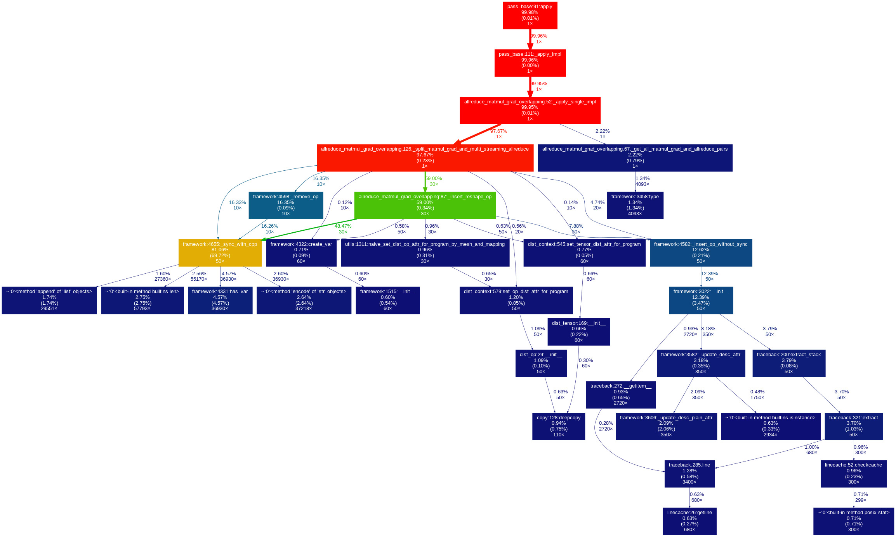
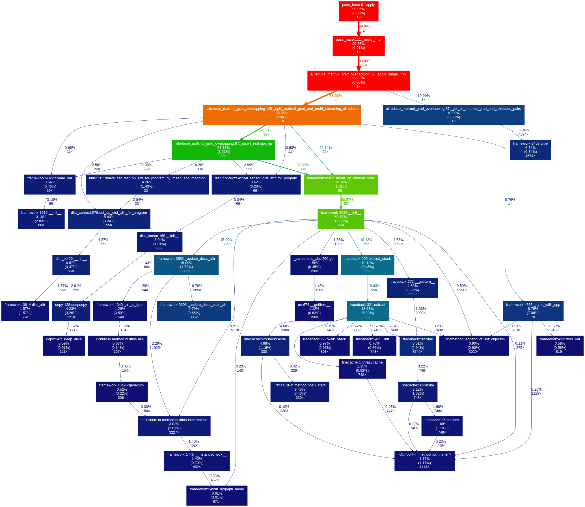
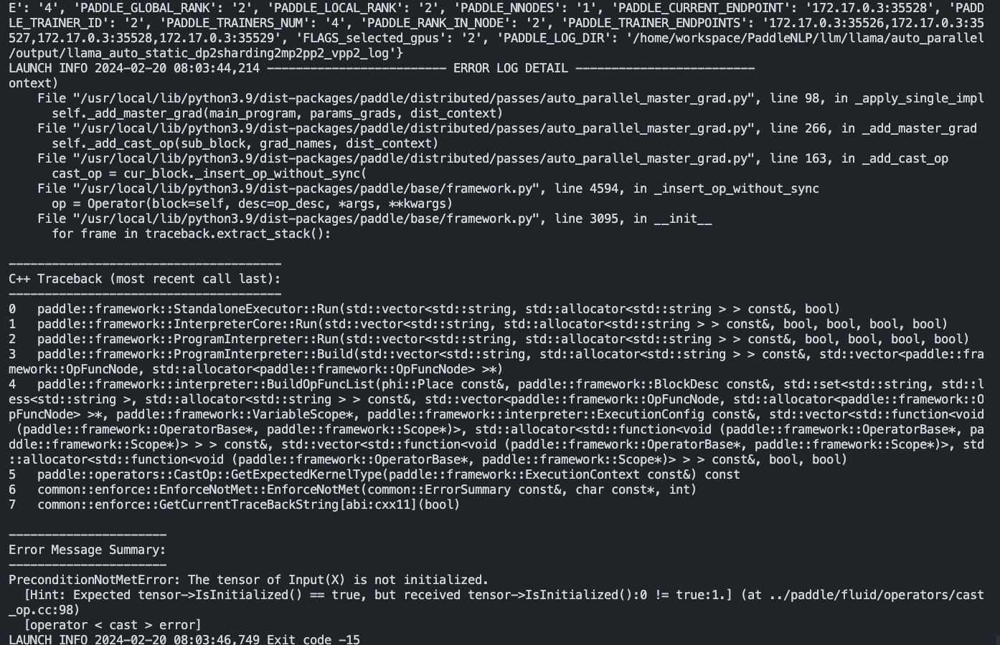
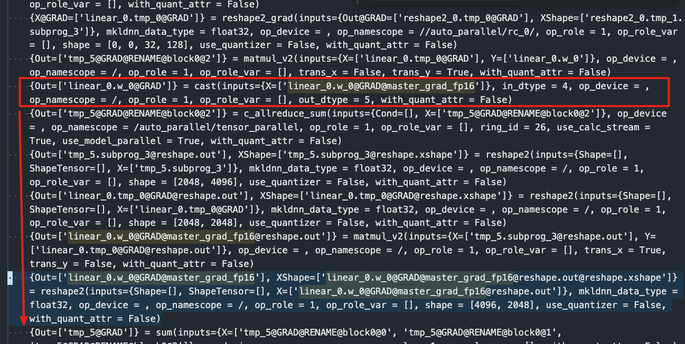

### 姓名

卢畅

### 实习项目

静态图半自动并行训练性能优化

### 本周工作

本项目的主要工作是针对 Paddle 静态图模型的半自动并行训练性能优化，本周主要工作如下：

1. 为 VPP 适配 send_recv_overlap

send_recv_overlap 是将通信和计算重叠的技术，可以提高通信效率。在 VPP 中，适配之前 VPP 编排模式并不支持 send_recv_overlap，因此需要对 VPP 进行适配。

相关 PR：

- https://github.com/PaddlePaddle/Paddle/pull/61541

2. 优化 all_reduce_matmul_grad_overlapping

当下 all_reduce_matmul_grad_overlapping 中有很多多余的 sync_with_cpp 。将这些多余的 sync_with_cpp 去掉，在 overlapping 之后再进行 sync_with_cpp 可以提高性能。

```
优化前 （单位：秒）：

1    0.000    0.000    0.212    0.212 pass_base.py:91(apply)
1    0.000    0.000    0.211    0.211 pass_base.py:111(_apply_impl)
1    0.000    0.000    0.211    0.211 allreduce_matmul_grad_overlapping.py:52(_apply_single_impl)
1    0.000    0.000    0.207    0.207 allreduce_matmul_grad_overlapping.py:126

优化后（单位：秒）：

1    0.000    0.000    0.046    0.046 pass_base.py:91(apply)
1    0.000    0.000    0.046    0.046 pass_base.py:111(_apply_impl)
1    0.000    0.000    0.046    0.046 allreduce_matmul_grad_overlapping.py:52(_apply_single_impl)
1    0.000    0.000    0.040    0.040 allreduce_matmul_grad_overlapping.py:125
```

优化前耗时分布：

  

优化后耗时分布：

 

相关 PR:

- https://github.com/PaddlePaddle/Paddle/pull/61817

3. 修复 allreduce_matmul_grad_overlapping 和 master_grad 同时开启时候的 bug

当下 allreduce_matmul_grad_overlapping 和 master_grad 同时开启的情况下，会出现 cast op 位置错误的情况，导致 cast op 将没有初始化的tensor作为输入，进而导致选Kernel 报错：

  

为了适配这种情况，我们需要需要将依赖 dy 的 op 移动到 allreduce_matmul_grad_overlapping 的第二个 matmul 之后：

  

经过测试，llama 模型的loss和pr修改前可以对齐

相关 PR：

- https://github.com/PaddlePaddle/Paddle/pull/61865

4. 将 reduce 的 op 移动到 optimize 阶段以提高性能

静态图下开启sharding后，每个micro batch 反向阶段都会进行 allreduce, 但是反向阶段做通信的操作性能比较差。

sharding 的这个 pass 在做通信的时候会插入一下reduce去做通信，现在将reduce移动到opt阶段，这样可以减少通信的次数，提高性能。

```
没有gm:  reduce(grad) -> opt(grad)
有gm: reduce(grad) -> grad_megred=add(grad) -> opt(grad_megred)         
优化后: grad_megred=add(grad) -> reduce(grad_megred) -> opt(grad_megred)
                                insert role=opt
```

测试 Case:

- 使用 c_reduce_sum 通过测试，llama 模型 loss 可以对齐 ✅
- 使用 c_reduce_avg 通过测试，llama 模型 loss 可以对齐 ✅

相关 PR:

- https://github.com/PaddlePaddle/Paddle/pull/62157
- https://github.com/PaddlePaddle/Paddle/pull/62441
- https://github.com/PaddlePaddle/PaddleNLP/pull/8045

5. 阅读 Zero-Bubble 的论文

阅读了 Zero-Bubble 的论文，了解了 Zero-Bubble 的原理和实现，并写了笔记。

笔记链接：

- https://space.keter.top/docs/high_performance/%E5%88%86%E5%B8%83%E5%BC%8F/zero-bubble

### 下周工作

1. 阅读 Zero-Bubble 相关代码，了解其实现原理
2. 初步编写 Zero-Bubble 的实现方案并与导师讨论以完善方案


### 导师点评
卢畅同学这段时间完成了多项关键的性能优化任务，不仅为VPP适配了send_recv_overlap技术，修复了allreduce_matmul_grad_overlapping和master_grad同时开启时出现的bug，还成功将sharding reduce移动到optimize阶段进一步提升了训练性能，这些优化对于大规模并行训练具有重要意义。
期待在下周的工作中继续保持这种良好的状态，为项目的成功贡献更多力量。
