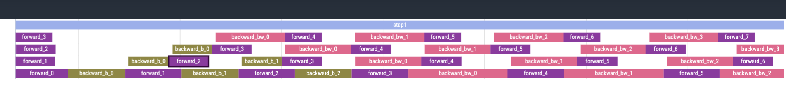

### 姓名

卢畅

### 实习项目

静态图半自动并行训练性能优化

### 本周工作

本周的主要工作是设计 Zero Bubble 的实现方案，以及与导师讨论并完善方案。还完成了几个 Zero Bubble 并行调度的前置任务，以及对 Zero Bubble 的实现方案进行了初步的实现。

1. 将 allreduce_matmul_grad_overlapping 中拆分 matmul_grad_op 的操作提取到 pass_utils 当中

由于 Zero Bubble 需要对 matmul_grad_op 进行拆分，所以需要将现有的拆分操作提取到 pass_utils 当中，以便 Zero Bubble 调用。

相关 PR：

- https://github.com/PaddlePaddle/Paddle/pull/62737

2. 将 pipeline_scheduler_pass.py 中的 pass 进行拆分成单独的文件

当下 Paddle 内部已经有了 4 种 pipeline_scheduler_pass， 之前都放在 pipeline_scheduler_pass.py 里面，后续如果继续添加 pipeline_scheduler_pass 就会导致 pipeline_scheduler_pass.py 略微臃肿。本 PR 将 pipeline_scheduler_pass 内的 pass 进行拆分并放到一个文件夹当中

相关 PR：

- https://github.com/PaddlePaddle/Paddle/pull/62645

3. 完成 Zero Bubble 的实现方案初步设计

与导师反复讨论，初步设计了 Zero Bubble 的实现方案，主要包括如下主要任务：

- [ ] 为 Paddle 适配 ZB-H1 编排策略
    - [x] 将 matmul_v2_grad 进行拆分 
    - [ ] 将反向计算分为两部分，进行并行化改造 
    - [ ] 在 Llama2 上测试 ZB-H1 的性能提升
    - [ ] 移除优化器步骤之间的同步
- [ ] 为 Paddle 适配 ZB-Vpp 编排策略
- [ ] 为 Paddle 适配 ZB-H2 编排策略
- [ ] 移除优化器步骤之间的同步操作
- [ ] 实现自动搜索最优调度编排策略 ZH-1P ZH-2P

详见Tracking Issue:

- https://github.com/PaddlePaddle/Paddle/issues/62666

4. 初步编写 ZB-H1 的编排方案

初步编写了 Zero Bubble 的编排方案，并对结果进行初步测试

- 精度可以对得上的，有时候小数点后3位以后会有误查（符合论文的描述）
- 速度我这边测的规模比较小（pp4, batch 1, hidden_layer=4） 3090 上 interval_samples_per_second: 5.7 左右 =》 6.1 左右
- 显存占用变多了

调度结果如下：

  

相关 PR：

- https://github.com/PaddlePaddle/Paddle/pull/62865

### 下周工作

1. 完善 ZB-H1 的编排实现，以及对结果进行测试
2. 对 ZB-H1 支持 send_backward_recv_forward overlap
3. 排查显存占用变多的问题

### 导师点评
卢畅同学本周将一些关键操作提取到pass_utils中，使得Zero Bubble能够方便地调用，还对pipeline_scheduler_pass进行了拆分，使代码结构更加清晰。在Zero Bubble的实现方案上，与导师进行了深入的讨论，并初步完成了ZB-H1的编排方案，这是一个非常重要的里程碑。
下周计划完善ZB-H1的编排实现，并对结果进行测试，同时还计划支持send_backward_recv_forward overlap，这将有助于进一步提升性能。
总的来说，卢畅同学本周的工作非常出色，展现出了良好的编程能力和问题解决能力。希望能够继续保持这种良好的势头，在接下来的工作中取得更大的进步。