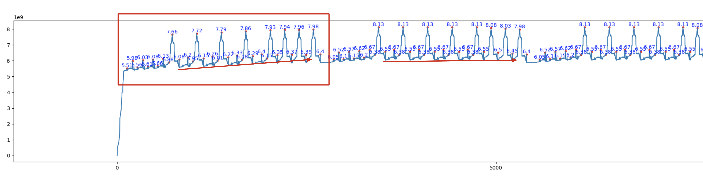

### 姓名

卢畅

### 实习项目

静态图半自动并行训练性能优化

### 本周工作

本周工作主要是编写 ZBV 编排所需要用到的显存估计功能

#### 1. 显存工具编写

目前显存工具的主要思路是根据每个 op 的输入和输出参数大小来估计的（除了 persistable 以外的其他参数，persistable 的参数已经在 start up的时候分配）。具体来说就是根据 op 的执行顺序更新 var 的显存占用。同时对于 program 内后续不会继续用到的 var 的显存及时模拟释放。var 的显存占用是计算了 local size 后（DistributedTensor.get_local_sizes）乘上类型的字节数。

基本功能完成编写后，在 Llama2 模型上与实际跑模型时候的显存进行对比，目前发现和实际显存还有一定的差距，需要进一步定位问题。

相关 PR：

- https://github.com/PaddlePaddle/Paddle/pull/63402

#### 2. 定位 Forward 阶段显存逐步增加的原因

通过可视化 Llama2 1f1b 场景下显存的实际使用曲线发现，Forward 阶段显存逐步增加。经过排查发现显存增加的原因是因为，流水并行场景下后续的 Backward 阶段会依赖 Forward 阶段的输出，所以这些变量就会被保留在显存中。因此在估计显存占用的时候需要考虑这些变量。

#### 3. 排查 Backward 阶段的显存增长问题

Llama2 1f1b 场景下显存的实际使用曲线，在第一个 step 里面，backward 阶段会有一个显存的增加，而且这个显存的后面并没有释放掉。

  

这个问题排查了很久最后咨询了其他研发老师发现这个问题引起的原因是 pir 下 builtin.combine op 没有正常 gc 引起的。这个问题已经在 #63573 中修复了。

#### 4. 排查 Backward 阶段峰值显存估计差距的原因

目前 1F1B 场景下显存估计和实际显存基本一致，但是 Backward 阶段的峰值显存估计和实际峰值显存还是有一定的差距。这个问题还在排查中。估计 backward program 的峰值显存与实际运行时候的峰值显存差了 10% 左右。

目前已经排除由于 inplace 策略引起的显存估计不准确的问题，具体原因还在排查中。一下是估计的显存和实际显存的对比表(记录了 op 运行之前的显存)：

| 手动根据静态图模拟 |  | 实际运行 |  |
| --- | --- | --- | --- |
| op   |   显存   |   op   |   显存 |
| cast   |   50364416   |   cast   |   50364416 |
| pow   |   83918848   |   pow   |   83918848 |
| reduce_mean   |   117473280   |   mean   |   50372608 |
| scale   |   117481472   |   scale_   |   50372608 |
| rsqrt   |   117481472   |   rsqrt_   |   50372608 |
| elementwise_mul   |   117481472   |   multiply   |   83927040 |
| elementwise_mul   |   151035904   |   multiply   |   117481472 |
| matmul_v2   |   184590336   |   matmul   |   151035904 |
| reshape2   |   218144768   |   reshape_   |   151035904 |
| matmul_v2   |   218144768   |   matmul   |   184590336 |
| reshape2   |   251699200   |   reshape_   |   184590336 |
| matmul_v2   |   251699200   |   matmul   |   218144768 |
| reshape2   |   285253632   |   reshape_   |   218144768 |
| squeeze2   |   285253632   |   squeeze   |   219193344 |
| squeeze2   |   286302208   |   squeeze   |   220241920 |
| unsqueeze2   |   287350784   |   unsqueeze   |   220258304 |
| gather_nd   |   287367168   |   gather_nd   |   220241920 |
| unsqueeze2   |   287350784   |   unsqueeze_   |   220241920 |
| unsqueeze2   |   287350784   |   unsqueeze   |   220241920 |
| gather_nd   |   287350784   |   gather_nd   |   220225536 |
| unsqueeze2   |   287334400   |   unsqueeze_   |   220225536 |
| elementwise_mul   |   287334400   |   multiply   |   253779968 |
| slice   |   320888832   |   slice   |   270557184 |
| slice   |   337666048   |   slice   |   287334400 |
| scale   |   354443264   |   scale_   |   287334400 |
| concat   |   354443264   |   concat   |   287334400 |
| elementwise_mul   |   387997696   |   multiply   |   320888832 |
| elementwise_add   |   421552128   |   add   |   287334400 |
| elementwise_mul   |   455106560   |   multiply   |   320888832 |
| slice   |   488660992   |   slice   |   337666048 |
| slice   |   505438208   |   slice   |   354443264 |
| scale   |   522215424   |   scale_   |   354443264 |
| concat   |   522215424   |   concat   |   354443264 |
| elementwise_mul   |   555769856   |   multiply   |   387997696 |
| elementwise_add   |   589324288   |   add   |   354443264 |
| transpose2   |   622878720   |   transpose   |   354443264 |
| transpose2   |   622878720   |   transpose   |   354443264 |
| transpose2   |   622878720   |   transpose   |   354443264 |
| scale   |   622878720   |   scale_   |   354443264 |
| transpose2   |   622878720   |   transpose   |   354443264 |
| matmul_v2   |   622878720   |   matmul   |   891314176 |
| reshape2   |   1159749632   |   reshape   |   891314176 |
| elementwise_add   |   1159749632   |   add   |   874536960 |
| cast   |   1696620544   |   cast_   |   874536960 |
| softmax   |   1696620544   |   softmax_   |   874536960 |
| cast   |   1696620544   |   cast   |   1411407872 |
| matmul_v2   |   2233491456   |   matmul   |   1444962304 |
| transpose2   |   2267045888   |   transpose   |   1444962304 |
| reshape2   |   2267045888   |   reshape_   |   1444962304 |
| matmul_v2   |   2267045888   |   matmul   |   1478516736 |
| elementwise_add   |   2300600320   |   add   |   1478516736 |
| cast   |   2334154752   |   cast   |   1512071168 |
| pow   |   2367709184   |   pow   |   1545625600 |
| reduce_mean   |   2401263616   |   mean   |   1512079360 |
| scale   |   2401271808   |   scale_   |   1512079360 |
| rsqrt   |   2401271808   |   rsqrt_   |   1512079360 |
| elementwise_mul   |   2401271808   |   multiply   |   1545633792 |
| elementwise_mul   |   2434826240   |   multiply   |   1579188224 |
| matmul_v2   |   2468380672   |   matmul   |   1669365760 |
| matmul_v2   |   2558558208   |   matmul   |   1759543296 |
| swiglu   |   2648735744   |   swiglu   |   1849720832 |
| matmul_v2   |   2738913280   |   matmul   |   1849720832 |
| recv_v2   |   2772467712   |   recv_v2   |   1883275264 |
| assign   |   2806022144   |   assign_   |   1883275264 |
| elementwise_add_grad   |   2806022144   |   add_grad_   |   1916829696 |
| matmul_v2_grad   |   2806022144   |   matmul_grad   |   2063630336 |
| elementwise_add   |   2952822784   |   swiglu_grad   |   1793097728 |
| swiglu_grad   |   2772467712   |   matmul_grad   |   1916829696 |
| matmul_v2_grad   |   2682290176   |   add_   |   1736474624 |
| elementwise_add   |   2806022144   |   matmul_grad   |   1826652160 |
| matmul_v2_grad   |   2625667072   |   multiply_grad   |   1579204608 |
| elementwise_add   |   2715844608   |   multiply_grad   |   1545641984 |
| sum   |   2535489536   |   rsqrt_grad_   |   1545633792 |
| elementwise_mul_grad   |   2501935104   |   scale_   |   1545633792 |
| elementwise_add   |   2468397056   |   mean_grad   |   1579180032 |
| elementwise_mul_grad   |   2468380672   |   pow_grad_   |   1545625600 |
| rsqrt_grad   |   2434834432   |   cast_   |   1545625600 |
| scale   |   2434826240   |   add_n   |   1478516736 |
| reduce_mean_grad   |   2434826240   |   add_grad_   |   1512071168 |
| pow_grad   |   2434818048   |   matmul_grad   |   1545625600 |
| cast   |   2401263616   |   reshape_grad_   |   1478516736 |
| sum   |   2401263616   |   transpose_grad   |   1478516736 |
| elementwise_add_grad   |   2334154752   |   matmul_grad   |   1444962304 |
| matmul_v2_grad   |   2334154752   |   cast_   |   1444962304 |
| elementwise_add   |   2367709184   |   softmax_grad   |   908091392 |
| reshape2_grad   |   2300600320   |   cast_   |   908091392 |
| transpose2_grad   |   2300600320   |   add_grad_   |   908091392 |
| matmul_v2_grad   |   2300600320   |   matmul_grad   |   371220480 |
| cast   |   2267045888   |   transpose_grad   |   371220480 |
| softmax_grad   |   2267045888   |   scale_   |   371220480 |
| cast   |   1730174976   |   transpose_grad   |   371220480 |
| elementwise_add_grad   |   1730174976   |   add_grad_   |   404774912 |
| matmul_v2_grad   |   1176526848   |   multiply_grad   |   371220480 |
| transpose2_grad   |   639655936   |   concat_grad   |   371220480 |
| scale   |   639655936   |   scale_   |   371220480 |
| transpose2_grad   |   639655936   |   slice_grad   |   387997696 |
| transpose2_grad   |   639655936   |   multiply_grad   |   371220480 |
| transpose2_grad   |   639655936   |   add_grad_   |   404774912 |
| elementwise_add_grad   |   639655936   |   multiply_grad   |   370171904 |
| elementwise_mul_grad   |   606101504   |   concat_grad   |   370171904 |
| concat_grad   |   572547072   |   scale_   |   370171904 |
| scale   |   538992640   |   slice_grad   |   386949120 |
| slice_grad   |   538992640   |   multiply_grad   |   369123328 |
| slice_grad   |   555769856   |   reshape_grad_   |   369123328 |
| elementwise_mul_grad   |   572547072   |   matmul_grad   |   436232192 |
| elementwise_add_grad   |   538992640   |   add_n   |   302014464 |
| elementwise_mul_grad   |   505438208   |   reshape_grad_   |   302014464 |
| concat_grad   |   470835200   |   matmul_grad   |   369123328 |
| scale   |   437280768   |   add_n   |   234905600 |
| slice_grad   |   437280768   |   reshape_grad_   |   234905600 |
| slice_grad   |   454057984   |   matmul_grad   |   268460032 |
| elementwise_mul_grad   |   470835200   |   add_n   |   134242304 |
| reshape2_grad   |   436232192   |   multiply_grad   |   100704256 |
| matmul_v2_grad   |   436232192   |   multiply_grad   |   67141632 |
| elementwise_add   |   503341056   |   rsqrt_grad_   |   67133440 |
| sum   |   436232192   |   scale_   |   67133440 |
| reshape2_grad   |   369123328   |   mean_grad   |   100679680 |
| matmul_v2_grad   |   369123328   |   pow_grad_   |   67125248 |
| elementwise_add   |   436232192   |   cast_   |   67125248 |
| sum   |   369123328   |   add_n   |   16384 |

### 下周工作

进一步排查 Backward 阶段峰值显存估计差距的原因，尽快解决这个问题。在显存估计功能完成后，开始着手编写 ZBV 的编排功能。

### 导师点评