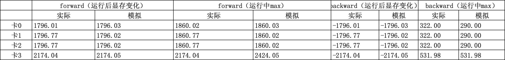

### 姓名

卢畅

### 实习项目

静态图半自动并行训练性能优化

### 本周工作

本周工作主要是编写 ZBV 编排代码，并在不同 memory limit 下进行测试以及将编排结果与官方实现对比。还对显存估计工具的问题进行了排查，并在不同配制下进行测试。

#### 1. 解决Backward 阶段峰值显存估计偏差的问题

在将 no_need_buffer 情况的 var 考虑之后，显存估计的结果和实际的峰值显存之间的差距有所缩小

#### 2. 在不同配置下估计显存

pp4, gradient accumulation 8, 开启 recompute,batch1, num_hidden_layers 4

  

pp4, gradient accumulation 8, 不开启 recompute,batch1, num_hidden_layers 4

  

pp2, mp2, gradient accumulation 8, 不开启 recompute,batch2, num_hidden_layers 4

#### 2. 编写 ZBV 编排代码

初步完成 ZBV 编排的代码编写

相关 PR：

- https://github.com/PaddlePaddle/Paddle/pull/63800

#### 3. 编排结果与官方实现对比

**1、vpp2 pp2 无内存限制结果对比**

**官方实现编排结果：**

 
  

**自己实现编排结果：**

  

编排结果一致

**2、vpp2 pp2 内存限制 1p (和1f1b 一样的内存限制) 结果对比**

**官方实现编排结果：**

  

**自己实现编排结果：**

  

编排结果一致

**3、vpp2 pp2 内存限制 1.5p 结果对比**

**官方实现编排结果：**

  

**自己实现编排结果：**

  

编排结果一致

**4、vpp2 pp2 内存限制 2p 结果对比**

**官方实现编排结果：**

  

**自己实现编排结果：**

**5、vpp2 pp4 无内存限制 结果对比**

**官方实现编排结果：**

  

**自己实现编排结果：**

  

编排结果一致

**6、vpp2 pp4 1p 内存限制 结果对比**

**官方实现编排结果：**

  

**自己实现编排结果：**

  

编排结果一致

**7、vpp2 pp4 1.5p 内存限制 结果对比**

**官方实现编排结果：**

**自己实现编排结果：**

  

**8、vpp2 pp4 2p 内存限制 结果对比**

**官方实现编排结果：**

  

**自己实现编排结果：**

  

编排结果一致

测试结果表明，自己实现的编排结果与官方实现的编排结果一致。由于实现还适配了 vpp_degree > 2 的情况，官方没有实现，所以在这种情况下，只能用自己的实现进行对比。

**9、vpp2 pp8 microbatches 16 无内存限制 结果对比**

**官方实现编排结果：**

  

**自己实现编排结果：**

  

编排结果略微有一些不一致，这是由于我们的实现中调整了 backward_b 之前 forward 的插入策略。官方的实现会限制 forward 的数量，但是我们认为只要满足显存限制，forward 的数量可以更多。

官方实现的 bubble rate 为 1.25%，我们的实现的 bubble rate 为 1.15%。

**10、vpp2 pp8 microbatches 16 1p 内存限制 结果对比**

**官方实现编排结果：**

  

**自己实现编排结果：**

  

这里编排结果不一致，但是推测是官方实现的 bug，在这样样例里面 max_mem 是 32，每个 forward 的显存是 2，但是官方实现的编排结果中，有 17 个 forward，这样的话显存就超了。我们的实现是 16 个 forward，显存是 32，所以是满足显存限制的。

**11、vpp2 pp8 microbatches 16 1.5p 内存限制 结果对比**

**官方实现编排结果：**

  

**自己实现编排结果：**

  

这里编排结果不一致，原因和无内存限制的情况一样，官方实现的 bubble rate 为 1.25%，我们的实现的 bubble rate 为 1.15%。

### 下周工作

适配 vpp_degree > 2 的情况，完成 ZBV 编排代码的编写。修改分布式标记适配 ZBV 的 V 形编排。在 Llama2 上进行初步性能测试。

### 导师点评
