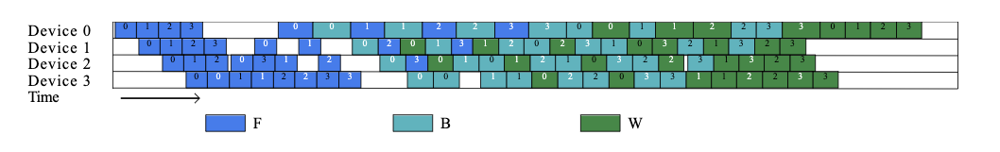

### 姓名

卢畅

### 实习项目

静态图半自动并行训练性能优化

### 本周工作

#### 1. 为 ZBV 适配分布式标记

由于 ZBV 的 V 型编排和 VPP 的切图方式不同，我们需要对 ZBV 的分布式切分标记进行适配。

同时当 chunk 数量是偶数的时候，输入和输出都都在第一个 stage 上，我们需要把 input 和 label 都放在第一个 stage 上。且当 chunk 数量是奇数的时候，计算 loss 的相关 op 也需要放在第一个 stage 上。否则 zbv 编排都会 hang 住。

#### 2. 在实际业务场景下验证性能

在 Llama2 上进行了实际业务场景下的性能测试，发现了一些问题。

1. 当 chunk 是偶数的时候，计算 loss 的时间过长，导致了 bubble rate 过高。具体来说如下图所示：

  

因此当 acc_steps 较小的时候，奇数 chunk 的性能要优于偶数 chunk。

我在编排的时候将 loss 的计算时间考虑进去，这样可以进一步优化编排性能。

同时由于这种情况的存在，我认为 zbv 的 rollback 实现并不是很有必要，论文里的理想编排情况很难出现，rollback 可能也并不会带来很大的性能提升。

2. zbv 的官方时间中在没有 f 任务的时候会错误的插入 w 任务，导致了 b 任务的 delay

修改前后实际运行 timeline 对比如下：

修改前：

  

修改后：

修改后 8 卡 a100 机器上，在 pp4, dp2, chunk5 的条件下进行对比，zbv 的效果已经超过了当下最优的 vpp5 方案 (zbv 548ms 左右一个 step，vpp5 568 ms 左右一个 step，提升了 3.52%)。

#### 3. 将 zbv 编排和显存估计功能结合

之前跑的时候zbv编排都是用的模拟显存数据，现在我们将显存估计功能和zbv编排结合，可以更好的估计显存。并且根据 program 的显存占用估计出 1f1b 所用的显存并设置最大显存倍率来约束 zbv 的编排。并为 Paddle 和 PaddleNLP 添加相关运行参数。

相关 PR：

- https://github.com/PaddlePaddle/Paddle/pull/63800
- https://github.com/PaddlePaddle/PaddleNLP/pull/8480

#### 4. 为流水线 timeline 工具适配动转静

之前流水线 timeline 可视化工具只能适配静态图，现在我们将其适配动转静的情况。

相关 PR：

- https://github.com/PaddlePaddle/Paddle/pull/64568
- https://github.com/PaddlePaddle/PaddleNLP/pull/8488

### 下周工作

继续测试 zbv 编排的性能，尝试在更多的业务场景下测试 zbv 编排的性能，对 zbv 编排进行收尾。

### 导师点评
