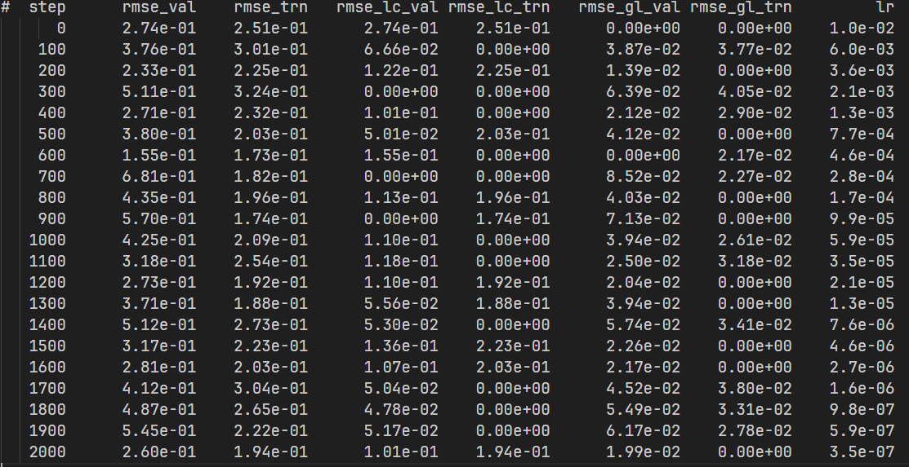
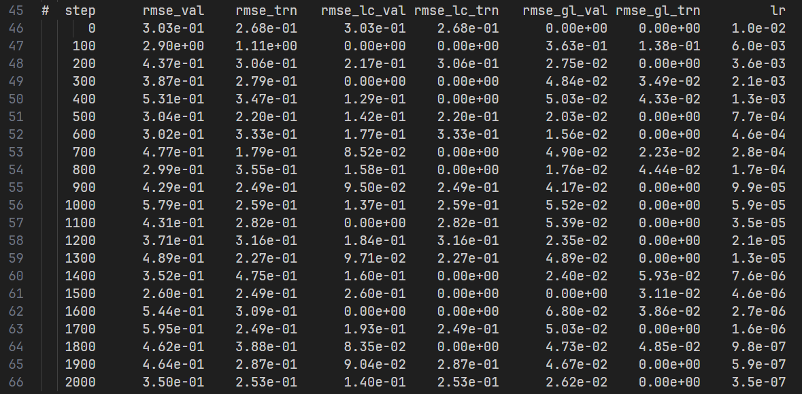

### 姓名

徐苏勇

Github ID：[xusuyong](https://github.com/xusuyong)

### 实习项目

[科学计算领域拓展专项（DeePMD-kit、光学案例）](https://github.com/PaddlePaddle/community/blob/master/hackathon/hackathon_6th/%E3%80%90Hackathon%206th%E3%80%91%E9%A3%9E%E6%A1%A8%E6%8A%A4%E8%88%AA%E8%AE%A1%E5%88%92%E9%9B%86%E8%AE%AD%E8%90%A5%E9%A1%B9%E7%9B%AE%E5%90%88%E9%9B%86.md#%E9%A1%B9%E7%9B%AE%E5%8D%81%E4%BA%8C%E7%A7%91%E5%AD%A6%E8%AE%A1%E7%AE%97%E9%A2%86%E5%9F%9F%E6%8B%93%E5%B1%95%E4%B8%93%E9%A1%B9deepmd-kit%E5%85%89%E5%AD%A6%E6%A1%88%E4%BE%8B)

### 本周工作

1. **为DeepMD-kit的paddle后端增加 water_tensor polar 案例**

   * 跑通tensorflow版本，lcurve输出：
      
   * 跑通paddle版本，lcurve输出：
      
   * 将原paddle2分支的代码整理到paddle分支。相关PR：[Add water tensor polar2](https://github.com/HydrogenSulfate/deepmd-kit/pull/6)
2. **问题疑惑与解答**

### 下周工作

1. 为paddleScience增加光学案例

### 导师点评
