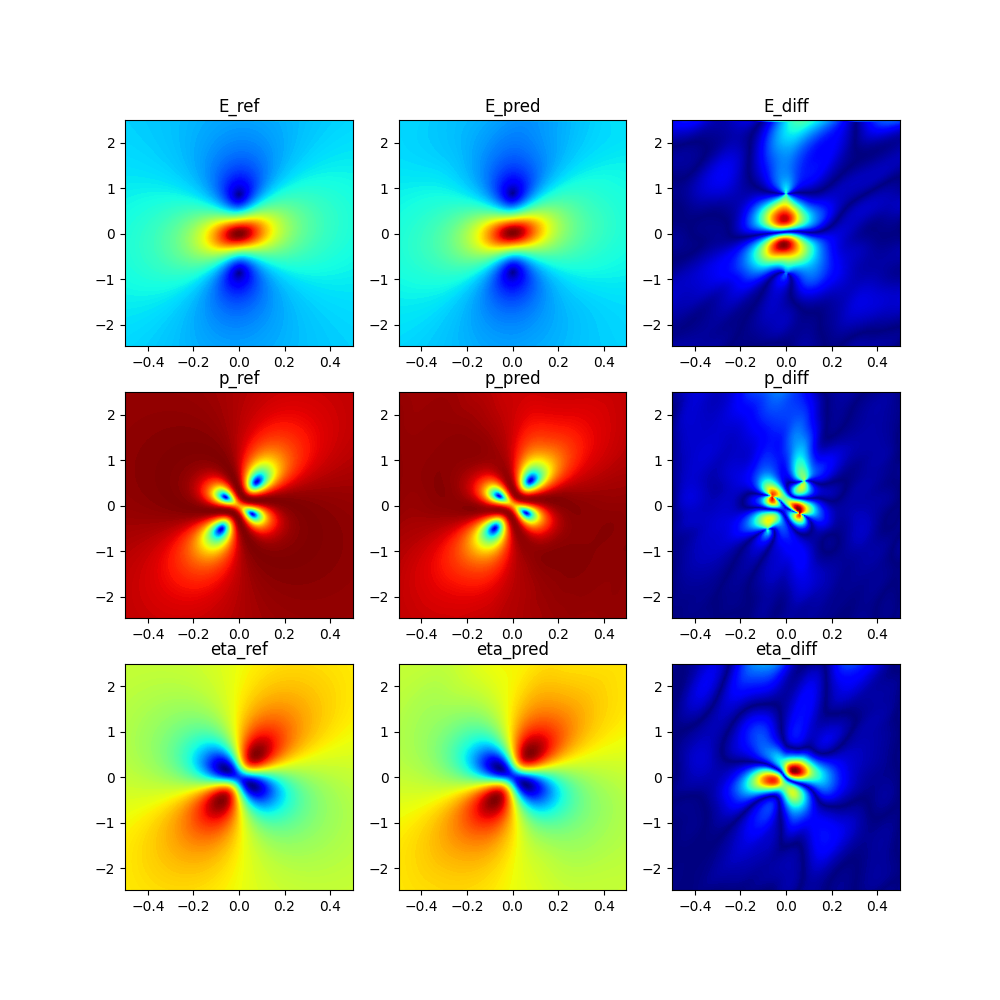
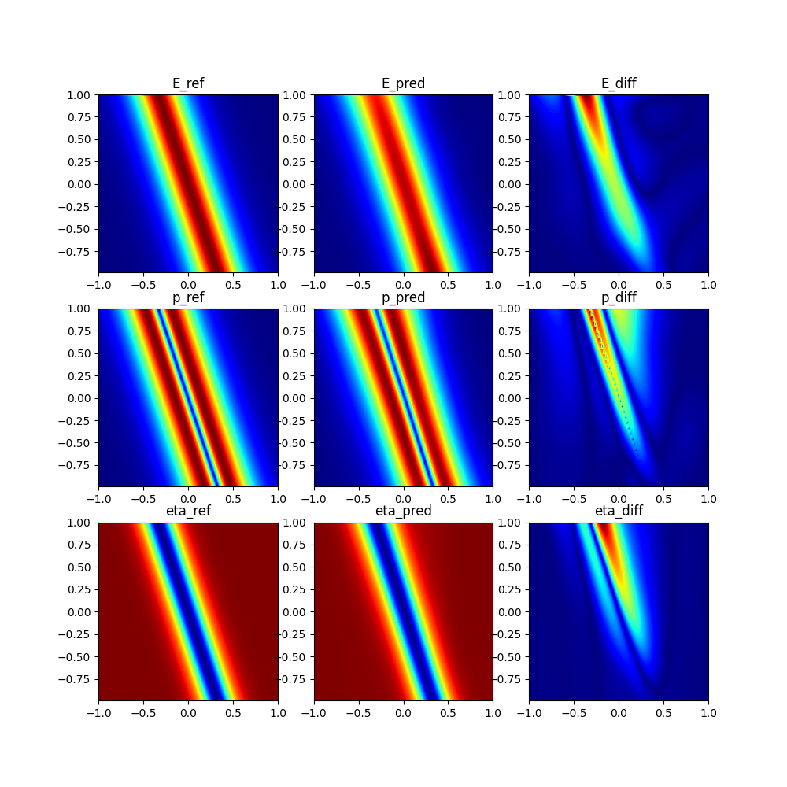

### 姓名

徐苏勇

Github ID：[xusuyong](https://github.com/xusuyong)

### 实习项目

[科学计算领域拓展专项（DeePMD-kit、光学案例）](https://github.com/PaddlePaddle/community/blob/master/hackathon/hackathon_6th/%E3%80%90Hackathon%206th%E3%80%91%E9%A3%9E%E6%A1%A8%E6%8A%A4%E8%88%AA%E8%AE%A1%E5%88%92%E9%9B%86%E8%AE%AD%E8%90%A5%E9%A1%B9%E7%9B%AE%E5%90%88%E9%9B%86.md#%E9%A1%B9%E7%9B%AE%E5%8D%81%E4%BA%8C%E7%A7%91%E5%AD%A6%E8%AE%A1%E7%AE%97%E9%A2%86%E5%9F%9F%E6%8B%93%E5%B1%95%E4%B8%93%E9%A1%B9deepmd-kit%E5%85%89%E5%AD%A6%E6%A1%88%E4%BE%8B)

### 本周工作

1. **增加NLS-MB方程的光学怪波案例**
在使用 Adam 优化器训练完毕之后，将优化器更换成二阶优化器 L-BFGS 继续训练少量轮数，从而进一步提高模型精度。
   结果可视化：
   
   从上到下,*E*是(慢变电场)，*p*是共振介质偏振的量度，$\eta$表示粒子数反转的程度，可以看到PINN预测结果与参考解基本一致

2. **增加NLS-MB方程的光孤子案例**
结果可视化：
   
   可以看到预测结果与参考解基本一致，局部diff比较大，可以微调
相关PR [[New example] Add nls-mb example](https://github.com/PaddlePaddle/PaddleScience/pull/838)

3. **问题疑惑与解答**
   

### 下周工作

1. 进一步简化代码
2. 写文档 

### 导师点评

辛苦苏勇研发两个光学领域的案例 👍 ，代码已经review完成，可以尽快修改一下后合入。
