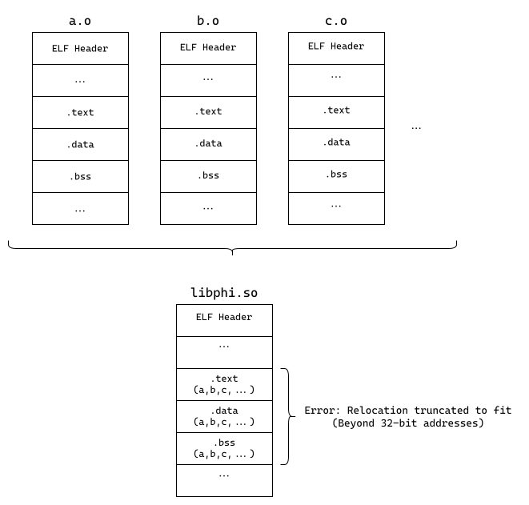
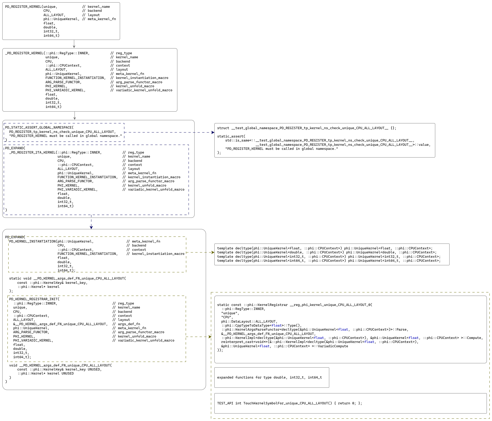

### 姓名

凌少鹏

Github ID：[silverling](https://github.com/silverling)

### 实习项目

Paddle CMake 治理和编译优化

### 本周工作

1. 分析编译多种 CUDA 架构的 libphi.so 时链接器的报错原因
   
   在编译大于等于 6 个 CUDA 架构时，编译器会在链接 libphi.so 文件时报错：
   ```
   ...
   /usr/lib/gcc/x86_64-linux-gnu/12/../../../x86_64-linux-gnu/crti.o: in function `_init':
   (.init+0x7): relocation truncated to fit: R_X86_64_REX_GOTPCRELX against undefined symbol `__gmon_start__'
   paddle/phi/CMakeFiles/phi.dir/common/place.cc.o: in function `common::PD_Exception::~PD_Exception()':
   place.cc:(.text._ZN6common12PD_ExceptionD2Ev[_ZN6common12PD_ExceptionD5Ev]+0xf): relocation truncated to fit: R_X86_64_REX_GOTPCRELX against symbol `vtable for common::PD_Exception' defined in .data.rel.ro._ZTVN6common12PD_ExceptionE[_ZTVN6common12PD_ExceptionE] section in paddle/phi/CMakeFiles/phi.dir/common/place.cc.o
   paddle/phi/CMakeFiles/phi.dir/common/place.cc.o: in function `common::PD_Exception::~PD_Exception()':
   place.cc:(.text._ZN6common12PD_ExceptionD0Ev[_ZN6common12PD_ExceptionD5Ev]+0xf): relocation truncated to fit: R_X86_64_REX_GOTPCRELX against symbol `vtable for common::PD_Exception' defined in .data.rel.ro._ZTVN6common12PD_ExceptionE[_ZTVN6common12PD_ExceptionE] section in paddle/phi/CMakeFiles/phi.dir/common/place.cc.o
   paddle/phi/CMakeFiles/phi.dir/common/place.cc.o: in function `phi::CustomRegisteredDeviceMap::Instance()':
   place.cc:(.text._ZN3phi25CustomRegisteredDeviceMap8InstanceEv+0xa): relocation truncated to fit: R_X86_64_PC32 against `.bss._ZGVZN3phi25CustomRegisteredDeviceMap8InstanceEvE30g_custom_registered_device_map'
   place.cc:(.text._ZN3phi25CustomRegisteredDeviceMap8InstanceEv+0x11): relocation truncated to fit: R_X86_64_PC32 against `.bss._ZZN3phi25CustomRegisteredDeviceMap8InstanceEvE30g_custom_registered_device_map'
   place.cc:(.text._ZN3phi25CustomRegisteredDeviceMap8InstanceEv+0x2b): relocation truncated to fit: R_X86_64_PC32 against `.bss._ZGVZN3phi25CustomRegisteredDeviceMap8InstanceEvE30g_custom_registered_device_map'
   place.cc:(.text._ZN3phi25CustomRegisteredDeviceMap8InstanceEv+0x32): relocation truncated to fit: R_X86_64_PC32 against `.bss._ZZN3phi25CustomRegisteredDeviceMap8InstanceEvE30g_custom_registered_device_map'
   place.cc:(.text._ZN3phi25CustomRegisteredDeviceMap8InstanceEv+0x54): relocation truncated to fit: R_X86_64_REX_GOTPCRELX against symbol `phi::CustomRegisteredDeviceMap::~CustomRegisteredDeviceMap()' defined in .text._ZN3phi25CustomRegisteredDeviceMapD2Ev[_ZN3phi25CustomRegisteredDeviceMapD5Ev] section in paddle/phi/CMakeFiles/phi.dir/common/place.cc.o
   place.cc:(.text._ZN3phi25CustomRegisteredDeviceMap8InstanceEv+0x5b): relocation truncated to fit: R_X86_64_PC32 against `.bss._ZZN3phi25CustomRegisteredDeviceMap8InstanceEvE30g_custom_registered_device_map'
   place.cc:(.text._ZN3phi25CustomRegisteredDeviceMap8InstanceEv+0x66): relocation truncated to fit: R_X86_64_PC32 against symbol `__dso_handle' defined in .data.rel.local section in /usr/lib/gcc/x86_64-linux-gnu/12/crtbeginS.o
   ...
   ```
   其中的报错信息主要为 "relocation truncated to fit"。为了搞清该报错原因，我搜索学习了编译链接的相关概念。
   
   首先，编译器会将每个源码文件（`.c`, `.cc`）编译为目标文件（relocatable object file，`.o`），然后链接过程分为两步：
   - 第一步，链接器会将每个目标文件的同类型的节（Section）排列到一起；
   - 第二步，链接器将其中未定义、需要重定位的符号（Symbol）进行计算和填充。

   
   
   现代主流编译器生成的目标文件的重定位符号的寻址空间为 32 位（$-2^{31} \sim 2^{31} - 1$），即使我们的操作系统是 64 位也是如此。而当我们拥有很多目标文件时，链接器首先将他们的节排列在一起，导致其中的符号的相对跳转地址超过了 32 位，所以链接器会报错。
  
   在与导师讨论之后，有如下一些可能的解决方案：
   - 清理源码文件中引入的无用头文件。当每个源码文件引入没有用到的头文件时，可能会额外引入一些全局变量和函数实现，从而导致该源码文件生成的目标文件存在无用体积。
   - 清理头文件中的引入的其他无用头文件，以及拆分头文件，尽可能使得头文件紧凑、独立，实现与声明分离。

2. 清理上述两个解决方案的无用 `#include`
   
   该过程任务繁重，需要分析研究的头文件数量和源码文件巨多。
   
   于是我编写了批量处理脚本，对每个源码文件和头文件中的每个 `#include` 首先尝试删去，然后编译 `libphi.so`，如果编译成功，则表明该 `#include` 语句可以删去。在对所以文件进行测试之后，总计修改的文件有 1000 多个。然而，这种方法的效果并不理想，其删除的结果基本不符合规范（例如一些源码甚至删去了自身函数声明的头文件），并且其最终编译的 `libphi.so` 的体积几乎没有变化。

   这种情况是因为存在一些头文件包含了很多其他的头文件，例如 `paddle/phi/core/kernel_registry.h` 所以一些源码文件只需 include 该头文件，即可编译通过。但这并不能改善编译体积。

   Google 有一款开源工具为 [include-what-you-use](https://github.com/include-what-you-use/include-what-you-use)，这款工具基于 Clang/LLVM，能够分析项目中头文件的不规范引用问题，并给出修改建议。

   然而，目前 Paddle 使用 Clang 编译存在一些问题，以及由于开启了 `—Wall -Werror` 选项，还有一些实现代码需要修改，所以 `include-what-you-use` 这款工具还需要一些功夫才能应用。

3. 除了上述两种方法，更有可行性的方案是**模块分离**

   考虑将 PHI 中的算子按照后端区分，分别编译为独立的 `.so` 文件。

   目前先只考虑将 CUDA 算子划分出来，编译为 `libphi_cuda.so`，其余文件编译为 `libphi.so`。

4. 另外的长期计划：**添加完善 Clang 编译器的支持**

   为了利用 Clang/LLVM 等一系列工具链的使用，例如 clangd、include-what-you-use、LLVM IR 等高效开发工具的利用，考虑逐步完善 Clang/LLVM 编译套件的支持。借助 clangd 等工具，可以在开发阶段方便地实时获取代码建议，编写更加符合规范地代码。
    
5. 另外的优化方向：**清除冗余实现代码**

   在编译优化的过程中，发现了部分代码存在重复实现的问题，例如 [affine_grid_kernel.cc](https://github.com/PaddlePaddle/Paddle/blob/1208cd3345113b21821accef9d31acd636b0f74a/paddle/phi/kernels/cpu/affine_grid_kernel.cc#L24C1-L43C3) 和 [affine_grid_grad_kernel.cc](https://github.com/PaddlePaddle/Paddle/blob/1208cd3345113b21821accef9d31acd636b0f74a/paddle/phi/kernels/cpu/affine_grid_grad_kernel.cc#L24C1-L43C3)，这类问题难以批量排查，还需后续开发过程中留意这种情况。

6. 另外的优化方向：**减少 inline 函数和模板、以及宏的使用**

   使用了 inline 函数和模板、以及宏的代码在编译展开和模板实例化后会增加许多文件体积，这部分需要优化的工作量很多，需要的知识储备也很多，目前还没有做安排。

   本周针对 `kernel_registry.h` 中的 Paddle 算子注册机制进行了初步学习与研究，通过手动展开宏和编译器辅助预处理展开，了解了一些算子的注册机制。例如下图是对 UniqueKernel 的算子注册宏的展开：

   

7. 相关PR：

   本周主要和导师讨论 Paddle 编译架构的设计思路，PR 数量较少，初步基础的 PR 如下：
   - https://github.com/PaddlePaddle/Paddle/pull/62454
   - https://github.com/PaddlePaddle/Paddle/pull/62473

### 下周工作

1. 分模块编译 PHI，划分 CUDA 算子单独编译
2. 完善 Clang/LLVM 支持
3. 完善 CMake 中的代码规范，优化 deprecated 代码

### 导师点评
本周工作进展迅速，高质量完成，快速完成了头文件自动清理的脚本代码，快速入门了paddle多架构编译工作，尝试了不同实验方案并取得进展，在paddle仓库合入两个修复warning的PR，工作非常满意！
