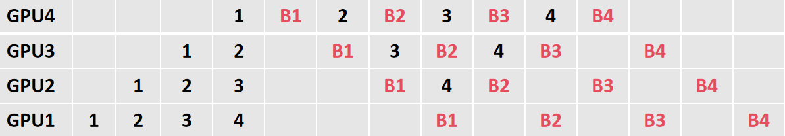

# Pipelin Parallel学习记载

## 1.流水线并行PP评价指标

流水并行（Pipeline Parallelism，PP）中，针对流水并行（PP）假设并行的stage 切分为p 份，micro-batches 为m，每个micro-batches 的前向和后向执行时间为tf 和tb。在理想的环境下，前向和后向的合起来理想的执行时间应该是（图1解释下列公式原因，）：
$$
t_{ideal}=m(tf+tb)
$$
不过在实际 Pipeline 把网络模型切分成不同 stage（**stage指的是模型的不同阶段**） 放在不同的机器，会导致在正向的 p - 1 和反向的 p – 1 时间内会出现计算等待时间。那这个中间空白的地方，我们叫做 Bubble 空泡。

而空泡 Bubble 的产生，是因为算子内并行和算子间并行解决单设备内存不足的问题，模型经过拆分后的上一个 rank 的 stage 需要长期持续处于空闲状态，等待 其他 rank 的 stage 计算完成，才可以开始计算，这极大降低了设备的平均使用率。这种现象被称为**并行空泡（Parallelism Bubble**）。

图1

总的 bubble 占用的时间跟流水并行 PP 切分策略相关（看图2，这里的p-1与bubble产生的原因有关，可以看到，在前向传播的时候，最开始时，每个stage的计算要等待前一个计算的结果，因此，从时间线上看（横轴），最终会多出p-1个前向时钟周期，即每多一个stage，就多一个前向时钟周期，因此，当stage为p时，就多出p-1个前向时钟周期）：
$$
t_{bubble}=(p-1)(tf+tb)
$$

图2

## 2.流水并行1F1B编排模式

### 2.1 1F1B编排模式解读

图3

  1F1B 示例如图所示，以 GPU3 的 F1（GPU3 的第 2 个 micro-batch 的前向计算）为例，F1 在计算前，F1 的反向 B1（GPU3 的第 1 个 micro-batch 的反向计算）已经计算结束，即可释放 F1 的中间变量，从而 F2 可以复用 F1 中间变量的显存。**释放不必要的中间变量，峰值显存下降，设备资源利用率显著提升，但bubble数没变**

### 2.2 分析1F1B中bubble来源

 	为了在bubble中添加check操作，来检查forward是否正常进行，首先需要分析bubble是如何产生的，才能知道在哪里会产生bubble，以及什么会影响到bubble的个数

​	**1.设备数与num_micro_batches数确定时，分析时序图是否唯一**

​	当设备数为4个，num_micro_batches为4时分析理想1f1b和非理想1f1b两种情况的时序图：

非理想1f1b时序图

理想1f1b时序图

​	**分析结果：**

​	从上面两个图可以看到，同样采用1f1b的思想，即当一个micro_batche的forward部分做完就立刻做其backward，并且对于每一个设备来说，他们的job顺序都没有改变——举个例子，1F1B在编排时，会产生对于GPU1来说，在**warmup阶段**会编排warmup_num=pp_degree(纯pp下，使用的设备数)-pp_stage(纯pp下，设备编号)，对于GPU1来说，就是4-1=3，即先编排3个foward，对应图中的1，2，3；接着在**Stabilization阶段**会编排num_micro_batches-warmup_num个1F1B，对应GPU1来说就是4-3=1，即编排1组连续的FB；最后**warmdown阶段**因为foward部分做完了，所以对应的，还需要编排warmup_num个backword。可以看到非理想的1f1b下，每个设备的job顺序也是按照这个来排列的，但是job发生的时间有所不同。

​	分析可知，虽然时序图不唯一，但是我们可以发现，两种时序图对应的最终计算结果是一致的，因此我们想要在bubble时期插入操作，则强制让其按理想的1f1b时序图来执行即可，例如在GPU1的第三个forward后面插入3个周期的check操作。

​	**2.设备数与num_micro_batches数确定时，forward和backward时钟周期不一致，分析1F1B时序图变化**

backward为2个时钟周期时序图

​	**分析结果：**

​	分析可知，此时bubble的个数变多了，每个设备上的bubble数，从原来的6个变成了9个，从bubble产生的原因可知，是因为前向产生了3个forward的等待，后向产生了3个backward的等待，因此产生的bubble数为`3*t_f+3*t_b`，该公式对于任意的forward和backward的时钟周期都成立，因此也可以将其用数学公式规律化。

### 2.3 分析1F1B中bubble_check插入位置

bubble_check插入位置分段分析

​	观察上图，与理想1f1b时序图有些差别，但是对比两图可以发现，同样满足1F1B的编排方式，因为1F1B的编排可分为3个阶段，**warmup阶段**、**Stabilization阶段**、**warmdown阶段（自己编的名字）**而此时bubble_check的插入位置即可表示如下：

 1. 在**warmup阶段**，在原来排列好的job前，插入`pp_stage-1`个bubble_check

 2. 在**Stabilization阶段**，在原来排列好的job前和后，分别插入`pp_degree-pp_stage`个bubble_check

 3. 在最后的**warmdown阶段**，在原来排列好的job后面，插入`pp_stage-1`个bubble_check

    

**再考虑一种num_micro_batches>pp_degree**

num_micro_batches大于pp_degree时bubble_check插入位置分析

可以看到，规律还是如上公式所示。