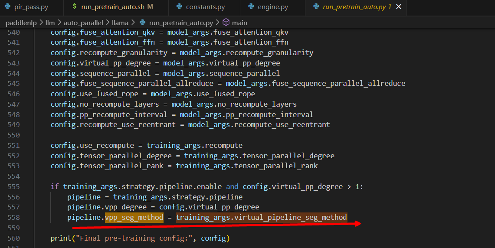

# Vpp去尾工作

## 1.检查当前是否支持模型层数为（vpp_degree*pp_degree-1）

### 1.1 追溯报错源头

运行参数为vpp_degree=2,pp_degree=2,hidden_layer=7


报错，有assert检查，追溯相关代码，


可以看到，这里做了一个判断，即切分结构名称的个数必须是num_chunks的整数倍，同时发现一些定义，切分方式、切分结构名称等

## 2.运行参数为vpp_degree=2,pp_degree=2,hidden_layer=8，进行追溯

### 2.1 追溯seg_method

先追溯seg_method




切分方式，vpp默认为llamaDecoderLayerAuto

### 2.2 追溯seg_struct_names


​	从_extract_seg_method解读发现，该函数主要是根据正则匹配表达式，匹配struct_name为seg_method（忽略大小写）的，也就是匹配算子的struct_name为llamaDecoderLayerAuto的，再看_get_seg_struct_names发现，forward算子的开始index即对所有算子从前往后找，找到第一个llamaDecoderLayerAuto，而结束的index则是从后往前找，找到第一个llamaDecoderLayerAuto，打印出来可以看到就是我们训练时设置的hidden layer的个数

### 2.3 追溯vpp_reshard部分的核心代码complete_chunk_id

#### step1：


​	获取一些重要的元素，其中sub_process_meshes为子进程网格，即如何将计算分布到多个设备上

获取所有算子即ops


#### step2，3：	


如果用户没有指定的分配方法，则使用vpp strategy，这里按vpp的思想获取seg_pp_stages,seg_chunk_ids,seg_layer_num效果如下：


​	块需要按照设备交错的方式进行分布，即每个设备上的块号，相互之间是一定不会相同的，在此场景下，就是例如：0号设备，分别放0号和1号块，每个块放2层，控制逻辑还在后面的代码中，此处不详细记录。

​	第一层的op起始index从0开始，最后一层的op终止index从最后一个op的index结束，其余的op则遍历op列表，直到找到第一个当前op的struct_name=当前层的名称，即记录每一层的最开始的那个op的index，如下：


#### step4：


​	在这一步，是进行vpp reshard的主要逻辑，start_index和stop_index记录的是这一块中的所有层的起始index和终止index，因为seg_pp_stage是pp_degree对num_chunks求余得到的，所以按照num_chunks循环的时候，就遵循vpp原则，依次将chunk按照pp_stage递增的顺序放置，并且不断循环，从而达到每个"0"块放一遍所有的设备，再将每个1块放一遍所有的设备。

## 3.开发思路


### 3.1 更改assert设置

​		支持 整除或者(len(seg_struct_names)+1) %num_chunks ，即支持少一层的操作，且当为少一层的操作时，此时num_chunks数不能等于len(seg_struct_names)+1，即块数不能等于层数+1，否则少一层，则有一个块是空的，当前暂不支持。

```
assert (
        (len(seg_struct_names) % num_chunks == 0) or ((len(seg_struct_names)+1) % num_chunks == 0 and (len(seg_struct_names)+1) // num_chunks != 1)
    )
```

### 3.2 少一层的设计思路


​	可以看到，首先左边的图，即pp少一层后，我们先分析哪些数值会变化影响结果:

```
	sub_process_meshes = get_sub_process_mesh_by_program(dist_program)
    pp_degree = pipeline_strategy.pp_degree
    vpp_degree = pipeline_strategy.vpp_degree
    seg_method = pipeline_strategy.vpp_seg_method
    schedule_mode = pipeline_strategy.schedule_mode
    num_chunks = pp_degree * vpp_degree
    seg_pp_stages = [i % pp_degree for i in range(num_chunks)]
    seg_chunk_ids = [i // pp_degree for i in range(num_chunks)]
    seg_layer_num = len(seg_struct_names) // num_chunks
```

​	观察重要参数`seg_pp_stages`、`seg_chunk_ids`、`seg_layer_num`,其中`seg_pp_stages`为[0,1,0,1]不变，`seg_chunk_ids`为[0,0,1,1]不变，`seg_layer_num`发生了变化，即从`2`变成了`1`，而根据我们的图示可以看到，我们此时希望的仍然是`seg_layer_num`为`2`，只有最后一个chunk的`seg_layer_num`为1，因此，我们将此处seg_layer_num给换掉，让其和块对应起来，即如下代码：

```
seg_layer_num=[0]*num_chunks#记录每个块里面的层数
for j in len(0,seg_struct_names):#把层数分别分给每个块，保证每个块至少先被分一层，按此逻辑可以支持少多层，只要保证每个块至少一层
	i=j%num_chunks
	seg_layer_num[i]=seg_layer_num[i]+1
		
```

把后续的所有seg_layer_num用seg_layer_num[seg_id]代替即可

​	带入右边的情况验证，同样支持。
