# vpp非均匀切分任务

## 1.寻找num_micro_batches具体是外部什么参数

num_micro_batches为：

在PipelinePass类中的def _task_1f1b(self):中定义的self._program.pipeline_opt

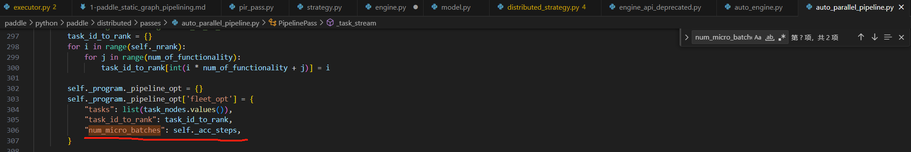

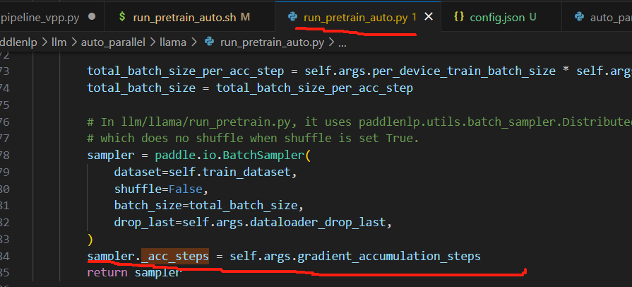

也就是梯度累加的步数，其实就是micro_batches的数目


## 2.当前源码参考

#### 2.1 当前的限制条件

发现vpp代码中含有acc_step和pp_degree是否整除关系的检查

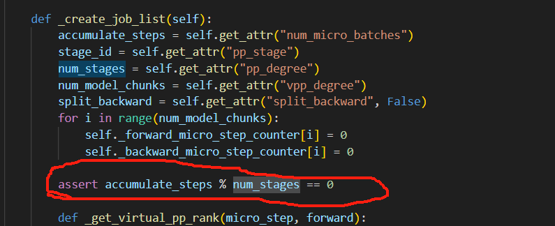

这里的整除式：
$$
accumulate\_steps\ \%  \ num\_stages == 0
$$
表明了一个观点，因为`accumulate_steps`和`num_stages`均是大于0的数，因此当前的限制为accumulate_steps必须为num_stages的整数倍，因此为了加入非均匀vpp，我们需要弱化此处的强约束条件，改为以下条件：
$$
accumulate\_steps \geq num\_stages
$$
而分析整除式，可以发现，原来的整除式子，也包含了accumulate_steps和num_stages满足以上关系，但是此时，无需让acc_steps为pp_degree的整数倍，因此我们将条件做到了弱化处理。


#### 2.2 代码优化部分

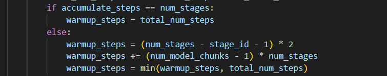

分析发现，在整除关系下，这里无需判断两者相等的情况，else对应的公式均适用于所有倍数的情况，下面会给出证明。


## 3.均匀vpp排列分析

为了编排非均匀vpp，我们首先要观察一下均匀vpp的排列方式

#### 3.1 各阶段Step分析

##### 3.1.1 `accumulate_steps  % num_stages`且 `accumulate_steps ！= num_stages`

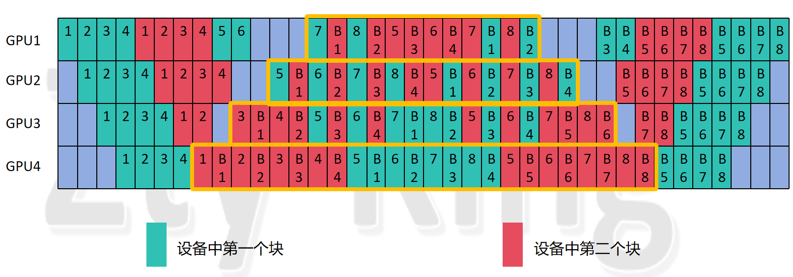

这里我们选择`num_stages`为4，而`accumulate_steps`为4，`hidden_layer`为8，`vpp_degree（num_model_chunks）`为2进行分析：

​		因为`vpp`是基于`1F1B`的编排，因此我们同样可以用相同的规律把中间的稳定阶段先选择出来，即`1F1B`的阶段，我没有按照论文里的图来画，但也遵循了排列规则，并且将其画成了对称的形式，这样可以更直观的感受（也为了后面做`aadiff_check`做准备），可以看到，具体情况如上面的黄色框图所示，能够发现此时对于每一个`GPU`来说，编排仍然是呈现对称关系，例如`GPU1`就是左边10个`forward`，右边10个`forward`，中间是几组`1F1B`，那么根据规律我们可以发现，每个设备对应的编排公式如下：

1. 计算 `warmup_steps` 的初始值：

$$
\text{warmup\_steps} = (\text{num\_stages} - \text{stage\_id} - 1) + (\text{num\_stages} - \text{stage\_id} - 1)
$$

​    2.更新 `warmup_steps`：
$$
\text{warmup\_steps} += (\text{num\_model\_chunks} - 1) \times \text{num\_stages}
$$
​	3.计算`steady_steps`:
$$
total\_num\_steps = accumulate\_steps * num\_model\_chunks
$$

$$
steady\_steps = total\_num\_steps - warmup\_steps
$$


​	第3个式子很好理解，由前面知道关系`accumulate_steps>=num_stages`，梯度累加的步数`accumulate_steps`就为`micro_bitch`的数量，对于一个设备来说，要经历的`step`数（forward和backward看为一个step）为`micro_bitch`的数量*该设备上模型的层数（因为每个`micro_bitch`一定会经过这些层），所以得到`total_num_steps`公式如上，而除掉warm_up阶段和尾部的cool_down阶段相对应的f_b个数，剩下的就是在stable阶段进行的f_b个数，所以得到`steady_steps`的公式。

​	那么我们详细来分析一下，1、2两个式子的含义：

​	首先，我们需要先分析一下，什么时候能开始我们的stable阶段，也就是稳定的1F1B阶段，我们可以直接看下面这个图：

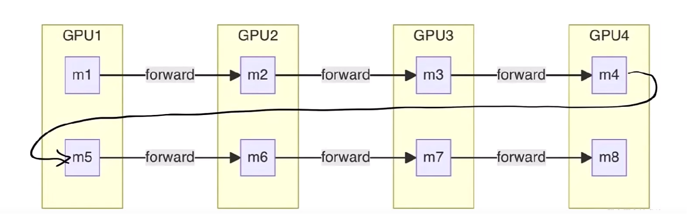

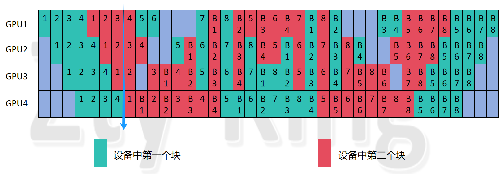

​	我们将模型分成了2个大块，并且，每个大块分为了4个小块，第一个大块的4个小块分别放在`GPU1-4`上，第二个大块的4个小块紧接着放在`GPU1-4`上，不难发现，我们的一个`micro_batch`执行的顺序是从`GPU1->GUP4`再返回到`GPU1`，再依次执行到`GPU4`，那么可以发现，我们最早能执行`backward`的时间在第一个`micro_bitch`执行了8层的`forward`之后，即对应上图中的蓝色箭头的位置，此时可以看到我们的第一个`micro_bitch`已经执行了8个`forward`，因此可以开始执行`backward`了，所以`stable`阶段的启动时间就是此刻。

​	那么我们可以看到，第一个出现的`1F1B`就是蓝色箭头左边的`forward`和蓝色箭头右边的`backward`，而执行这对`1F1B`之前，`GPU4`还需要执行1，2，3，4 `micro_batch`在该设备第一个块中的`forward`，原因是，第一个`micro_batch`执行完了第一个大块的4个小块的`forward`因此又要从GPU1-GPU4执行第二个大块的4个小块的`forward`，因此此时为了让设备不空闲，在等待第一个`micro_batch`执行的同时，我们同时执行了第2，3，4个`micro_batch`在GPU4上第一个块的forward，再加上第一个`micro_batch`的第一块的forward，在`1F1B`共执行了4个forward。

​	那么我们分析一下，这个forward的个数与什么有关？

​	由上述原理可知，我们除了GPU4处理的第一个`micro_batch`的forward，我们是在等待第一个`micro_batch`再次到达GPU4时处理了其它的`micro_batch`，因此，该forward个数为`(1+pp_dgree-1)*(num_model_chunks-1)`,这里的`num_model_chunks-1`也很容易理解，如果模型被分为n大块，那么第一个`micro_batch`就只能在第n次达到最后一个GPU时，才能开始执行backward，所以前面一定执行了`（n-1）`轮的`（1+pp_dgree-1）`，又因为最后一个设备执行了

`(1+pp_dgree-1)*(num_model_chunks-1)`个forward，那么一定每个设备都执行了`(1+pp_dgree-1)*(num_model_chunks-1)`个forward，所以我们能推出，每个设备在进入stable阶段之前，至少一定有`(1+pp_dgree-1)*(num_model_chunks-1)`个forwad，这就是`公式2`中我们所加的`(num_model_chunks-1)*num_stages`。

​	解释完了公式2，我们再来看看公式1的两个(num_stages - stage_id - 1)是如何产生的呢？

​	首先第一个`(num_stages - stage_id - 1)`为什么会出现，我们要考虑到，在流水并行刚刚启动的时候，`GPU1`会先处理第一个`micro_batch`，然而，可以发现`GPU2-GPU4`此时是完全空闲的状态，因此，说明`GPU1`比其它设备要多处理一个`micro_batch`，其它设备以此类推，因此对于最后一个gpu来说，第一个设备`GPU1`比它多处理的`forward`个数为`（pp_degree-(pp_stage+1)）`,`pp_stage`从0号开始，也就是我们公式中出现的`(num_stages - stage_id - 1)`，第二、三个设备同样满足该公式，因此每个设备多处理的`forward`个数为`(num_stages - stage_id - 1)`，可以看到最后一个设备该数值是0，因为它比任何设备执行都慢，因此不会比其它设备多执行`forward`。

​	其次是第二个`(num_stages - stage_id - 1)`为什么会出现，我们考虑到，GPU4最先进入1F1B，而第一个backward从最后一个设备到达第一个设备的时钟周期个数为`（pp_degree-(pp_stage+1)）`,从最后一个设别到达第二、三个设别的时钟周期也满足这个式子，而在这第一个执行的`backward`到达之前，设备没办法执行`backward`，那么它们就无法进入1F1B的状态，因此仍然处于`warmup`阶段执行对应个数的`forward`，直到第一个`backward`到达才进入stable阶段，因此每个设备在进入stable阶段之前就会再多执行`(num_stages - stage_id - 1)`个`forward`。可以看到最后一个设备该数值是0，因为它立刻执行`backward`不会等待，因此没有多执行的`forward`。

​	所以我们将每个设备在进入stable阶段执行的forward加起来，就是warmup_steps的个数，即`(num_stages - stage_id - 1)+(num_stages - stage_id - 1)+(num_model_chunks-1)*num_stages`得到最终的公式——公式1，公式2。

##### 3.1.2  `accumulate_steps == num_stages`

​	接下来我们分析两个数相同时，上述式子是否成立，这里我们为了数据多样化，我们选择`num_stages`为3，而`accumulate_steps`为3，`hidden_layer`为9，`vpp_degree（num_model_chunks）`为3进行分析：

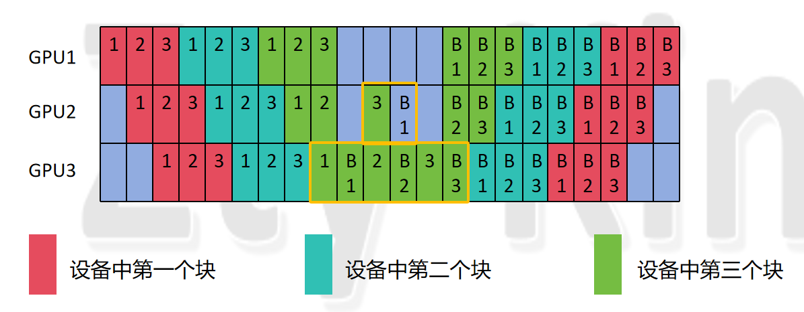

​	可以看到，图中`GPU1`没有1F1B阶段，`GPU2`有一对1F1B，`GPU3`有3对1F1B，我们同样用以下三个式子做分析：

1. 计算 `warmup_steps` 的初始值：

$$
\text{warmup\_steps} = (\text{num\_stages} - \text{stage\_id} - 1) + (\text{num\_stages} - \text{stage\_id} - 1)
$$

​    2.更新 `warmup_steps`：
$$
\text{warmup\_steps} += (\text{num\_model\_chunks} - 1) \times \text{num\_stages}
$$
​	3.计算`steady_steps`:
$$
total\_num\_steps = accumulate\_steps * num\_model\_chunks
$$

$$
steady\_steps = total\_num\_steps - warmup\_steps
$$

我们从`GPU3`开始带入，得到如下结果：

1.
$$
\text{warmup\_steps} =(3-2-1)+(3-2-1)=0
$$
2.
$$
\text{warmup\_steps} = 0 + (\text{3} - 1) \times \text{3}=6
$$
3.
$$
total\_num\_steps = 3*3 = 9
$$

$$
steady\_steps = 9-6=3
$$

我们可以看到，跟结果是一样的，我们带入`GPU2`的数值，同样符合，但是我们再带入GPU1的数值：

1.
$$
\text{warmup\_steps} =(3-0-1)+(3-0-1)=4
$$
2.
$$
\text{warmup\_steps} = 4 + (\text{3} - 1) \times \text{3}=10
$$
3.
$$
total\_num\_steps = 3*3 = 9
$$

$$
steady\_steps = 9-10=-1
$$

我们观察上图可以发现，此时`warmup_steps`并不为10，而且`steady_steps`也成了负数，那么是什么原因造成的呢，我们分析如下：

首先，由公式2的由来可是，每个设备都满足，所以有6个`step`是一定没问题的，那么问题就出现在公式1上面，我们前面分析知道，公式1的产生有两点：

1. 设备号小的设备放置的模型层号也较小，因此要优先处理`micro_batch`，因此在`num_micro_batches>=pp_degree`时，条件1产生的`step`一定成立
2. 又由于反向传播从设备号最大的设备开始，而此时设备号低的设备为了让设备空闲可以继续处理后续的`micro_batches`，但此时就需要注意一个问题，如果`num_micro_batches`没那么大，即满足如下关系式：

$$
\text{num\_micro\_batches} \times \text{num\_model\_chunks} < (\text{num\_model\_chunks} - 1) \times \text{num\_stages} + (\text{num\_stages} - \text{stage\_id} - 1) + (\text{num\_stages} - \text{stage\_id} - 1)
$$

​	我们知道在我们规定的条件下，上式右边的第1、2项一定满足，而第三项就会因为设备号低的设备还没等到第一个backward，已经处理完所有的`micro_batch的forward`了，条件2式子（即第三项加数不成立)

那么此时的warmup_steps我们也可以轻易地看出来，其实就是total_num_steps，因此为了保证公式的一致性，我们只需要多加一个条件即可，第三个公式如下：

4.修正`warmup_steps`:
$$
\text{warmup\_steps} = \min(\text{warmup\_steps}, \text{total\_num\_steps})
$$
这样这4个式子就清晰地展现了均匀vpp各阶段的step数。

#### 3.2 对于单个设备的编号编排分析


​	基于各阶段`step`的分析，我们继续分析可以发现，我们仅看某一个设备，则它对于每个设备上计算不同层的`micro_batch`编号的排列遵循以下公式：

`forward`排列，其中`micro_step`的范围为`(0，acc_step *num_model_chunks )`：
$$
\text{virtual\_pp\_stage} = \text{micro\_step} \mod ( \text{num\_stages} \times \text{num\_model\_chunks} )
$$

$$
\text{virtual\_pp\_stage} = \left\lfloor \frac{\text{virtual\_pp\_stage}}{\text{num\_stages}} \right\rfloor
$$

​	将`vpp_stage`带入计算得到对应的实际步数

```python
def _record_fwd_micro_step(self, virtual_pp_rank):
        real_micro_step = self._forward_micro_step_counter[virtual_pp_rank]
        self._forward_micro_step_counter[virtual_pp_rank] += 1
        return real_micro_step
```


​	因为`backward`与`forward`刚好相反，因此其`vpp_stage`要再加上下面这个公式：
$$
\text{virtual\_pp\_stage} = \text{num\_model\_chunks} - \text{virtual\_pp\_stage} - 1
$$
​	从上面我们也可以看到，其实确定最终`real_micro_step `，即所编排forward任务的实际ID，主要是对`vpp_stage`的编排,因此我们重点分析`vpp_stage`公式是怎么来的,首先我们要明确一点的是，论文的编排思想是——（因为`forward`和`backward`具有对称性，因此我们只看`forward`）对某个设备来说，每编排`pp_degree`个就切换到模型下一层，其实这样非常符合我们的流水并行的特点，我们可以再来看一眼下面这个图：


​	因为经过`pp_degree`个时钟周期后，我们第`i`次输入进去的`micro_batch`就可以进行第`i+1`层的`forward`，所以排列是按照每`pp_degree`个就切换到模型下一层进行排列的，又因为，总模型块数为：`num_model_chunks*pp_degree`，即一个`micro_batch`走完每一块模型（即后面提到的一轮）要走这么多`step`，所以用当前的`micro_step`对其求余数，可以知道当前`micro_batch`处于这一轮的第几个位置，再用得到的相对位置，对`pp_degree`做整除运算向下取整，即可得到当前的micro_step属于的模型大块块号（即在哪一大块上执行），从0开始记录，每记录一个就会将对应数值+1，最终得到图示的编排效果（图示从1开始记录）。

## 4.非均匀vpp排列分析

我们现在将条件修改为`accumulate_steps>=num_stages`而不在让其为倍数关系，并进行分析

### 4.1 第一种情况：

这里我们选择`num_stages`为4，而`accumulate_steps`为9，`hidden_layer`为8，`vpp_degree（num_model_chunks）`为2进行分析

排列1：（论文方法排列）：

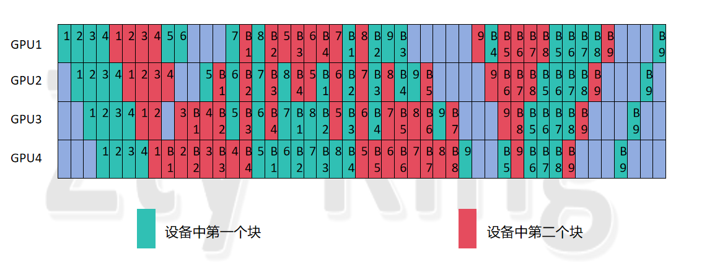

#### 	4.1.1 各阶段Step分析

​	我们首先分析，以下4个式子是否满足各阶段stpe的编排：

1. 计算 `warmup_steps` 的初始值：

$$
\text{warmup\_steps} = (\text{num\_stages} - \text{stage\_id} - 1) + (\text{num\_stages} - \text{stage\_id} - 1)
$$

​    2.更新 `warmup_steps`：
$$
\text{warmup\_steps} += (\text{num\_model\_chunks} - 1) \times \text{num\_stages}
$$
​	3.计算`steady_steps`:
$$
total\_num\_steps = accumulate\_steps * num\_model\_chunks
$$

$$
steady\_steps = total\_num\_steps - warmup\_steps
$$

​	4.修正`warmup_steps`:
$$
\text{warmup\_steps} = \min(\text{warmup\_steps}, \text{total\_num\_steps})
$$
​	分析可知，同样成立，例如：`GPU1`的`warmup_steps`计算出来为`3+3+4=10`，则`steady_steps`为`9*2-10=8`,由图可知符合。因此可知，以这4个式子对于`warm_up`和`stable`的`step`个数，对于`均匀与非均匀vpp`的编排都是成立的。

#### 4.1.2 各阶段单个设备的编号编排分析

​	其次我们分析编号编排，是否同样满足之前的公式：


$$
\text{virtual\_pp\_stage} = \text{micro\_step} \mod ( \text{num\_stages} \times \text{num\_model\_chunks} )
$$

$$
\text{virtual\_pp\_stage} = \left\lfloor \frac{\text{virtual\_pp\_stage}}{\text{num\_stages}} \right\rfloor
$$

​	这里我首先给出结论，公式不再满足，需要做变动，其实我们通过公式的来历即可知道，如果继续按照上式求解，那么就会出现，最终余数部分，通过上式计算后，第一步得到的结果，小于`pp_dgree`的均设置为第0块，大于等于`pp_dgree`，小于`pp_dgree*2`的均设置为第1块。然而我们分析一个具体的例子。

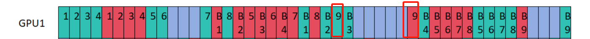

​	上图可以看到，`forward`总步数为`2*9=18`，也就是9个`micro`分别在`GPU1`中的两块模型中进行`forward`，前16步计算的实际`vpp_stage`没问题，但是第17，18步即micro_step为16，17若按上式计算（step从0开始），则最终的`vpp_stage` 均为0，也就是最后的两步均为在模型第0块执行的`forward`，而看图可知，显然不对，应该是一个在第0块，一个在第1块。

​	因此我们提出以下改进：

```
			remainder = accumulate_steps %  num_stages
			virtual_pp_stage = micro_step % (num_stages * num_model_chunks)
            if micro_step <= (accumulate_steps // num_stages)*(num_stages * num_model_chunks):
                virtual_pp_stage = virtual_pp_stage // num_stages
            else:
                virtual_pp_stage = virtual_pp_stage // remainder
            if not forward:
                virtual_pp_stage = num_model_chunks - virtual_pp_stage - 1
            return virtual_pp_stage
```

​	我们分析知道了，造成错误的原因是余数部分，因此我们将余数单独处理，即`else`部分，令`remainder`为`acc_step mod pp_degree`，可以看到此时多出来的几个step其实就是以`remainder`为基，以`num_model_chunks`为倍数进行扩张的数据集，而这个扩张后的数据集以`remainder`为基，被分别分到每个`chunk`中，因此这里对`remainder`进行整除预算即可。


### 4.2 第二种情况：

​		这里我们选择`num_stages`为4，而`accumulate_steps`为5，`hidden_layer`为8，`vpp_degree（num_model_chunks）`为2进行分析，我们不再做其它分析，因为我已经经过多种情况的验算过，Step的分析和设备编排各forward编号的分析，此处仅仅分析非均匀vpp的优化是否具有普遍现象：

排列1：（论文方法排列）：

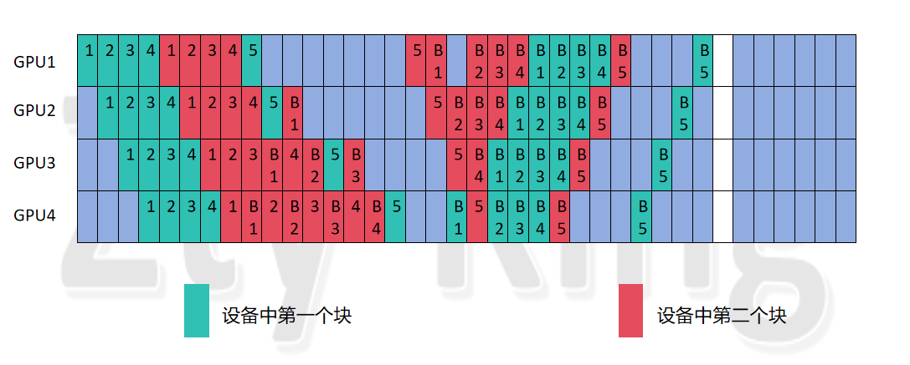

